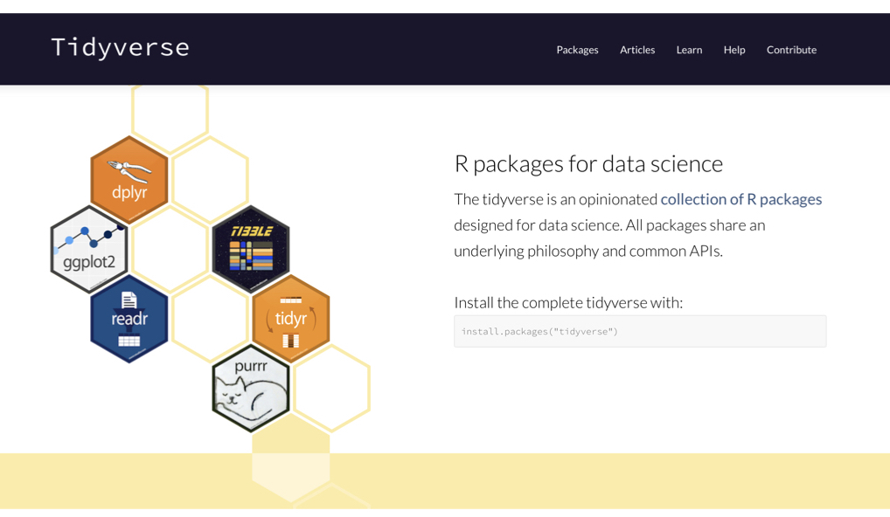
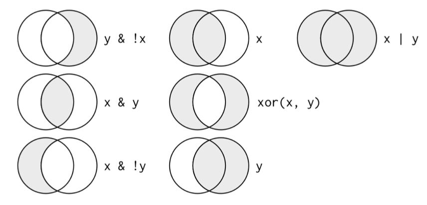

```{r setup, include=FALSE}
knitr::opts_chunk$set(echo = FALSE)
```

# But first a beautiful chair

## {.flexbox .vcenter}

```{r, echo=FALSE, out.width='80%', fig.align='center'}

```

## {.flexbox .vcenter}

```{r, echo=FALSE, out.width='100%', fig.align='center'}
knitr::include_graphics("images/week_01.002.jpeg")
```

## {.flexbox .vcenter}

```{r, echo=FALSE, out.width='100%', fig.align='center'}
knitr::include_graphics("images/week_01.003.jpeg")
```

## Why use `R`?  {.flexbox .vcenter}

- R is a _statistical_ programming language (derived from S)
    - Superb data management & graphics capabilities
    - Reproducibility - can keep your scripts to see exactly what was done
    - You can write your own functions
    - Powerful and flexible
    - Runs on all computer platforms
    
## Why use `R`?  {.flexbox .vcenter}
- Well established system of packages and documentation- new enhancements all the time!
- Active development and dedicated community (lots of help)
- Can use a nice GUI front end such as `Rstudio`
- Can embed your `R` analyses in dynamic, polished files using `R markdown`
- FREE
    
## Why use `R`? {.flexbox .vcenter}
```{r, echo=FALSE, out.width='40%'}
knitr::include_graphics("images/volcano_plot.png")
knitr::include_graphics("images/rainbow_boxplot.png")
knitr::include_graphics("images/blob_plot.png")
knitr::include_graphics("images/Stacked_barplot.png")

```

## Why use `R`?  {.flexbox .vcenter}

- Resources
    - The R Project Homepage: http://www.r-project.org
    - Quick R Homepage: http://www.statmethods.net
    - Bioconductor: http://www.bioconductor.org
    - An Introduction to R (long!): http://cran.r-project.org/doc/manuals/R-intro.html
    - Google - tutorials, guides, demos, packages and more


## Running `R` {.flexbox .vcenter}

- Run R from the command line- type R

- Install a R Integrated Development Environment (IDE)
    - RStudio: http://www.rstudio.com
    - Makes working with R much easier, particularly for a new R user
    - Run on Windows, Mac or Linux OS


## `R Studio` {.flexbox .vcenter}

```{r, echo=FALSE, out.width='80%', fig.align='center'}
knitr::include_graphics("images/RStudio_Screenshot.png")
```

## _Exercise 1.1: Exploring R studio_ {.flexbox .vcenter}

- Take a few minutes to familiarize yourself with the R studio environment by locating the following features:
    - The windows clockwise from top left are: the code editor, the workspace and history, the plots and files window, and the R console.
    - In the plots and files window, click on the packages and help tabs to see what they offer. 
    - See what types of new files can be made in R studio by clicking the top left icon- open a new R script.

- Now open the file called *Student_Exercises_for_Workshop_Lectures.Rmd*. This file will serve as your digial notebook for parts of the workshop and contains the other exercises.


## `RMarkdown` {.flexbox .vcenter}

- A better way to embed code in R Markdown files
- http://kbroman.org/knitr_knutshell/pages/Rmarkdown.html
- You can insert `R chunks` into `Rmarkdown` documents
- _Exercise 1.2: Intro to `R Markdown` Files_


## BASICS of `R` {.flexbox .vcenter .smaller}

- Commands can be submitted through the terminal, console or scripts
- In your scripts, anything that follows '#' symbol (aka hash) is just for humans
- Notice on these slides I'm evaluating the code chunks and showing output
- The output is shown here after the two `#` symbols and the number of output items is in `[]`
- Also notice that `R` follows the normal priority of mathematical evaluation


```{r basic multiplication, echo=TRUE}
4*4
```

```{r more multiplication, echo=TRUE}
(4+3*2^2)
```


## Assigning Variables {.flexbox .vcenter}
- A better way to do this is to assign variables
- Variables are assigned values using the `<-` operator.
- Variable names must begin with a letter, but other than that, just about anything goes.
- Do keep in mind that `R` is case sensitive.

## Assigning Variables {.flexbox .vcenter}

```{r assigning variables, echo=TRUE, tidy=TRUE}

x <- 2
x*3
y <- x * 3
y-2

```

These do not work

```{r eval=FALSE, echo=TRUE}
3y <- 3
3*y <- 3
```


## Arithmetic operations on functions {}

- Arithmetic operations can be performed easily on functions as well as numbers.

```{r functions, eval = FALSE, echo = TRUE}
x+2
x^2
log(x)
```

- Note that the last of these - `log` - is a built in function of `R`, and therefore the object of the function needs to be put in parentheses
- These parentheses will be important, and we'll come back to them later when we add arguments after the object in the parentheses  
- The outcome of calculations can be assigned to new variables as well, and the results can be checked using the 'print' command


## Arithmetic operations on functions {.flexbox .vcenter}

```{r, echo=TRUE}
y <- 67
print(y)

x <- 124
z <- (x*y)^2
print(z)
```

## STRINGS {.flexbox .vcenter}
- Variables and operations can be performed on characters as well
- Note that characters need to be set off by quotation marks to differentiate them from numbers
- The `c` stands for `concatenate`
- Note that we are using the same variable names as we did previously, which means that we're overwriting our previous assignment
- A good rule of thumb is to use new names for each variable, and make them short but still descriptive

## STRINGS {.flexbox .vcenter}

```{r, echo=TRUE}
x <- "I Love"
print (x)
y <- "Biostatistics"
print (y)
z <- c(x,y)
print (z)
```


## VECTORS {.flexbox .vcenter}

- In general `R` thinks in terms of vectors (a list of characters, factors or numerical values) and it will benefit any `R` user to try to write programs with that in mind, as it will simplify most things.
- Vectors can be assigned directly using the 'c()' function and then entering the exact values.

## VECTORS {.flexbox .vcenter}

```{r Example vectors, echo=TRUE}
n <- c(2,3,4,2,1,2,4,5,10,8,9)
print(n)
```

## FACTORS {.flexbox .vcenter}

- The vector `x` is now what is called a list of character values.
- Sometimes we would like to treat the characters as if they were units for subsequent calculations.
- These are called `factors`, and we can redefine our character variables as factors.
- This might seem a bit strange, but it’s important for statistical analyses where we might want to see the mean or variance for two different treatments.

## FACTORS {.flexbox .vcenter}

```{r, eval = FALSE, echo = TRUE}
n_factor <- as.factor(n)
print (n_factor)

z_factor <- as.factor(z)
print (z_factor)

```
- Note that factor levels are reported alphabetically


```{r, eval = FALSE, echo = TRUE}
str(n)
str(n_factor)
class(n)
class(n_factor)
```
- We can also determine how `R` "sees" a variable using str() or class() functions. 
- This is a useful check when importing datasets.


## Basic Statistics {.flexbox .vcenter}
Many functions exist to operate on vectors.

```{r, eval = FALSE, echo = TRUE}
mean(n)
median(n)
var(n)
log(n)
exp(n)
sqrt(n)
sum(n)
length(n)
sample(n, replace = T)
```
- Notice that the last function (`sample`) has an argument (`replace=T`)
- Arguments simply modify or direct the function in some way
- There are many arguments for each function, some of which are defaults

## Getting Help {.flexbox .vcenter}

- Getting Help on any function is very easy - just type a question mark and the name of the function.
- There are functions for just about anything within `R` and it is easy enough to write your own functions if none already exist to do what you want to do.
- In general, function calls have a simple structure: a function name, a set of parentheses and an optional set of parameters to send to the function.
- Help pages exist for all functions that, at a minimum, explain what parameters exist for the function.  


## Getting Help {.flexbox .vcenter}

```{r, eval = FALSE, echo = TRUE}
- help(mean)
- ?mean
- example(mean)
- help.search("mean")
- apropos("mean")
- args(mean)
```

## Creating vectors {.smaller}

- Creating vector of new data by entering it by hand can be a drag
- However, it is also very easy to use functions such as `seq` and `sample`
- Try the examples below Can you figure out what the three arguments in the parentheses mean?
- Try varying the arguments to see what happens.
- Don't go too crazy with the last one or your computer might slow way down

## Creating vectors {.smaller}

```{r, echo = TRUE}
seq_1 <- seq(0.0, 10.0, by = 0.1)
print(seq_1)
seq_2 <- seq(10.0, 0.0, by = -0.1)
print(seq_2)
```

## Creating vectors {.smaller}

```{r, echo = TRUE}
seq_square <- (seq_2)*(seq_2)
print(seq_square)
```

## Creating vectors {.smaller}

```{r, echo = TRUE}
seq_square_new <- (seq_2)^2
print(seq_square_new)
```


## Drawing samples from distributions {.flexbox .vcenter}

- Here is a way to create your own data sets that are random samples.
- Again, play around with the arguments in the parentheses to see what happens.

## Drawing samples from distributions {.smaller}

```{r Samples from distributions 1, out.width='100%', echo = TRUE}
x <- rnorm (10000, 0, 10)
y <- sample (1:10000, 10000, replace = T)
xy <- cbind(x,y)
plot(x,y)
```

## Drawing samples from distributions {.smaller}

```{r Samples from distributions 2, out.width='100%', echo = TRUE}
x <- rnorm (10000, 0, 10)
y <- sample (1:10000, 10000, replace = T)
xy <- cbind(x,y)
plot(xy)
```

## Drawing samples from distributions {.smaller}

```{r Samples from distributions 3, out.width='100%', echo = TRUE}
x <- rnorm (10000, 0, 10)
y <- sample (1:10000, 10000, replace = T)
xy <- cbind(x,y)
hist(x)
```

## Drawing samples from distributions {.flexbox .vcenter}

- You’ve probably figured out that y from the last example is drawing numbers with equal probability.
- What if you want to draw from a distribution?
- Again, play around with the arguments in the parentheses to see what happens.

## Drawing samples from distributions {.flexbox .vcenter out.width='50%'}

```{r, out.width='100%', echo = TRUE}
x <-rnorm(1000, 0, 100)
hist(x, xlim = c(-500,500))
curve(50000*dnorm(x, 0, 100), xlim = c(-500,500), add=TRUE, col='Red')
```
- `dnorm()` generates the probability density, which can be plotted using the `curve()` function.
- Note that is curve is added to the plot using `add=TRUE`

## Visualizing Data {.flexbox .vcenter}

- So far you've been visualizing just the list of output numbers
- Except for the last example where I snuck in a `hist` function.
- You can also visualize all of the variables that you've created using the `plot` function (as well as a number of more sophisticated plotting functions).
- Each of these is called a `high level` plotting function, which sets the stage
- `Low level` plotting functions will tweak the plots and make them beautiful

## Visualizing Data {.flexbox .vcenter .smaller}

```{r, echo = TRUE}
seq_1 <- seq(0.0, 10.0, by = 0.1)
plot (seq_1, xlab="space", ylab ="function of space", type = "p", col = "red")
```

## Putting plots in a single figure {.flexbox .vcenter}

- On the next slide
- The first line of the lower script tells R that you are going to create a composite figure that has two rows and two columns. Can you tell how?

```{r, echo=TRUE, outwidth="50%", out.height="20%"}
seq_1 <- seq(0.0, 10.0, by = 0.1)
seq_2 <- seq(10.0, 0.0, by = -0.1)
```

## Putting plots in a single figure {.flexbox .vcenter .smaller}

```{r, echo=TRUE, outwidth="50%", out.height="50%"}
par(mfrow=c(2,2))
plot (seq_1, xlab="time", ylab ="p in population 1", type = "p", col = 'red')
plot (seq_2, xlab="time", ylab ="p in population 2", type = "p", col = 'green')
plot (seq_square, xlab="time", ylab ="p2 in population 2", type = "p", col = 'blue')
plot (seq_square_new, xlab="time", ylab ="p in population 1", type = "l", col = 'yellow')
```


## R Interlude | Complete Excercises 1.3-1.8

## Working with 'Real' Datasets


## A biological example to get us started {.flexbox .vcenter}

Say you perform an experiment on two different strains of stickleback fish, one from an ocean population (RS) and one from a freshwater lake (BP) by making them microbe free. Microbes in the gut are known to interact with the gut epithelium in ways that lead to a proper maturation of the immune system.

## A biological example to get us started {.smaller .flexbox .vcenter}

EXPERIMENTAL SETUP - You carry out an experiment by treating multiple fish from each strain so that some of them have a conventional microbiota, and some are inoculated with only one bacterial species. You then measure the levels of gene expression in the stickleback gut using RNA-seq. You suspect that the sex of the fish might be important so you track it too.

```{r, echo=FALSE, out.width='60%', fig.asp=.75, fig.align='center'}
knitr::include_graphics("images/week_01.005.jpeg")
```


## {.flexbox .vcenter}

```{r, echo=FALSE, out.width='100%', fig.asp=.75, fig.align='center'}
knitr::include_graphics("images/week_01.006.jpeg")
```

## Collecting Data with Analyses in Mind {.flexbox .vcenter}

- How should the data set be organized to best analyze it?
- What are the key properties of the variables?
- Why does that matter for learning R?
- Why does that matter for performing statistical analyses?


## Data set rules of thumb (aka Tidy Data) {.flexbox .vcenter}

- Store a copy of data in non-proprietary formats
- Leave an uncorrected file when doing analyses
- Maintain effective metadata about the data
- When you add observations to a database, add rows
- When you add variables to a database, add columns
- A column of data should contain only one data type

## {.flexbox .vcenter}

```{r, echo=FALSE, out.width='100%', fig.asp=.75, fig.align='center'}
knitr::include_graphics("images/week_01.007.jpeg")
```


## Creating Data Frames in R {.smaller}

- As you have seen, in R you can generate your own random data set drawn from nearly any distribution very easily.
- Often we will want to use collected data.
- Now, let’s make a dummy dataset to get used to dealing with data frames
- Set up three variables (habitat, temp and elevation) as vectors

```{r, echo=TRUE}
habitat <- factor(c("mixed", "wet", "wet", "wet", "dry", "dry", "dry","mixed"))
temp <- c(3.4, 3.4, 8.4, 3, 5.6, 8.1, 8.3, 4.5)
elevation <- c(0, 9.2, 3.8, 5, 5.6, 4.1, 7.1, 5.3)
```

- Create a data frame where vectors become columns

```{r, echo=TRUE}
mydata <- data.frame(habitat, temp, elevation)
row.names(mydata) <- c("Reedy Lake", "Pearcadale", "Warneet", "Cranbourne",
                       "Lysterfield", "Red Hill", "Devilbend", "Olinda")
```

- Now you have a hand-made data frame with row names


## Reading in Data Frames in R {.flexbox .vcenter}

- A strength of `R` is being able to import data from an external source
- Create the same table that you did above in a spreadsheet like Excel
- Export it to comma separated and tab separated text files for importing into `R`.
- The first will read in a comma-delimited file, whereas the second is a tab-delimited
- In both cases the header and row.names arguments indicate that there is a header row and row label column
- Note that the name of the file by itself will have R look in the CWD, whereas a full path can also be used

## Reading in Data Frames in R {.flexbox .vcenter}

```{r, eval = FALSE, echo = TRUE}
YourFile <- read.table('yourfile.csv', header=T, row.names=1, sep=',')
YourFile <- read.csv('yourfile.csv', header=T, row.names=1, sep=',')
YourFile <- read.table('yourfile.txt', header=T, row.names=1, sep='\t')
```

## Exporting Data Frames in R {.flexbox .vcenter}

```{r, eval = FALSE, echo = TRUE}
write.csv(YourFile, "yourfile.csv", quote=F, row.names=T, sep=",")
write.table(YourFile, "yourfile.txt", quote=F, row.names=T, sep="\t")
```

## Indexing in data frames {.flexbox .vcenter}
- Next up - indexing just a subset of the data
- This is a very important idea in R, that you can analyze just a subset of the data.
- This is analyzing only the data in the file you made that has the factor value 'mixed'.

```{r, echo=TRUE, eval=FALSE}
print (YourFile[,2])
print (YourFile$temp)
print (YourFile[2,])
plot (YourFile$temp, YourFile$elevation)
```

## Indexing in data frames {.flexbox .vcenter}
- You can perform operations on particular levels of a factor
- Calculating the mean of the 'mixed' and 'gipps' levels of habitat.
- Note that the first argument is the numerical column vector, and the second is the factor column vector.
- The third is the operation. Reversing the first two does not work (the one below).

```{r, eval = FALSE, echo = TRUE}
tapply(YourFile$temp, YourFile$habitat, mean)
tapply(YourFile$temp, YourFile$habitat, var)
```


# Data wrangling and exploratory data analysis (EDA)

## Tidyverse family of packages {.smaller}

```{r, echo=FALSE, out.width='90%', fig.align='center'}

```

## Tidyverse family of packages {.vcenter .flexbox}

- Hadley Wickham and others have written R packages to modify data

- These packages do many of the same things as base functions in R

- However, they are specifically designed to do them faster and more easily

- Wickham also wrote the package GGPlot2 for elegant graphics creations

- GG stands for ‘Grammar of Graphics’


## Example of a tibble {.smaller}

```{r, echo=FALSE, out.width='90%', fig.align='center'}
knitr::include_graphics("images/week_3.012.jpeg")
```

## Example of a tibble {.smaller}

```{r, echo=FALSE, out.width='90%', fig.align='center'}
knitr::include_graphics("images/week_3.013.jpeg")
```

## Types of vectors of data {.smaller}

```{r, echo=FALSE, out.width='50%', fig.align='center'}
knitr::include_graphics("images/week_3.014.jpeg")
```

## Types of vectors of data {.vcenter}

`int` stands for integers  

`dbl` stands for doubles, or real numbers

`chr` stands for character vectors, or strings  

`dttm` stands for date-times (a date + a time)  

`lgl` stands for logical, vectors that contain only TRUE or FALSE

`fctr` stands for factors, which R uses to represent categorical variables with fixed possible values  

`date` stands for dates  

## Types of vectors of data {.smaller}

- Logical vectors can take only three possible values:
    - `FALSE`
    - `TRUE`
    - `NA` which is 'not available'.

- Integer and double vectors are known collectively as numeric vectors.
    - In `R` numbers are doubles by default.

- Integers have one special value: NA, while doubles have four:
    - `NA`
    - `NaN` which is 'not a number'
    - `Inf`
    - `-Inf`

## Types of vectors of data {.smaller}

- R will also implicitly coerce the length of vectors.
    - This is called **vector recycling**
    - The shorter vector is repeated or recycled
    - The shorter vector will be made the same length as the longer vector

- R will expand the shortest vector to the same length as the longest
    - This is so-called **recycling**
    - This is silent except when the length of the longer is not an integer multiple of the length of the shorter
    - When it is not you’ll get an error

- The vectorised functions in tidyverse will throw errors when you recycle anything other than a scalar.
    - If you do want to recycle something other than a scaler
    - You’ll need to do it yourself with `rep()`

## Key functions in `dplyr` for vectors

- Pick observations by their values with `filter()`.
- Reorder the rows with `arrange()`.
- Pick variables by their names with `select()`.
- Create new variables with functions of existing variables with `mutate()`.
- Collapse many values down to a single summary with `summarise()`.

## `filter()`, `arrange()` & `select()`

```{r, echo=T, eval=F}
filter(flights, month == 11 | month == 12)
```

```{r, echo=T, eval=F}
arrange(flights, year, month, day)
```

```{r, echo=T, eval=F}
select(flights, year, month, day)
```

```{r, echo=FALSE, out.width='60%', fig.align='center'}

```


## `mutate()` & `transmutate()`

This function will add a new variable that is a function of other variable(s)

```{r, echo=T, eval=F}
mutate(flights_sml,
  gain = arr_delay - dep_delay,
  hours = air_time / 60,
  gain_per_hour = gain / hours
)
```

This function will replace the old variable with the new variable

```{r, echo=T, eval=F}
transmute(flights,
  gain = arr_delay - dep_delay,
  hours = air_time / 60,
  gain_per_hour = gain / hours
)
```

## `group_by( )` & `summarize( )` {.smaller}

This first function allows you to aggregate data by values of categorical variables

```{r, echo=T, eval=F}
by_day <- group_by(flights, year, month, day)
```

Once you have done this aggregation, you can then calculate values (in this case the mean) of other variables split by the new aggregated levels of the categorical variable

```{r, echo=T, eval=F}
summarise(by_day, delay = mean(dep_delay, na.rm = TRUE))
```

- Note - you can get a lot of missing values!
- That’s because aggregation functions obey the usual rule of missing values:
    - if there’s any missing value in the input, the output will be a missing value.
    - fortunately, all aggregation functions have an na.rm argument which removes the missing values prior to computation

## R INTERLUDE | Complete Exercises 1.9-1.11 {.flexbox .vcenter}

# The tidyverse Continued: ggplot2 {.flexbox .vcenter}

## GGPlot2 and the Grammar of Graphics

- GG stands for ‘Grammar of Graphics’
- A good paragraph uses good grammar to convey information
- A good figure uses good grammar in the same way
- Seven general components can be used to create most figures

## GGPlot2 and the Grammar of Graphics

```{r, echo=FALSE, fig.cap="xxx", out.width='90%', fig.asp=.75, fig.align='center'}
knitr::include_graphics("images/images_4a.017.jpeg")
```


[//]: The Grammar of Graphics. Visual by Thomas de Beus

## The `geom_bar` function {.flexbox .vcenter}

```{r, eval=TRUE, echo=TRUE,fig.asp=0.5}
library(ggplot2)
ggplot(data=diamonds) +
  geom_bar(mapping=aes(x=cut))
```

## The `geom_bar` function {.flexbox .vcenter}
Now try this...

```{r gp1, eval=TRUE, echo=TRUE,fig.asp=0.5}
ggplot(data=diamonds) +
  geom_bar(mapping=aes(x=cut, colour=cut))
```

## The `geom_bar` function {.flexbox .vcenter}
and this...

```{r, eval=TRUE, echo=TRUE,fig.asp=0.5}
ggplot(data=diamonds) +
  geom_bar(mapping=aes(x=cut, fill=cut))
```

## The `geom_bar` function {.flexbox .vcenter}
and finally this...

```{r, eval=TRUE, echo=TRUE,fig.asp=0.5}
ggplot(data=diamonds) +
  geom_bar(mapping=aes(x=cut, fill=clarity), position="dodge")
```

## The `geom_histogram` and `geom_freqpoly` function {.flexbox .vcenter }
With this function you can make a histogram
```{r, eval=TRUE, echo=TRUE,fig.asp=0.4}
ggplot(data=diamonds) +
  geom_histogram(mapping=aes(x=carat), binwidth=0.5)
```

## The `geom_histogram` and `geom_freqpoly` function {.flexbox .vcenter }
This allows you to make a frequency polygram
```{r, eval=TRUE, echo=TRUE,fig.asp=0.4}
ggplot(data=diamonds) +
  geom_freqpoly(mapping=aes(x=carat), binwidth=0.5)
```

## The `geom_boxplot` function {.flexbox .vcenter}

Boxplots are very useful for visualizing data

```{r, eval=TRUE, echo=TRUE,fig.asp=0.5}
ggplot(data=diamonds, mapping=aes(x=cut, y=price)) +
  geom_boxplot()
```

## The `geom_boxplot` function {.flexbox .vcenter}

```{r, eval=TRUE, echo=TRUE,fig.asp=0.5}
ggplot(data=mpg, mapping=aes(x=class, y=hwy)) +
  geom_boxplot() +
  coord_flip()
```

## The `geom_boxplot` function {.flexbox .vcenter}

```{r gp2, eval=TRUE, echo=TRUE,fig.asp=0.5}
ggplot(data=mpg, mapping=aes(x=reorder(class, hwy, FUN=median), y=hwy)) +
  geom_boxplot() +
  coord_flip()
```

## The `geom_point` & `geom_smooth` functions {.flexbox .vcenter}

```{r, eval=TRUE, echo=TRUE,fig.asp=0.5}
ggplot(data=diamonds, mapping=aes(x=x, y=y)) +
  geom_point()
```

## The `geom_point` & `geom_smooth` functions {.flexbox .vcenter}

```{r, eval=TRUE, echo=TRUE,fig.asp=0.5}
ggplot(data=mpg) +
  geom_point(mapping=aes(x=displ, y=hwy)) +
  facet_wrap(~class, nrow=2)
```

## The `geom_point` & `geom_smooth` functions {.flexbox .vcenter}

```{r, eval=TRUE, echo=TRUE,fig.asp=0.5}
ggplot(data=mpg) +
  geom_point(mapping=aes(x=displ, y=hwy)) +
  facet_grid(drv~cyl)
```

## The `geom_point` & `geom_smooth` functions {.flexbox .vcenter}

```{r, eval=TRUE, echo=TRUE,fig.asp=0.5}
ggplot(data=mpg) +
  geom_smooth(mapping=aes(x=displ, y=hwy), method = "loess")
```

## Combining geoms {.flexbox .vcenter}

```{r, eval=TRUE, echo=TRUE,fig.asp=0.5}
ggplot(data=mpg) +
  geom_point(mapping=aes(x=displ, y=hwy)) +
  geom_smooth(mapping=aes(x=displ, y=hwy), method = "loess")
```

## Adding labels {.flexbox .vcenter}

```{r, eval=TRUE, echo=TRUE,fig.asp=0.5}
ggplot(data=mpg, aes(displ, hwy)) +
  geom_point(aes(color=class)) +
  geom_smooth(se=FALSE, method="loess") +
  labs(title = "Fuel efficiency generally decreases with engine size",
  subtitle = "Two seaters (sports cars) are an exception because of their light weight",
  caption = "Data from fueleconomy.gov")
```


## Themes

```{r, echo=FALSE, fig.cap="xxx", out.width='80%', fig.asp=.75, fig.align='center'}
knitr::include_graphics("images/images_4a.018.jpeg")
```


## FINAL R INTERLUDE | Complete Exercise 1.12 {.flexbox .vcenter}
