```{r setup, include=FALSE}
knitr::opts_chunk$set(echo = FALSE)
```

# But first a beautiful chair

## {.flexbox .vcenter}

```{r, echo=FALSE, out.width='80%', fig.align='center'}
knitr::include_graphics("images/week_01.001.jpeg")
```

## {.flexbox .vcenter}

```{r, echo=FALSE, out.width='100%', fig.align='center'}
knitr::include_graphics("images/week_01.002.jpeg")
```

## {.flexbox .vcenter}

```{r, echo=FALSE, out.width='100%', fig.align='center'}
knitr::include_graphics("images/week_01.003.jpeg")
```

## {.flexbox .vcenter}

```{r, echo=FALSE, out.width='100%'}
knitr::include_graphics("images/week_01.004.jpeg")
```


## Goals for statistics section

- Dynamical systems and stochastic processes
- Probability distributions and density functions
- Bernoulli, Binomial, Normal, Poisson
- Data wrangling and Exploratory Data Analysis (EDA)
- Figures - the good, the bad and the ugly
- Grammar of Graphics (GG)
- Creating beautiful graphics using GGPlot2
- FOR THURSDAY - On your EDA exercises will be posted
- Finish point estimation
- Tidy data wrangling and Exploratory Data Analysis (EDA)
- Hypothesis testing and Types of errors
- Figures - the good, the bad and the ugly
- Grammar of Graphics (GG) and Creating beautiful graphics using GGPlot2
- Introduction to Linear Models
- Simple linear regression and multiple linear regression (next week)
- Git and GitHub (starting next Tuesday)
- Finish simple linear regression
- Analysis of residuals
- How to report your statistical results
- Multiple linear regression
- Git and GitHub
- One factor ANOVA
- Experimental Design
- Finish simple linear regression
- Analysis of residuals
- How to report your statistical results
- **Non-linear regression**
- **Multiple linear regression**
- **Git and GitHub**
- **One factor ANOVA**
- **Experimental Design (Tuesday)**
- One factor ANOVA
- Git and GitHub
- Means tests in ANOVA
- Experimental Design
- Power analyses
- Multi-factor ANOVA
- Experimental Design
- Power analyses
- Multi-factor ANOVA
- Nested ANOVA
- Factorial ANOVA
- Analysis of CoVariance (ANCOVA)
- Experimental Design
- Power analyses
- Multi-factor ANOVA
- **Nested ANOVA**
- **Factorial ANOVA**
- **Analysis of CoVariance (ANCOVA)**
- Figures - the good, the bad and the ugly
- Grammar of Graphics (GG)
- Creating beautiful graphics using GGPlot2
- Introduction to Linear Models
- Simple linear regression
- Analysis of residuals
- Multiple linear regression
- Git and GitHub (Thursday)

# Basics of probability and distributions

## Dynamical systems | state space and transition rules {.smaller}

```{r, echo=FALSE, out.width='60%', fig.align='center'}
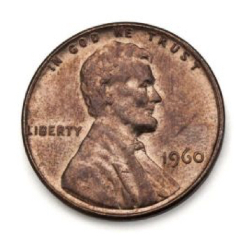
```

## Probability of independent events {.smaller}

```{r, echo=FALSE, out.width='100%', fig.align='center'}
knitr::include_graphics("images/week_2.002.jpeg")
```

## Random variables & probability {.smaller}

- **Probability** is the expression of belief in some future outcome

- A **random variable** can take on different values with different probabilities

- The **sample space** of a random variable is the universe of all possible values

- The **sample space** can be represented by a 

    - **probability distribution** (for discrete variables) 
    - **probability density function** (PDF - for continuous variables)
    - algebra and calculus are used for each respectively
    - the probabilities of an entire sample space **always sum to 1.0**

- There are many **families** or **forms** of distributions or PDFs
    - depends on the nature of the dynamical system they represent
    - the exact **instantiation of the form** depends on their parameter values
    - we are often interested in statistics in **estimating parameters**

## Bernoulli distribution {.smaller}

- Describes the expected outcome of a single event with probability `p`

- Example of flipping of a **fair** coin once

$$Pr(X=\text{Head}) = \frac{1}{2} = 0.5 = p $$

$$Pr(X=\text{Tails}) = \frac{1}{2} = 0.5 = 1 - p $$

- If the coin isn't fair then $p \neq 0.5$
- However, the probabilities still sum to 1 

$$ p + (1-p) = 1 $$

- Same is true for other binary possibilities
    - success or failure
    - yes or no answers
    - choosing an allele from a population based upon allele frequences

## Probability rules {.flexbox .vcenter}

- Flip a coin twice
- Represent the first flip as ‘X’ and the second flip as ‘Y’
- First, pretend you determine the probability in advance of flipping both coins

\br
\br
\br

$$ Pr(\text{X=H and Y=H}) = p*p = p^2 $$
$$ Pr(\text{X=H and Y=T}) = p*p = p^2 $$
$$ Pr(\text{X=T and Y=H}) = p*p = p^2 $$
$$ Pr(\text{X=T and Y=T}) = p*p = p^2 $$

## Probability rules


- Now determine the probability if the `H` and `T` can occur in any order

$$ \text{Pr(H and T) =} $$ 
$$ \text{Pr(X=H and Y=T) or Pr(X=T and Y=H)} = $$ 
$$ (p*p) + (p*p) = 2p^{2} $$
  

- These are the **'and'** and **'or'** rules of probability
    - 'and' means multiply the probabilities
    - 'or' means sum the probabilities
    - most probability distributions can be built up from these simple rules

## Joint and conditional probability

**Joint probability**

$$Pr(X,Y) = Pr(X) * Pr(Y)$$    

- Note that this is true for two independent events
- However, for two non-independent events we also have to take into account their **covariance**


## Joint and conditional probability

**Conditional probability**

- For two **independent** variables

$$Pr(Y|X) = Pr(Y)\text{ and }Pr(X|Y) = Pr(X)$$ 

- For two **non-independent** variables

$$Pr(Y|X) \neq Pr(Y)\text{ and }Pr(X|Y) \neq Pr(X)$$

- Variables that are non-independent have a shared variance, which is also known as the **covariance**
- Covariance standardized to a mean of zero and a unit standard deviation is **correlation**

## Binomial Distribution {.smaller}

- A **binomial distribution** results from the **combination** of several independent Bernoulli events 

- **Example** - pretend that you flip 20 fair coins and record the number of heads
- Now repeat that process and record the number of heads for each
- We expect that most of the time we will get approximately 10 heads
- Sometimes we get many fewer heads or many more heads
- The distribution of probabilities for each combination of outcomes is

$$\large f(k) = {n \choose k} p^{k} (1-p)^{n-k}$$

- `n` is the total number of trials
- `k` is the number of successes
- `p` is the probability of success
- `q` is the probability of not success
- For binomial as with the Bernoulli `p = 1-q`

## Binomial Probability Distribution  {.smaller}

```{r, echo=FALSE, out.width='100%', fig.align='center'}
knitr::include_graphics("images/week_2.003.jpeg")
```

## R INTERLUDE | binomially distributed data {.smaller}

- Pretend that you want to create your own binomial distribution
    - you could flip 20 fair coins: 20 independent Bernoulli “trials”
    - you could then replicate this 100 times: 100 “observations”
    - for each one of your replicates you record the number of heads
    - probability of heads (“success”) for any flip of a fair coin is 0.5
- Draw a diagram of what you think the distribution would look like
    - what will the x-axis represent, and what are its values?
    - what will the y-axis represent, and what are its values?
    - where will the 'center of mass' be?
    - what parameter determines the value of the center of mass?
    - what parameter determines the spread of the distribution?
    
## R INTERLUDE | binomially distributed data {.smaller}

- Using R, simulate these experimental data 
    - using the $rbinom()$ function
    - look at the arguments to see how they map on to the trials, probability of each trial, and number of replicates
    - use the $hist()$ function to plot the simulated data.
    - what do the y- and x-axes represent?
    - what is the most common outcome, in terms of the number of “successes” per trial? Does this make sense?
- Now just change you script to do the following
    - perform 200 trials for each of the 100 replicates
    - perform 2000 trials for each of the 100 replicate
    - how do the distributions change when you go from 20 to 200 to 2000 trials?
    
## R INTERLUDE | binomially distributed data {.smaller}

- Note that the binomial function incorporates both the 'and' and 'or' rules of probability
- This part is the probability of each outcome (multiplication)

$$\large p^{k} (1-p)^{n-k}$$

This part (called the binomial coefficient) is the number of different ways each combination of outcomes can be achieved (summation)

$$\large {n \choose k}$$
Together they equal the probability of a specified number of successes

 $$\large f(k) = {n \choose k} p^{k} (1-p)^{n-k}$$

## R INTERLUDE | binomially distributed data {.smaller}

- Now perform your experiment using R
- Use the `rbinom` function to replicate what you sketched out for coin flipping
- Be sure to check out the other functions in the `binom` family
- Make sure you know how you are mapping the parameeters to values
- Take the output and create a histogram
- Does it look similar to what you expected?
- Now change the values around so that
    - You have more or fewer coin flips per trial
    - You replicate the process with more or fewer trials
    - You change the coin from being fair to being slightly biased
    - You change the coin from being slightly to heavily biased

## Poisson Probability Distribution  {.smaller}

- Another common situation in biology is when each trial is discrete but number of observations of each outcome is observed

- Some examples are
    - counts of snails in several plots of land
    - observations of the firing of a neuron in a unit of time
    - count of genes in a genome binned to units of 500 amino acids in length
- Just like before you have 'successes', but 
    - now you count them for each replicate
    - the replicates now are units of area or time
    - the values can now range from 0 to an arbitrarily large number

## Poisson Probability Distribution  {.smaller}

- For example, you can examine 100 plots of land
    - count the number of snails in each plot
    - what is the probability of observing a plot with 'r' snails is
- `Pr(Y=r)` is the probability that the number of occurrences of an event `y` equals a count `r` in the total number of trials

$$Pr(Y=r) = \frac{e^{-\mu}\mu^r}{r!}$$

- Note that this is a single parameter function because $\mu = \sigma^2$, and the two together are often just represented by $\lambda$

$$Pr(y=r) = \frac{e^{-\lambda}\lambda^r}{r!}$$

- This means that for a variable that is truly Poisson distributed:
    - the mean and variance should be equal to one another, a hypothesis that you can test
    - variables that are approximately Poisson distributed but have a larger variance than mean are often called 'overdispersed'

## Poisson Probability Distribution | gene length by bins of 500 nucleotides {.smaller}

```{r, echo=FALSE, out.width='80%', fig.align='center'}
knitr::include_graphics("images/week_2.004.jpeg")
```

## Poisson Probability Distribution | increasing parameter values of $\lambda$ {.smaller}

```{r, echo=FALSE, out.width='80%', fig.align='center'}
knitr::include_graphics("images/week_2.005.jpeg")
```

## Log-normal PDF | Continuous version of Poisson (-ish) { .smaller}

```{r, echo=FALSE, out.width='100%', fig.align='center'}
knitr::include_graphics("images/week_2.006.jpeg")
```

## Transformations to ‘normalize’ data {.smaller .vcenter .flexbox}

```{r, echo=FALSE, out.width='100%', fig.align='center'}
knitr::include_graphics("images/week_2.007.jpeg")
```

## Transformations to ‘normalize’ data {.smaller .vcenter .flexbox}

```{r, echo=FALSE, out.width='100%', fig.align='center'}
knitr::include_graphics("images/week_2.008.jpeg")
```

## Binomial to Normal | Categorical to continuous {.smaller .vcenter .flexbox}

```{r, echo=FALSE, out.width='100%', fig.align='center'}
knitr::include_graphics("images/week_2.009.jpeg")
```

## The Normal (aka Gaussian) | Probability Density Function (PDF) {.smaller}

```{r, echo=FALSE, out.width='90%', fig.align='center'}
knitr::include_graphics("images/week_2.011.jpeg")
```

## Normal PDF {.smaller}

```{r, echo=FALSE, out.width='50%', fig.align='center'}
knitr::include_graphics("images/week_2.012.jpeg")
```


## Normal PDF | A function of two parameters ($\mu$ and $\sigma$) {.smaller}

```{r, echo=FALSE, out.width='40%', fig.align='center'}
knitr::include_graphics("images/week_2.032.jpeg")
```
where 
$$\large \pi \approx 3.14159$$

$$\large \epsilon \approx 2.71828$$

To write that a variable (v) is distributed as a normal distribution with mean $\mu$ and variance $\sigma^2$, we write the following:

$$\large v \sim \mathcal{N} (\mu,\sigma^2)$$

## Normal PDF | estimates of mean and variance {.smaller}

Estimate of the mean from a single sample

$$\Large \bar{x} = \frac{1}{n}\sum_{i=1}^{n}{x_i} $$

Estimate of the variance from a single sample

$$\Large s^2 = \frac{1}{n-1}\sum_{i=1}^{n}{(x_i - \bar{x})^2} $$

The standard deviation is the square root of the variance

$$\Large s = \sqrt{s^2} $$

## Normal PDF

```{r, echo=FALSE, out.width='90%', fig.align='center'}
knitr::include_graphics("images/week_2.010.jpeg")
```

## Why is the Normal special in biology?

```{r, echo=FALSE, out.width='100%', fig.align='center'}
knitr::include_graphics("images/week_2.013.jpeg")
```

## Why is the Normal special in biology? {.smaller}

```{r, echo=FALSE, out.width='100%', fig.align='center'}
knitr::include_graphics("images/week_2.015.jpeg")
```

## Why is the Normal special in biology? {.smaller}

```{r, echo=FALSE, out.width='70%', fig.align='center'}
knitr::include_graphics("images/week_2.014.jpeg")
```

## Parent-offspring resemblance {.smaller}

```{r, echo=FALSE, out.width='50%', fig.align='center'}
knitr::include_graphics("images/week_2.016.jpeg")
```

## Genetic model of complex traits {.smaller}

```{r, echo=FALSE, out.width='90%', fig.align='center'}
knitr::include_graphics("images/week_2.017.jpeg")
```

## Distribution of $F_2$ genotypes | really just binomial sampling {.smaller}

```{r, echo=FALSE, out.width='80%', fig.align='center'}
knitr::include_graphics("images/week_2.018.jpeg")
```

## Why else is the Normal special?

- The normal distribution is immensely useful because of the central limit theorem  
- The central limit theorem states that, under mild conditions, the mean of many random variables independently drawn from the same distribution is distributed approximately normally, irrespective of the form of the original distribution
- One can think of numerous situations, such as when multiple genes contribute to a phenotype, that many factors contribute to a biological process
- In addition, whenever there is variance introduced by stochastic factors or sampling error, the central limit theorem holds as well
- Thus, normal distributions occur throughout biology and biostatistics

## z-scores of normal variables | Mean centering and ranging  {.smaller}

- Often we want to make variables more comparable to one another
- For example, consider measuring the leg length of mice and of elephants
- Which animal has longer legs in absolute terms? 
- Which has longer legs on average proportional to their body size? Which has more variation proportional to their body size?
- A qood way to answer this last question is to use 'z-scores', which are standardized to a mean of 0 and a s.d. of 1
- We can modify any normal distribution to have a mean of 0 and a standard deviation of 1 
- Another term for this is the standard normal distribution

$$\huge z_i = \frac{(x_i - \bar{x})}{s}$$

## R INTERLUDE | Simulate a population and sample it! {.smaller}

Simulate a population of 10,000 individual values for a variable x:

```{r, eval = F, echo = T}
x <- rnorm(10000, mean=50.5, sd=5.5) 
```

Take 1000 random samples of size 20, take the mean of each sample, and plot the distribution of these 1000 sample means.

```{r, eval = F, echo = T}
x_sample_means <- NULL
for(i in 1:1000){
x_samp <- sample(x, 20, replace=FALSE)
x_sample_means[i] <- mean(x_samp)
}
```

For one of your samples, use the equation from the previous slide to transform the values to z-scores. 

Plot the distribution of the z-scores, and calculate the mean and the standard deviation.  

## R INTERLUDE | Simulate a population and sample it!

- Now, create a second population (called x.lognorm) by log-transforming all 10,000 values from population “x”
- Plot the histogram of these data
- Repeat the taking of 1000 samples of size 20
- Take the mean of each sample
- Plot the distribution of these 1000 sample means from the known lognormal population. 
- What does the distribution of the sampled means look like?

## More than one variable | Bivariate normal, correlation and covariation {.smaller}

```{r, echo=FALSE, out.width='50%', fig.align='center'}
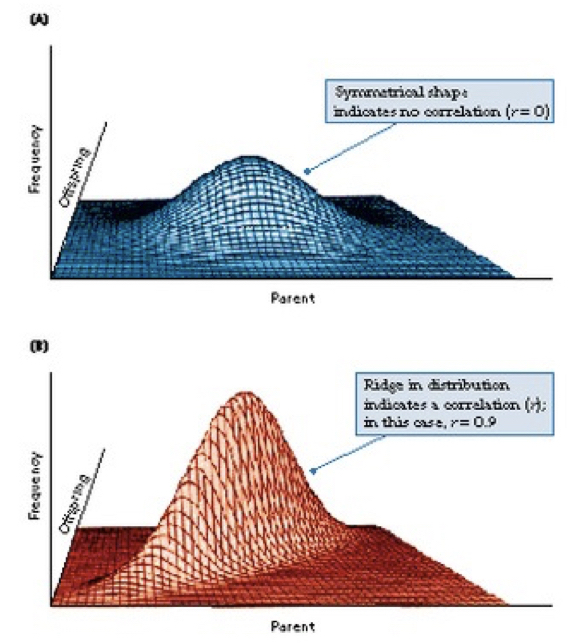
```

## More than one variable | Bivariate normal, correlation and covariation {.smaller}

```{r, echo=FALSE, out.width='80%', fig.align='center'}
knitr::include_graphics("images/week_2.020.jpeg")
```

## Covariance and Correlation {.vcenter .flexbox}

```{r, echo=FALSE, out.width='100%', fig.align='center'}
knitr::include_graphics("images/week_2.021.jpeg")
```

## Linear Models

```{r, echo=FALSE, out.width='100%', fig.align='center'}
knitr::include_graphics("images/week_2.022.jpeg")
```

## Show the data! | Anscombe’s Quartet {.smaller}

```{r, echo=FALSE, out.width='80%', fig.align='center'}
knitr::include_graphics("images/week_2.023.jpeg")
```

## Show the data! | Anscombe’s Quartet

- Mean of x in each case
9 (exact)

- Variance of x in each case
11 (exact)

- Mean of y in each case
7.50 (to 2 decimal places)

- Variance of y in each case
4.122 or 4.127 (to 3 decimal places)

- Correlation between x and y in each case
0.816 (to 3 decimal places)

- Linear regression line in each case
$y =3.00 + 0.50x$ (to 2 decimal places)

# Sampling and estimation

## Accuracy vs. Precision

```{r, echo=FALSE, out.width='50%', fig.align='center'}
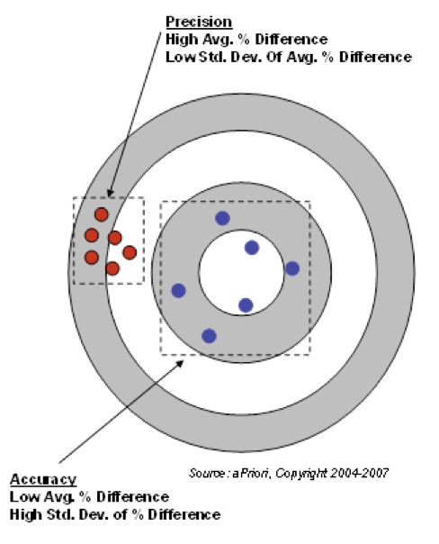
```

## Accuracy vs. Precision

- **Accuracy** is the closeness of an estimated value to its true value
- **Precision** is the closeness of repeated estimates to one another
- Our goal is to have **unbiased estimates** that are the most precise
- We have to **estimate parameters** and **test hypotheses** by taking **samples** that approximate the underlying distribution
- The goal of **replication** is to quantify variation at as many levels in a study as possible
- The goal of **randomization** is to avoid bias as much as possible

## Parameter Estimation

- **Parametric** (a few special exceptions, like the sample mean and its standard error)
- **Ordinary Least Squares (OLS)** - optimized procedure that produces one definitive result, easy to use but no estimates of confidence
- **Resampling** - bootstrapping and randomization
- **Maximum Likelihood (ML)** - Can provide model-based estimates with confidence, but harder to calculate
- **Bayesian Approaches** - Incorporates prior information into ML estimation

## Sampling variation of a parameter {.smaller}

```{r, echo=FALSE, out.width='100%', fig.align='center'}
knitr::include_graphics("images/week_2.025.jpeg")
```

## Estimation {.smaller}

- Estimation is the process of inferring a population parameter from sample data
- The value of one sample estimate is almost never the same as the population parameter because of random sampling error
- Imagine taking multiple samples, each will be different from the true value
- Most will be close, but some will be far away
- The **expected value** of a very large number of sample estimates is the value of the parameter being estimated
- Sampling distribution of an estimate
    - all values we might have obtained from our sample
    - probabilities of occurrence
- Standard error of an estimate
    - standard deviation of a sampling distribution
    - measures the precision of the parameter estimate
    - NO ESTIMATE IS USEFUL WITHOUT IT!

## Estimation and confidence intervals {.vcenter .flexbox}

```{r, echo=FALSE, out.width='90%', fig.align='center'}
knitr::include_graphics("images/week_2.025.jpeg")
```

## Estimation and confidence intervals {.vcenter .flexbox}

```{r, echo=FALSE, out.width='90%', fig.align='center'}
knitr::include_graphics("images/week_2.026.jpeg")
```

## Estimation and confidence intervals {.vcenter .flexbox}

```{r, echo=FALSE, out.width='100%', fig.align='center'}
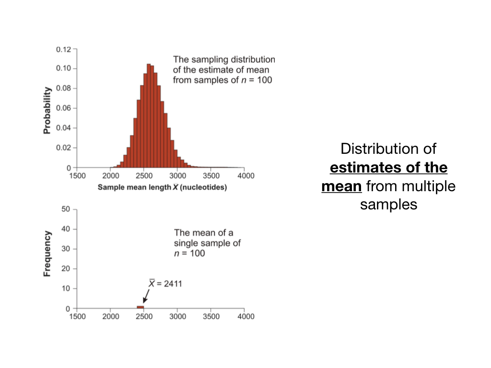
```

## Estimation and confidence intervals {.vcenter .flexbox}

```{r, echo=FALSE, out.width='100%', fig.align='center'}
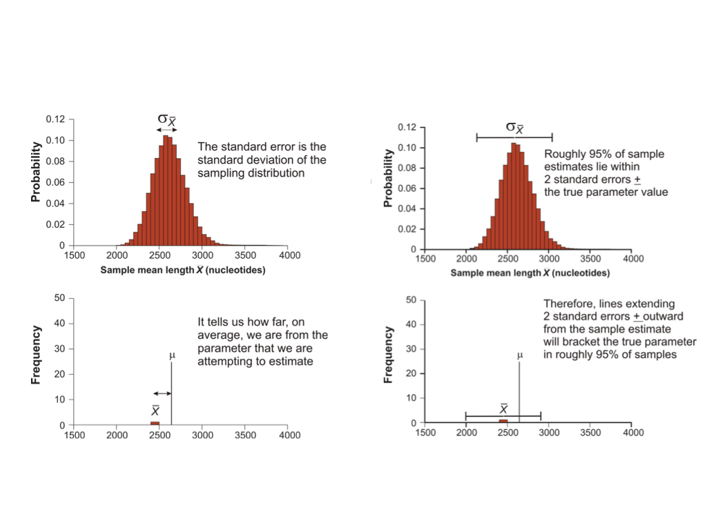
```

## Standard Error of the Mean (SEM)

$$\huge \sigma_{\bar{x}} \approx s_{\bar{x}} = \frac{s}{\sqrt{n}} $$


- where $s_{\bar{x}}$ is the estimated standard error of the distribution of the mean estimates
- which is usually just referred to as the 'standard error of the mean (SEM)
- note that this **is not** the standard deviation of the original distribution
- importantly, the SEM will go down as the sample size increases

## Standard Error

- Sadly, most other kinds of estimates do not have this amazing property.

- What to do?

- One answer: make your own sampling distribution for the estimate using the “bootstrap”.

- Method invented by Efron (1979).

## Parameter Estimation | Bootstrap Algorithm

- Use `R` to take a random sample of individuals from the original data
- Calculate the estimate using the measurements in the bootstrap sample (step 1)
- This is the first bootstrap replicate estimate 
- Repeat steps 1 and 2 a large number of times (1000 times is reasonable)
- Calculate the sample standard deviation of all the bootstrap replicate estimates obtained in step 3 
- The resulting quantity is called the bootstrap standard error 

## The etymology of the term 'bootstrap' {.smaller}

```{r, echo=FALSE, out.width='100%', fig.align='center'}

```

## Why the bootstrap is good

- Can be applied to almost any sample statistic
    - This includes means, proportions, correlations, regression
- Works when there is no ready formula for a standard error 
    - For example the median, trimmed mean, correlation, eigenvalue, etc.
- Is nonparametric, so doesn’t require normally-distributed data
- Works for estimates based on complicated sampling procedures or calculations
    - For example, it is used in phylogeny estimation

## R INTERLUDE | Bootstrapping to produce a confidence interval

Examine the `data_frames.R` script

Examine the `simple_boostrap.R` script

On your own - use R to figure out the bootstrap distribution for other parameters (such as variance).

## R INTERLUDE | Bootstrapping to produce a confidence interval {.smaller}

`x <- c(0.9, 1.2, 1.2, 1.3, 1.4, 1.4, 1.6, 1.6, 2.0, 2.0)`

- Use R to make 1000 “pseudo-samples” of size 10 (with replacement), using a for loop as before. 
- Name the pseudo-sample object “xboot”, and name the means of the xboot samples “z”.
- Plot the histogram of the resampled means, and calculate the standard deviation of the sample means (the bootstrap SEM) using the `sd()` function.
- How does it compare with the ordinary standard error of the mean calculated from the original, real sample?

`sd(x)/sqrt(10)`

- Now take one of the genes from the `GacuRNAseq_Subset.csv` data and obtain a bootstrapped estimate of the mean expression level.

## R INTERLUDE | Bootstrapping to produce a confidence interval

- The 2.5th and 97.5th percentiles of the bootstrap sampling distribution are a passable 95% confidence interval
- Note that no transformations or normality assumptions needed
- You can use the `quantile()` function to calculate these
- *On your own* - use R to figure out the bootstrap distribution for other parameters (such as variance).


## Parameter Estimation | Ordinary Least Squares (OLS)

- Algorithmic approach to parameter estimations
- One of the oldest and best developed statistical approaches
- Used extensively in linear models (ANOVA and regression)
- By itself only produces a single best estimate (No C.I.’s)
- Can use resampling approaches to get C.I.’s
- Many OLS estimators have been duplicated by ML estimators

## Parameter Estimation | Ordinary Least Squares (OLS) {.smaller}

```{r, echo=FALSE, out.width='80%', fig.align='center'}
knitr::include_graphics("images/week_2.031.jpeg")
```

# Hypothesis testing, test statistics, p-values {.smaller}

## What is a hypothesis {.vcenter .flexbox}

- A statement of belief about the world
- Need a **critical** test to 
    - accept or reject the hypothesis
    - compare the relative merits of different models
- This is where **statistical sampling distributions** come into play

## Hypothesis tests {.vcenter .flexbox}

$H_0$ : *Null hypothesis* : Ponderosa pine trees are the same height on average as Douglas fir trees

$H_A$ : *Alternative Hypothesis*: Ponderosa pine trees are not the same height on average as Douglas fir trees

## Hypothesis tests {.vcenter .flexbox}

- What is the probability that we would reject a **true null hypothesis**?

- What is the probability that we would accept a **false null hypothesis**?

- How do we **decide** when to reject a null hypothesis and support an alternative?

- What can we **conclude** if we fail to reject a null hypothesis?

- What **parameter estimates of distributions** are important to test hypotheses?

## Null and alternative hypotheses | population distributions {.smaller}

```{r, echo=FALSE, out.width='90%', fig.align='center'}
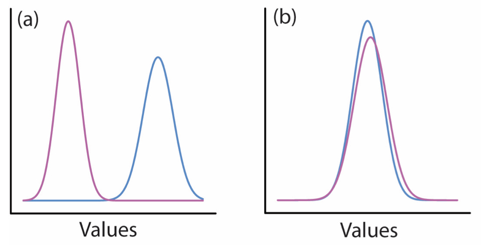
```

## Null and alternative hypotheses | population distributions {.smaller}

```{r, echo=FALSE, out.width='60%', fig.align='center'}
knitr::include_graphics("images/week_3.002.jpeg")
```

## Statistical sampling distributions {.vcenter .flexbox}

- Statistical tests provide a way to perform **critical tests** of hypotheses
- Just like raw data, statistics are **random variables** and depend on sampling distributions of the underlying data
- The particular **form of the statistical distribution** depends on the test statistic and parameters such as the degrees of freedom that are determined by sample size.

## Statistical sampling distributions {.vcenter .flexbox}

- In many cases we create a **null statistical distribution** that models the distribution of a test statistic under the **null hypothesis**. 
- Similar to point estimates, we calculate an **observed test statistic value** for our data
- Then see how probable it was by comparing against **the null distribution**
- The probability of seeing that value or greater is called the **p-value** of the statistic


## Four common statistical distributions {.smaller}

```{r, echo=FALSE, out.width='90%', fig.align='center'}
knitr::include_graphics("images/week_3.003.jpeg")
```

## The t-test and t sampling distribution {.vcenter .flexbox}

$H_0$ : Null hypothesis : Ponderosa pine trees are the same height on average as Douglas fir trees

$$H_0 : \mu_1 = \mu_2$$

$H_A$ : Alternative Hypothesis: Ponderosa pine trees are not the same height as Douglas fir trees


$$H_A : \mu_1 \neq \mu_2$$

## The t-test and t sampling distribution {.smaller}

$$\huge t = \frac{(\bar{y}_1-\bar{y}_2)}{s_{\bar{y}_1-\bar{y}_2}} $$

where

```{r, echo=FALSE, out.width='60%', fig.align='center'}
knitr::include_graphics("images/week_3.016.jpeg")
```

which is the calculation for the standard error of the mean difference

## The t-test and t sampling distribution | under different degrees of freedom {.smaller}

```{r, echo=FALSE, out.width='90%', fig.align='center'}
knitr::include_graphics("images/week_3.004.jpeg")
```

## The t-test and t sampling distribution | one tailed test {.smaller}

```{r, echo=FALSE, out.width='90%', fig.align='center'}
knitr::include_graphics("images/week_3.005.jpeg")
```

## The t-test and t sampling distribution | two tailed test {.smaller}

```{r, echo=FALSE, out.width='60%', fig.align='center'}
knitr::include_graphics("images/week_3.006.jpeg")
```

## Assumptions of parameteric t-tests  {.vcenter .flexbox}

- The theoretical t-distributions for each degree of freedom were calculated for populations that are:  
    - normally distributed
    - have equal variances (if comparing two means)
    - observations are independent (randomly drawn)
- This is an example of a **parametric** test
- What do you do if the there is non-normality?  
    - nonparametric tests such as Mann-Whitney-Wilcoxon
    - randomization tests to create a null distribution

## Type 1 and Type 2 errors {.smaller}

```{r, echo=FALSE, out.width='90%', fig.align='center'}
knitr::include_graphics("images/week_3.007.jpeg")
```

## Components of hypothesis testing

- **p-value** = the long run probability of rejecting a true null hypothesis
- **alpha** = critical value of p-value cutoff for experiments. The Type I error we are willing to tolerate.
- **beta** = cutoff for probability of accepting a false null hypothesis
- **Power** = the probability that a test will reject a false null hypothesis (1 - beta). It depends on effect size, sample size, chosen alpha, and population standard deviation
- **Multiple testing** = performing the same or similar tests multiple times - need to correct

## Null distributions and p-values {.flexbox .vcenter}

```{r, echo=FALSE, out.width='90%', fig.align='center'}
knitr::include_graphics("images/week_3.009.jpeg")
```

## Why do we use $\alpha = 0.5$ as a cutoff? {.smaller}

```{r, echo=FALSE, out.width='90%', fig.align='center'}
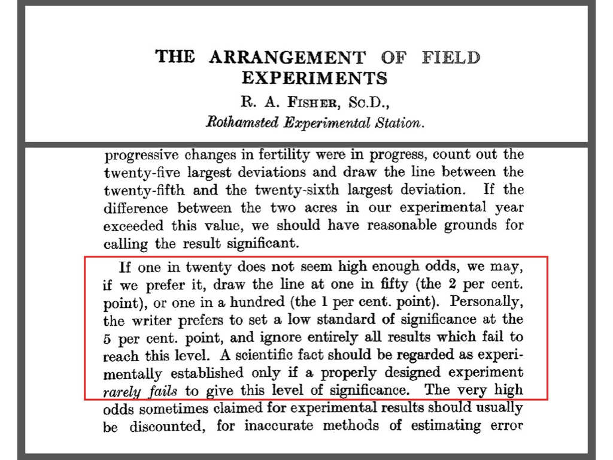
```

## R INTERLUDE | Parametric t-test in R {.smaller}

1. Make a dummy data set that contains one continuous and one categorical value (with two levels). Draw individuals of the two different factor levels from normal distributions with slightly different means. Take 100 obsv. per factor level. 

2. Now, perform a t-test to see if the two populations are statistically different from one another

```{r, eval=FALSE, echo=TRUE}
boxplot(continuous_variable~cat_variable, dataset name) 
t.test(continuous_variable~cat_variable, dataset name) 
```

3. Repeat steps 1 and 2 above but use different sample sizes (e.g. 10 , then 100, then 1000, then 10,000 obsv. per factor level) 

4. Repeat steps 1 and 2 above but now test between a categorical and continuous variable in the perchlorate data set (or any of your favorite data sets)

## R INTERLUDE | Parametric t-test in R {.smaller}

- Now, apply the equations for the t-statistic above to your simulated sample to perform the same test, but using a resampling approach
    - hint: go back to your Bootstrapping script
- Use this approach to calculate a distribution of random t statistics assuming the the null hypothesis of no difference is true. 
- Now, compare your observed value to your created null distribution. 
- What is the probability of that value occurring by chance under the null? 
    - This is your p-value! (Assume you’re doing a one-tailed test)
    - hint: Proportion of values in the null distribution equal to or larger than the observed t-value = p-value

## R INTERLUDE | Permutation t-test in R

- Randomization test example 1
- Data: The number of successful broods of pseudoscorpion females that were mated twice to either a single male (SM) or two different males (DM).
    - SM: `4 0 3 1 2 3 4 2 4 2 0 2 0 1 2 6 0 2 3 3`
    - DM: `2 0 2 6 4 3 4 4 2 7 4 1 6 3 6 4`
- Observed difference in the means between the two
    - $\bar{Y}_{SM}$ − $\bar{Y}_{DM}$ = 2.2−3.625 = −1.425

## R INTERLUDE | Permutation t-test in R {.smaller}

- Steps of the randomization test
- First, create a randomized data set in which the measurements are randomly reassigned (without replacement) to the two groups
    - For example, the following
    - SM: `4 0 7 4 2 2 2 1 4 4 0 3 3 4 6 2 4 6 0 0` 
    - DM: `2 2 3 3 2 3 3 4 1 2 1 4 6 6 2 0`
- Second, calculate the test statistic measuring the association between variables 
    - difference between group means
    - this is the first bootstrap replicate
- Repeat steps 1 and 2 many times to produce many bootstrap replicates

## R INTERLUDE | Permutation t-test in R {.smaller}

- Below is the **null distribution** of the test statistic from 10,000 replications 
    - This is produced by the randomized assignment of values to each group (SM or DM)
    - Thus this is the distribution we'd expect under the null hypothesis of no difference
- The observed value from the data is –1.425 
- The area in red is the tail beyond this observed value and is therefore the **bootstrap p-value**

```{r, echo=FALSE, out.width='40%', fig.align='center'}
knitr::include_graphics("images/week_3.010.jpeg")
```

## R INTERLUDE | Permutation t-test in R

- Of these 10,000 randomizations, only 176 had a test statistic (difference between means) equal to or less than the observed value, –1.425.
- You can use the simulated null distribution in the same way as t or F distribution in conventional tests.
- Proportion of values in the null distribution equal or larger than the observed value of the test statistic is 176/10000 = 0.0176.


# Linear Models and Regression

## Parent offspring regression

```{r, echo=FALSE, out.width='90%', fig.asp=.75, fig.align='center'}
knitr::include_graphics("images/images_4b.002.jpeg")
```

## Linear Models - a note on history

```{r, echo=FALSE, out.width='90%', fig.asp=.75, fig.align='center'}
knitr::include_graphics("images/images_4b.003.jpeg")
```

## Linear Models - a note on history

```{r, echo=FALSE, out.width='90%', fig.asp=.75, fig.align='center'}
knitr::include_graphics("images/images_4b.004.jpeg")
```

## Bivariate normality

```{r, echo=FALSE, out.width='90%', fig.asp=.75, fig.align='center'}
knitr::include_graphics("images/images_4b.005.jpeg")
```

## Covariance and correlation

```{r, echo=FALSE, out.width='90%', fig.asp=.75, fig.align='center'}
knitr::include_graphics("images/images_4b.006.jpeg")
```

## Anscombe's Quartet

```{r, echo=FALSE, out.width='90%', fig.asp=.75, fig.align='center'}
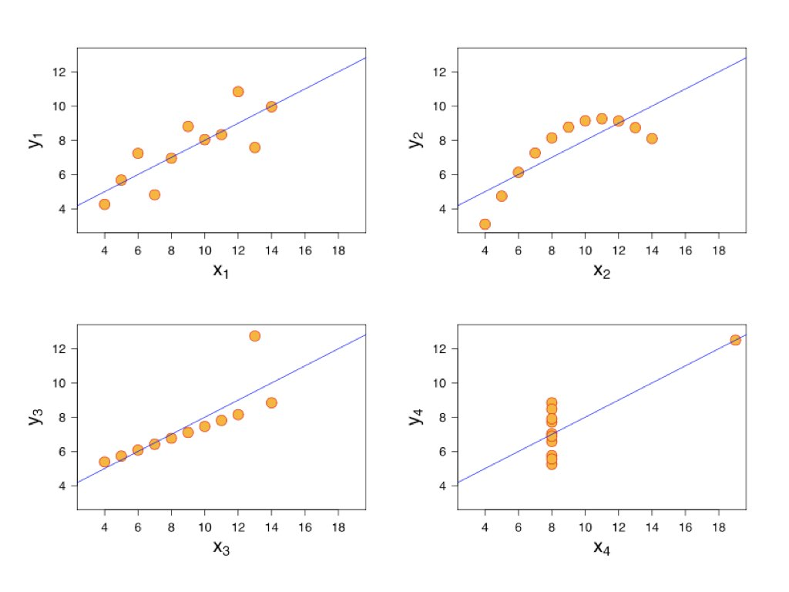
```

## Anscombe's Quartet {.smaller}

- *Mean* of x in each case 9 (exact)

- *Variance* of x in each case 11 (exact)

- Mean of y in each case 7.50 (to 2 decimal places)

- Variance of y in each case 4.122 or 4.127 (to 3 decimal places)

- Correlation between x and y in each case 0.816 (to 3 decimal places)

- Linear regression line in each case
$$ y = 3.00 + 0.50x$$

## A linear model to relate two variables

```{r, echo=FALSE, out.width='90%', fig.asp=.75, fig.align='center'}
knitr::include_graphics("images/images_4b.008.jpeg")
```

## Many approaches are linear models

- Is flexible: Applicable to many different study designs 
- Provides a common set of tools (lm in R for fixed effects)
- Includes tools to estimate parameters:
  - (e.g. sizes of effects, like the slope, or change in means)
- Is easier to work with, especially with multiple variables

## Many approaches are linear models

- Linear regression 
- Single factor ANOVA
- Analysis of covariance
- Multiple regression
- Multi-factor ANOVA
- Repeated-measures ANOVA

## Plethora of linear models

- General Linear Model (**GLM**) - two or more continuous variables

- General Linear Mixed Model (**GLMM**) - a continuous response variable with a mix of continuous and categorical predictor variables

- Generalized Linear Model - a GLMM that doesn’t assume normality of the response (we’ll get to this later)

- Generalized Additive Model (**GAM**) - a model that doesn’t assume linearity (we won’t get to this later)


## Linear models {.smaller}

All an be written in the form

response variable = intercept + (explanatory_variables) + random_error


in the general form:

$$ Y=\beta_0 +\beta_1*X_1 + \beta_2*X_2 +... + error$$  

where $\beta_0, \beta_1, \beta_2, ....$ are the parameters of the linear model

## linear model parameters

```{r, echo=FALSE, out.width='90%', fig.asp=.75, fig.align='center'}
knitr::include_graphics("images/images_4b.010.jpeg")
```


## linear model parameters

```{r, echo=FALSE, out.width='90%', fig.asp=.75, fig.align='center'}
knitr::include_graphics("images/images_4b.009.jpeg")
```


## linear models in R

All of these will *include* the intercept
```{r, echo=TRUE, eval=FALSE}
Y~X
Y~1+X
Y~X+1
```

All of these will *exclude* the intercept
```{r, echo=TRUE, eval=FALSE}
Y~-1+X
Y~X-1
```

Need to fit the model and then 'read' the output
```{r, echo=TRUE, eval=FALSE}
trial_lm <- lm(Y~X)
summary (trial_lm)
```

## R INTERLUDE {.smaller}
Write a script to read in the perchlorate data set. Now, add the code to perform a linear model of two continuous variables. Notice how the output of the linear model is specified to a new variable. Also note that the variables and dataset are placeholders

```{r, echo=TRUE, eval=FALSE}
my_lm <- lm(dataset$variable1 ~ dataset$variable2)
```

Now look at a summary of the linear model
```{r, echo=TRUE, eval=FALSE}
summary(my_lm)
print(my_lm)
```

Now let's produce a nice regression plot
```{r, echo=TRUE, eval=FALSE}
plot(dataset$variable1 ~ dataset$variable2, col = “blue”)
abline(my_lm, col = “red”)
```
Notice that you are adding the fitted line from your linear model
Finally, remake this plot in GGPlot2

## R INTERLUDE {.smaller}

- zfish_diet_IA.tsv
  - Protein - amount of protein in the diet
  - Weight - weight of the fish
  - SL - standard length of the fish
  
- Perchlorate_Data.tsv
  - Strain - of zebrafish
  - Perchlorate Level - treatment of perchlorate
  - T4 Hormone Level
  - Follicle Area
  - Number of Follicles
  - Age_Category
  - Testes Area
  - Testes Stage
  
## R INTERLUDE {.smaller}

```{r, echo=TRUE, eval=FALSE}
Perchlorate_Data <- read.table(‘perchlorate_data.tsv’, header=T, sep=‘/t’)
head(Perchlorate_Data)

x <- Perchlorate_Data$T4_Hormone_Level
y <- Perchlorate_Data$Testes_Area

perc_lm <- lm(y ~ x)
summary (perc_lm)

plot(y ~ x, col = "blue")
abline(perc_lm, col = "red")
```

## R INTERLUDE - Checking the output

```{r, echo=FALSE, out.width='90%', fig.asp=.75, fig.align='center'}
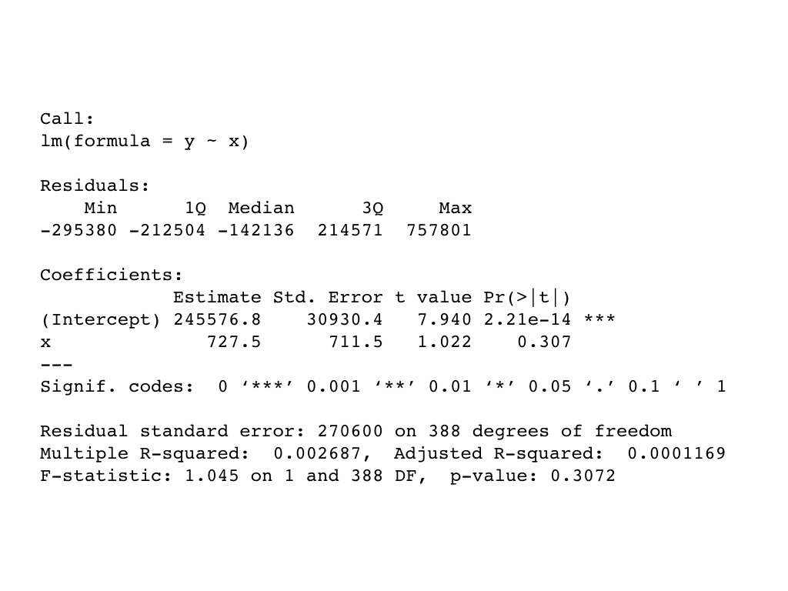
```

## Model fitting and hypothesis tests in regression

$$H_0 : \beta_0 = 0$$
$$H_0 : \beta_1 = 0$$


full model - $y_i = \beta_0 + \beta_1*x_i + error_i$

reduced model - $y_i = \beta_0 + 0*x_i + error_i$


1. fits a “reduced” model without slope term (H0)
2. fits the “full” model with slope term added back
3. compares fit of full and reduced models using an F test

## Model fitting and hypothesis tests in regression

```{r, echo=FALSE, out.width='90%', fig.asp=.75, fig.align='center'}
knitr::include_graphics("images/images_4b.011.jpeg")
```

## Hypothesis tests in linear regression {.smaller}

Estimation of the variation that is explained by the model (SS_model)

SS_model = SS_total(reduced model) - SS_residual(full model)

The variation that is unexplained by the model (SS_residual)

SS_residual(full model)

## Hypothesis tests in linear regression {.smaller}

```{r, echo=FALSE, out.width='90%', fig.asp=.75, fig.align='center'}
knitr::include_graphics("images/images_4b.012.jpeg")
```

## Hypothesis tests in linear regression {.smaller}

```{r, echo=FALSE, out.width='90%', fig.asp=.75, fig.align='center'}
knitr::include_graphics("images/images_4b.013.jpeg")
```


## $r^2$ as a measure of model fit

$$r^2 = SS_{regression}/SS_{total} = 1 - (SS_{residual}/SS_{total})$$
or 
$$r^2 = 1 - (SS_{residual(full)}/SS_{total(reduced)})$$
Which is the proportion of the variance in Y that is explained by X

## Relationship of correlation and regression

$$\beta_{YX}=\rho_{YX}*\sigma_Y/\sigma_X$$
$$b_{YX} = r_{YX}*S_Y/S_X$$

## Residual Analysis | did we meet our assumptions?

- Independent errors (residuals)
- Equal variance of residuals in all groups
- Normally-distributed residuals
- Robustness to departures from these assumptions is improved when sample size is large and design is balanced


## Residual Analysis | did we meet our assumptions?

$$y_i = \beta_0 + \beta_1 * x_I + \epsilon_i$$

## Residual Analysis

```{r, echo=FALSE, out.width='90%', fig.asp=.75, fig.align='center'}
knitr::include_graphics("images/images_4b.015.jpeg")
```

## Residual Analysis

```{r, echo=FALSE, out.width='90%', fig.asp=.75, fig.align='center'}
knitr::include_graphics("images/images_4b.016.jpeg")
```

## Handling violations of the assumptions of linear models

- What if your residuals aren’t normal because of outliers? 

- Nonparametric methods exist, but these don’t provide parameter estimates with CIs.

- Robust regression (rlm)

- Randomization tests 

## Anscombe's quartet again | what would residual plots look like for these?

```{r, echo=FALSE, out.width='90%', fig.asp=.75, fig.align='center'}
knitr::include_graphics("images/images_4b.017.jpeg")
```

## Anscombe's quartet again | what would residual plots look like for these?

```{r, echo=FALSE, out.width='90%', fig.asp=.75, fig.align='center'}
knitr::include_graphics("images/images_4b.018.jpeg")
```

## Residual Plots | Spotting assumption violations

```{r, echo=FALSE, out.width='90%', fig.asp=.75, fig.align='center'}
knitr::include_graphics("images/images_4b.020.jpeg")
```

## Residuals | leverage and influence {.smaller}

```{r, echo=FALSE, out.width='90%', fig.asp=.75, fig.align='center'}
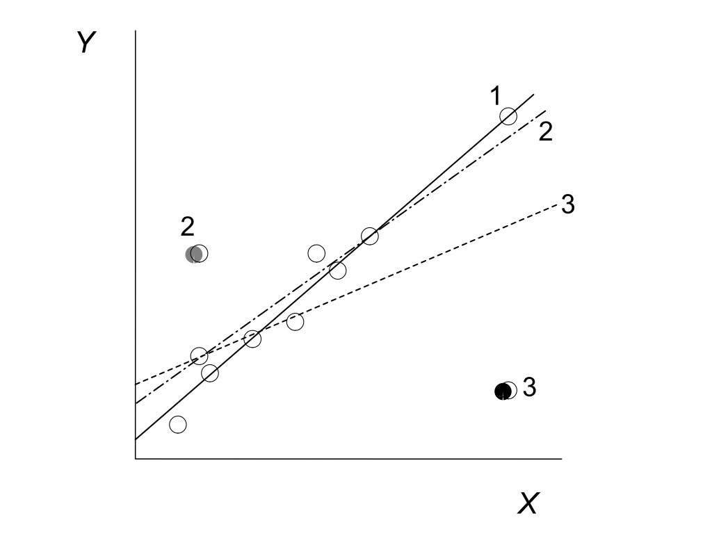
```

- 1 is an outlier for both Y and X
- 2 is not an outlier for either Y or X but has a high residual
- 3 is an outlier in just X - and thus a high residual - and therefore has high influence as measured by Cook's D

## Residuals | leverage and influence {.smaller}

- **Leverage** - a measure of how much of an outlier each point is in x-space (on x-axis) and thus only applies to the predictor variable.
(Values > 2*(2/n) for simple regression are cause for concern)

- **Residuals** - As the residuals are the differences between the observed and predicted values along a vertical plane, they provide a measure of how much of an outlier each point is in y-space (on y-axis). The patterns of residuals against predicted y values (residual plot) are also useful diagnostic tools for investigating linearity and homogeneity of variance assumptions

- **Cook’s D** statistic is a measure of the influence of each point on the fitted model (estimated slope) and incorporates both leverage and residuals. Values ≥ 1 (or even approaching 1) correspond to highly influential observations.


## R INTERLUDE | residual analyses {.smaller}
Let’s look at the zebrafish diet data. 

```{r, echo=TRUE, eval=FALSE}
x <- zfish_diet$Protein
y <- zfish_diet$Weight

zfish_lm <- lm(y ~ x)
summary (zfish_lm)

plot(y ~ x, col = "blue")
abline(zfish_lm, col = "red")

hist(residuals(zfish_lm), breaks=30)

plot (residuals(zfish_lm) ~ fitted.values(zfish_lm))
plot (residuals(zfish_lm) ~ x)
```


## R INTERLUDE | residual analyses {.smaller}

Or apply the plot() function to the linear model object directly

```{r, echo=TRUE, eval=FALSE}
plot(zfish_lm)
```

Figure out what these plots are telling you

## R INTERLUDE {.smaller}
How about using the influence.measures function???

```{r, echo=TRUE, eval=FALSE}
influence.measures(zfish_lm)
```

Do we have any high leverage observations we need to worry about???
Now go back and try to recreate these graphs in GGPlot2

## R INTERLUDE {.smaller}


# Tuesday

# General Linear Models


## Model fitting in regression {.smaller .flexbox .vcenter}

$$H_0 : \beta_0 = 0$$
$$H_0 : \beta_1 = 0$$


full model - $y_i = \beta_0 + \beta_1*x_i + error_i$

reduced model - $y_i = \beta_0 + 0*x_i + error_i$


1. fits a “reduced” model without slope term (H0)
2. fits the “full” model with slope term added back
3. compares fit of full and reduced models using an F test

## Model fitting in regression {.smaller .flexbox .vcenter}

```{r, echo=FALSE, out.width='90%', fig.asp=.75, fig.align='center'}
knitr::include_graphics("images/images_4b.011.jpeg")
```

## Hypothesis tests in linear regression {.smaller .flexbox .vcenter}

- Estimation of the variation that is explained by the model (SS_model)

- SS_model = SS_total(reduced model) - SS_residual(full model)

- The variation that is unexplained by the model (SS_residual)


## Hypothesis tests in linear regression {.smaller}

```{r, echo=FALSE, out.width='90%', fig.asp=.75, fig.align='center'}
knitr::include_graphics("images/images_4b.012.jpeg")
```

## Hypothesis tests in linear regression {.smaller}

```{r, echo=FALSE, out.width='90%', fig.asp=.75, fig.align='center'}
knitr::include_graphics("images/images_4b.013.jpeg")
```


## $r^2$ as a measure of model fit {.smaller .flexbox .vcenter}

$$r^2 = SS_{regression}/SS_{total} = 1 - (SS_{residual}/SS_{total})$$
or 
$$r^2 = 1 - (SS_{residual(full)}/SS_{total(reduced)})$$


Which is the proportion of the variance in Y that is explained by X


## Residual Analysis | did we meet our assumptions?

- Independent errors (residuals)
- Equal variance of residuals in all groups
- Normally-distributed residuals
- Robustness to departures from these assumptions is improved when sample size is large and design is balanced


## Residual Analysis | did we meet our assumptions? {.flexbox .vcenter}

$$y_i = \beta_0 + \beta_1 * x_I + \epsilon_i$$

```{r, echo=FALSE, out.width='70%', fig.asp=.75, fig.align='center'}
knitr::include_graphics("images/images_4b.015.jpeg")
```

## Residual Analysis {.flexbox .vcenter}

```{r, echo=FALSE, out.width='90%', fig.asp=.75, fig.align='center'}
knitr::include_graphics("images/images_4b.016.jpeg")
```

## Handling violations of the assumptions of linear models {.flexbox .vcenter}

- What if your residuals aren’t normal because of outliers? 

- Nonparametric methods exist, but these don’t provide parameter estimates with CIs.

- Robust regression (rlm)

- Randomization tests 

## Anscombe's quartet again | what would residual plots look like for these? {.flexbox .vcenter}

```{r, echo=FALSE, out.width='80%', fig.asp=.75, fig.align='center'}
knitr::include_graphics("images/images_4b.017.jpeg")
```

## Anscombe's quartet again | what would residual plots look like for these? {.flexbox .vcenter}

```{r, echo=FALSE, out.width='80%', fig.asp=.75, fig.align='center'}
knitr::include_graphics("images/images_4b.018.jpeg")
```

## Residual Plots | Spotting assumption violations {.flexbox .vcenter}

```{r, echo=FALSE, out.width='80%', fig.asp=.75, fig.align='center'}
knitr::include_graphics("images/images_4b.020.jpeg")
```

## Residuals | leverage and influence {.smaller .flexbox .vcenter}

```{r, echo=FALSE, out.width='60%', fig.asp=.75, fig.align='center'}

```

- 1 is an outlier for both Y and X
- 2 is not an outlier for either Y or X but has a high residual
- 3 is an outlier in just X - and thus a high residual - and therefore has high influence as measured by Cook's D

## Residuals | leverage and influence {.smaller}

- **Residuals** - As the residuals are the differences between the observed and predicted values along a vertical plane, they provide a measure of how much of an outlier each point is in y-space (on y-axis). The patterns of residuals against predicted y values (residual plot) are also useful diagnostic tools for investigating linearity and homogeneity of variance assumptions

- **Leverage** - a measure of how much of an outlier each point is in x-space (on x-axis) and thus only applies to the predictor variable.
(Values > 2*(2/n) for simple regression are cause for concern)

- **Cook’s D** statistic is a measure of the influence of each point on the fitted model (estimated slope) and incorporates both leverage and residuals. Values ≥ 1 (or even approaching 1) correspond to highly influential observations.


## R INTERLUDE | residual analyses {.smaller .flexbox .vcenter}
Let’s look at the zebrafish diet data. 

```{r, echo=TRUE, eval=FALSE}
x <- zfish_diet$Protein
y <- zfish_diet$Weight

zfish_lm <- lm(y ~ x)
summary (zfish_lm)

plot(y ~ x, col = "blue")
abline(zfish_lm, col = "red")

hist(residuals(zfish_lm), breaks=30)

plot (residuals(zfish_lm) ~ fitted.values(zfish_lm))
plot (residuals(zfish_lm) ~ x)
```


## R INTERLUDE | residual analyses {.smaller .flexbox .vcenter}

Or apply the plot() function to the linear model object directly

```{r, echo=TRUE, eval=FALSE}
plot(zfish_lm)
```

Figure out what these plots are telling you

## R INTERLUDE {.smaller .flexbox .vcenter}
How about using the influence.measures function???

```{r, echo=TRUE, eval=FALSE}
influence.measures(zfish_lm)
```

Do we have any high leverage observations we need to worry about???
Now go back and try to recreate these graphs in GGPlot2


# Different Types of Regression - Model 1 and Model 2

## Different Types of Regression | Model 1 and Model 2

```{r, echo=FALSE, out.width='90%', fig.asp=.75, fig.align='center'}
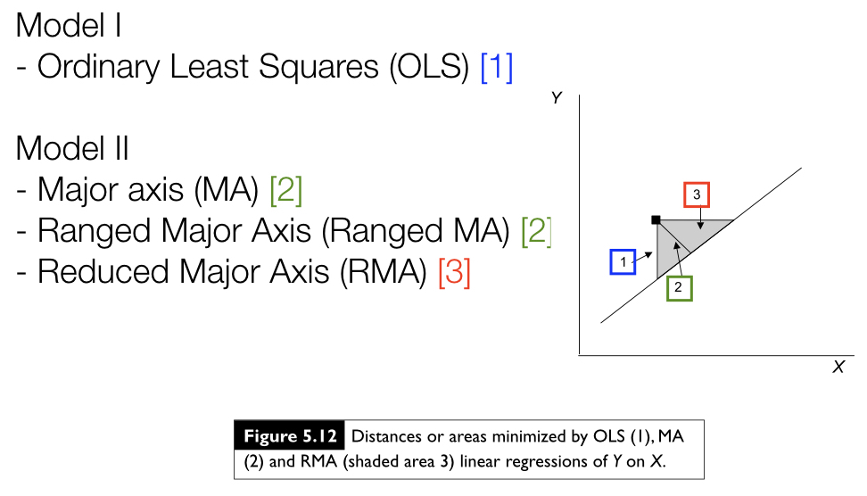
```

## Different Types of Regression | Model 1 and Model 2

```{r, echo=FALSE, out.width='90%', fig.asp=.75, fig.align='center'}
knitr::include_graphics("images/images_5a.002.jpeg")
```

## Different Types of Regression | Model 1 and Model 2

```{r, echo=FALSE, out.width='90%', fig.asp=.75, fig.align='center'}
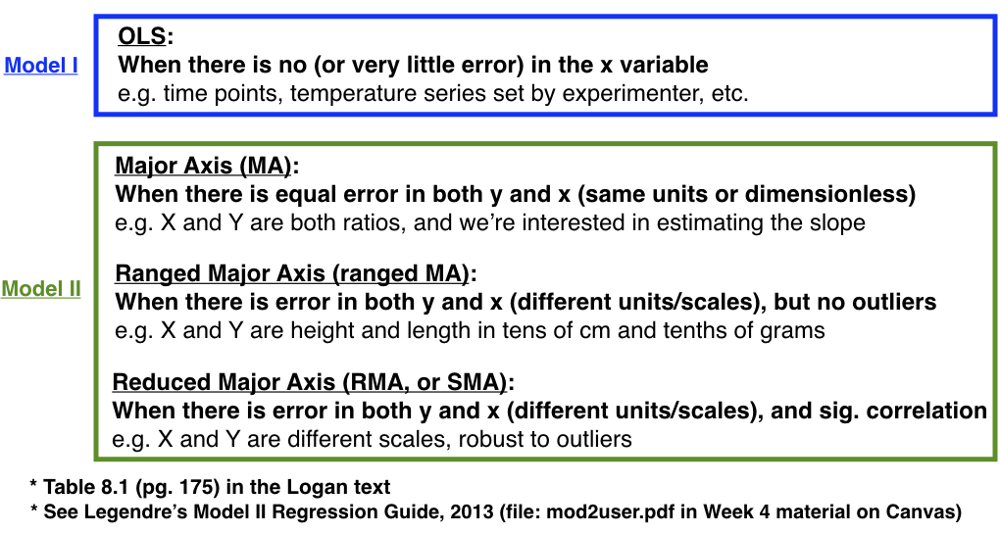
```

## Fitting more complicated models

```{r, echo=FALSE, out.width='90%', fig.asp=.75, fig.align='center'}
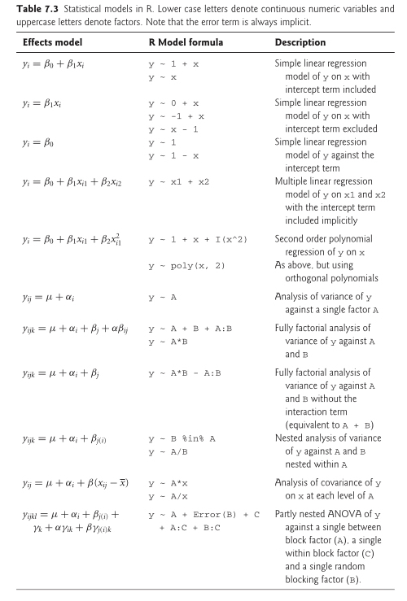
```


----------

## Smoothers and local regression {.smaller}

- **running medians** (or less robust running means) generate predicted values that are the medians of the responses in the bands surrounding each observation.
- **loess and lowesse** (locally weighted scatterplot smoothing) - fit least squares regression lines to successive subsets of the observations weighted according to their distance from the target observation and thus depict changes in the trends throughout the data cloud.
- **kernel smoothers** - new smoothed y-values are computed as the weighted averages of points within a defined window (bandwidth) or neighbourhood of the original x-values. Hence the bandwidth depends on the scale of the x-axis. Weightings are determined by the type of kernel smoother specified, and for. Nevertheless, the larger the window, the greater the degree of smoothing.
- **splines** - join together a series of polynomial fits that have been generated after the entire data cloud is split up into a number of smaller windows, the widths of which determine the smoothness of the resulting piecewise polynomial.

## R INTERLUDE | Model I and II regression {.smaller}

```{r, echo=TRUE, eval=FALSE}
x <- zfish$SL
y <- zfish$Weight

size_lm <- lm(y~x)
summary(size_lm)

plot(y~x, col = "blue")
abline(size_lm, col = "red")
```

Note that when we run the `lm()` function we use Model I regression. Is this appropriate?

## R INTERLUDE | Model I and II regression {.smaller}

```{r, echo=TRUE, eval=FALSE}
install.packages(“lmodel2”)
library(lmodel2)

size_lm_ModII <- lmodel2(y ~ x)
size_lm_ModII

abline(a=0.1912797, b=0.1097880, lty=2)
```

You should have generated OLS, MA, and SMA regression models, and the last plots SMA line from parameter estimates

## R INTERLUDE | Model I and II regression {.smaller}

- Say you measured green fluorescent protein abundance in cell culture across several key, carefully controlled temperatures.

- You ultimately want to know whether protein expression changes as a function of temperature in your experiment.

- Read in the gfp_temp.tsv data and perform a regression analysis.

- Address the following questions
    - Which is X and which is Y? 
    - Are residual assumptions met?
    - What model of regression should we use in this case and why?
   -  What is our decision regarding our null hypothesis of no relationship? 

# How to present your statistical results

## Style of a results section {.flexbox .vcenter}

- Write the text of the Results section concisely and objectively. 
- The passive voice will likely dominate here, but use the active voice as much as possible. 
- Use the past tense. 
- Avoid repetitive paragraph structures. Do not interpret the data here.

## Function of a results section {.flexbox .vcenter}

- The function is to objectively present your key results, without interpretation, in an orderly and logical sequence using both text and illustrative materials (Tables and Figures). 

- The results section always begins with text, reporting the key results and referring to figures and tables as you proceed. 

- The text of the Results section should be crafted to follow this sequence and highlight the evidence needed to answer the questions/hypotheses you investigated. 

- Important negative results should be reported, too. Authors usually write the text of the results section based upon the sequence of Tables and Figures.

## Summaries of the statistical analyses {.smaller .flexbox .vcenter}

May appear either in the text (usually parenthetically) or in the relevant Tables or Figures (in the legend or as footnotes to the Table or Figure). Each Table and Figure must be referenced in the text portion of the results, and you must tell the reader what the key result(s) is that each Table or Figure conveys.

- Tables and Figures are assigned numbers separately and in the sequence that you will refer to them from the text.
    - The first Table you refer to is Table 1, the next Table 2 and so forth.
    - Similarly, the first Figure is Figure 1, the next Figure 2, etc.

- Each Table or Figure must include a brief description of the results being presented and other necessary information in a legend.
    - Table legends go above the Table; tables are read from top to bottom.
    - Figure legends go below the figure; figures are usually viewed from bottom to top.

- When referring to a Figure from the text, "Figure" is abbreviated as Fig.,e.g., (Fig. 1. Table is never abbreviated, e.g., Table 1.

## Example {.flexbox .vcenter}

For example, suppose you asked the question, "Is the average height of male students the same as female students in a pool of randomly selected Biology majors?"  You would first collect height data from large random samples of male and female students. You would then calculate the descriptive statistics for those samples (mean, SD, n, range, etc) and plot these numbers. Suppose you found that male Biology majors are, on average, 12.5 cm taller than female majors; this is the answer to the question. Notice that the outcome of a statistical analysis is not a key result, but rather an analytical tool that helps us understand what is our key result.

## Differences, directionality, and magnitude {.smaller .flexbox .vcenter}

- Report your results so as to provide as much information as possible to the reader about the nature of differences or relationships. 

- For example, if you are testing for differences among groups, and you find a significant difference, it is not sufficient to simply report that "groups A and B were significantly different". How are they different? How much are they different? 

- It is much more informative to say something like, "Group A individuals were 23% larger than those in Group B", or, "Group B pups gained weight at twice the rate of Group A pups." 

- Report the direction of differences (greater, larger, smaller, etc) and the magnitude of differences (% difference, how many times, etc.) whenever possible.

## Statistical results in text {.smaller .flexbox .vcenter}

- Statistical test summaries (test name, p-value) are usually reported parenthetically in conjunction with the biological results they support. This parenthetical reference should include the statistical test used, the value, degrees of freedom and the level of significance. 

- For example, if you found that the mean height of male Biology majors was significantly larger than that of female Biology majors, you might report this result (in blue) and your statistical conclusion (shown in red) as follows:

    - "Males (180.5 ± 5.1 cm; n=34) averaged 12.5 cm taller than females (168 ± 7.6 cm; n=34) in the pool of Biology majors (two-sample t-test, t = 5.78, 33 d.f., p < 0.001).”

- If the summary statistics are shown in a figure, the sentence above need not report them specifically, but must include a reference to the figure where they may be seen:

    - "Males averaged 12.5 cm taller than females in the pool of Biology majors (two-sample t-test, t = 5.78, 33 d.f., p < 0.001; Fig. 1)."

## Statistical results in text {.flexbox .vcenter}

- Always enter the appropriate units when reporting data or summary statistics.
    - for an individual value you would write, "the mean length was 10 cm", or, "the maximum time was 140 min."
    - When including a measure of variability, place the unit after the error value, e.g., "...was 10 ± 2.3 m".
    - Likewise place the unit after the last in a series of numbers all having the same unit. For example: "lengths of 5, 10, 15, and 20 m", or "no differences were observed after 2, 4, 6, or 8 min. of incubation".

# Thursday

# Non-Linear Regression

## Complex non-linear regression | one response and one predictor

```{r, echo=FALSE, out.width='90%', fig.asp=.75, fig.align='center'}
knitr::include_graphics("images/images_5b.002.jpeg")
```

## Complex non-linear regression | one response and one predictor{.smaller}

- power
- exponential
- polynomial

```{r, echo=FALSE, out.width='50%', fig.asp=.75, fig.align='center'}
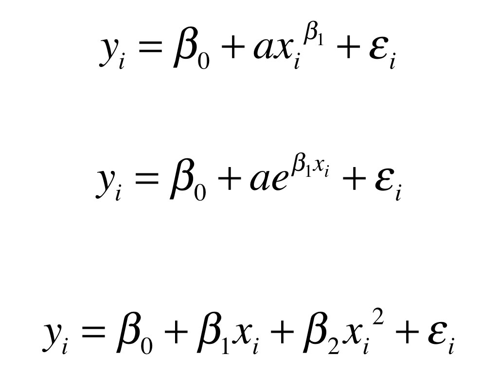
```

## Complex non-linear regression | one response and one predictor

```{r, echo=FALSE, out.width='80%', fig.asp=.75, fig.align='center'}
knitr::include_graphics("images/images_5b.003.jpeg")
```

# Multiple Linear Regression

## Multiple Linear Regression - Goals

- To develop a better predictive model than is possible from models based on single independent variables.

- To investigate the relative individual effects of each of the multiple independent variables above and beyond the effects of the other variables.

- The individual effects of each of the predictor variables on the response variable can be depicted by single partial regression lines. 

- The slope of any single partial regression line (partial regression slope) thereby represents the rate of change or effect of that specific predictor variable (holding all the other predictor variables constant to their respective mean values) on the response variable.

## Multiple Linear Regression | Additive and multiplicative models of 2 or more predictors

Additive model
$$y_i = \beta_0 + \beta_1x_{i1} + \beta_2x_{i2} + ... + B_jx_{ij} + \epsilon_i$$

Multiplicative model (with two predictors)
$$y_i = \beta_0 + \beta_1x_{i1} + \beta_2x_{i2} + B_3x_{i1}x_{i2} + \epsilon_i$$

## Multiple Liner Regression | Additive and multiplicative models {.smaller}

```{r, echo=FALSE, out.width='100%', fig.asp=.75, fig.align='center'}
knitr::include_graphics("images/images_5a.006.jpeg")
```

## R INTERLUDE | multiple regression with 2 predictor variables {.smaller}

- Read in the RNAseq_lip.tsv and examine the continuous variables.
- We are interested in whether Gene01 and/or Gene02 expression levels influence lipid content.
- First plot $Y$ vs $Gene01$, $Y$ vs $Gene02$, then set up and test a multiplicative model.
- What are the parameter estimates of interest in this case?
- What are the outcomes from our hypothesis tests?

```{r, echo=TRUE, eval=FALSE}
RNAseq_Data <- read.table(‘RNAseq_lip.tsv', header=T, sep=‘\t')

y <- RNAseq_Data$Lipid_Conc
g1 <- RNAseq_Data$Gene01
g2 <- RNAseq_Data$Gene02
g3 <- RNAseq_Data$Gene03
g4 <- RNAseq_Data$Gene04

Mult_lm <- lm(y ~ g1*g2)
summary(Mult_lm)
```
## R INTERLUDE | multiple regression with 2 predictor variables {.smaller}

- Now get rid of the interaction term, and set up a purely additive model
- Did any of our estimates change? Why?
- Did the degrees of freedom change? Why? 

```{r, echo=TRUE, eval=FALSE}
Add_lm <- lm(y ~ g1+g2)
summary(Add_lm)
```

- Finally try different combinations of genes

## R INTERLUDE | Now see if a polynomial fits better {.smaller}

```{r, echo=TRUE, eval=FALSE}
RNAseq_Data <- read.table(‘RNAseq_lip.tsv', header=T, sep=‘\t')

RNAseq_lm_linear <- lm(y ~ g4)
summary (RNAseq_lm_linear)
influence.measures(RNAseq_lm_linear)

RNAseq_lm_poly <- lm(y ~ poly(g4, 2))
summary (RNAseq_lm_poly)

lines(y, fitted(lm(y ~ poly(g4, 2))), type="l", col="blue")
influence.measures(RNAseq_lm_poly)
```

- Try this for different genes
- Try this for different degree polynomials


## Multiple linear regression assumptions

- linearity
- normality
- homogeneity of variance
- **multi-collinearity** - a predictor variable must not be correlated to the combination of other predictor variables.

## checking for multi-collinearity

```{r, echo=FALSE, out.width='70%', fig.asp=.75, fig.align='center'}
knitr::include_graphics("images/images_5b.001.jpeg")
```

```{r, echo=TRUE, eval=FALSE}
library(car)
scatterplotMatrix(~var1+var2+var3, diag=”boxplot”)
```

## R INTERLUDE | multiple regression with three variables {.smaller .flexbox .vcenter}

```{r, echo=TRUE, eval=FALSE}
RNAseq3_lm <- lm(y ~ g1+g2+g3)
summary(RNAseq3_lm)
plot(RNAseq3_lm)
```


```{r, echo=TRUE, eval=FALSE}
library(car)
scatterplotMatrix(~g1+g2+g3, diag=”boxplot”)
scatterplotMatrix(~y+g1+g2+g3, diag=”boxplot”)
```

To get tolerance (1-$R^2$) calculations

```{r, echo=TRUE, eval=FALSE}
1/vif(lm(y ~ g1 + g2 + g3))
```

- Is there any evidence for multi-collinearity?
- Try running a simple linear regression for y and Gene03 (y ~ g3).
- What is the slope estimate for Gene03, and how does it compare to the partial slope estimate above?

## Model selection

```{r, echo=FALSE, out.width='90%', fig.asp=.75, fig.align='center'}
knitr::include_graphics("images/images_5b.004.jpeg")
```

## Model selection | the problems

- How to decide the complexity of polynomial: straight line regression,  quadratic, cubic, .... 

- Which variables to keep/ discard when building a multiple regression  model? 

- Selecting from candidate models representing different biological  processes. 

## Model selection | a beetle example

```{r, echo=FALSE, out.width='80%', fig.asp=.75, fig.align='center'}
knitr::include_graphics("images/images_5b.005.jpeg")
```

## Start with linear regression

```{r, echo=FALSE, out.width='80%', fig.asp=.75, fig.align='center'}
knitr::include_graphics("images/images_5b.006.jpeg")
```

## Quadratic (2nd degree) polynomial?

```{r, echo=FALSE, out.width='80%', fig.asp=.75, fig.align='center'}
knitr::include_graphics("images/images_5b.007.jpeg")
```

## Quadratic (3rd degree) polynomial?

```{r, echo=FALSE, out.width='80%', fig.asp=.75, fig.align='center'}
knitr::include_graphics("images/images_5b.008.jpeg")
```

## A polynomial of degree 5?

```{r, echo=FALSE, out.width='80%', fig.asp=.75, fig.align='center'}
knitr::include_graphics("images/images_5b.009.jpeg")
```

## A polynomial of degree 10?

```{r, echo=FALSE, out.width='80%', fig.asp=.75, fig.align='center'}
knitr::include_graphics("images/images_5b.010.jpeg")
```

## The problem with this approach
- The log likelihood of the model increases with the number of parameters
- So does $r^2$
- Isn't this good - the best fit to the data?

```{r, echo=FALSE, out.width='70%', fig.asp=.75, fig.align='center'}
knitr::include_graphics("images/images_5b.011.jpeg")
```

## The problem with this approach

- Does it violate a principle of parsimony   
- Fit no more parameters than  is necessary. 
- If two or more models fit the  data almost equally well, prefer the simpler model. 
 
> "models should be pared down until they are minimal and adequate”        

Crawley 2007, p325 

## Let's consider our objectives

- Model should predicts well
 
- Approximates true relationship between the variables
 
- Be able to evaluate a wider array of models. Not only or more  “reduced” models.  
  
- NOTE: Reduced vs. full models are referred to as nested models. Non-subset models are called non-nested models. 

- Don’t confuse with nested experimental designs or  sampling designs. 

## How do we accomplish these goals? {.flexbox .vcenter}

How to accomplish these goals 
  To answer this, we need
 
- A criterion to compare models:  
    - Mallow’s Cp 
    - AIC (Akaike’s Information Criterion) 
    - BIC (Bayesian Information Criterion)

- A strategy for searching the candidate models

## How do we accomplish these goals?

- How to decide the complexity of polynomial: straight line regression,  quadratic, cubic, .... 

- Which variables to keep/ discard when building a multiple regression  model? 

- Selecting from candidate models representing different biological  processes. 

## {.smaller}

- **MSresiduals**- represents the mean amount of variation unexplained by the model, and therefore the lowest value indicates the best fit.

- **Adjusted $r^2$** - (the proportion of mean amount of variation in response variable explained by the model) is calculated as adj. r2 which is adjusted for both sample size and the number of terms. Larger values indicate better fit.

- **Mallow’s Cp** - is an index resulting from the comparison of the specific model to a model that contain all the possible terms. Models with the lowest value and/or values closest to
their respective p (the number of model terms, including the y-intercept) indicate best fit. 

- **Akaike Information Criteria (AIC)** - there are several different versions of AIC, each of which adds a different constant designed to penalize according to the number of parameters and sample size to a likelihood function to produce a relative measure of the information content of a model. Smaller values indicate more parsimonious models. As a rule of thumb, if the difference between two AIC values (delta AIC) is greater than 2, the lower AIC is a significant improvement in parsimony.

- **Schwarz or Bayesian Information Criteria (BIC or SIC)** - is outwardly similar to AIC. The
constant added to the likelihood function penalizes models with more predictor terms more heavily (and thus select more simple models) than AIC. It is for this reason that BIC is favored by many researchers.

## Mallow's Cp {.flexbox .vcenter}

- Frequently used in multiple regression
- Test case: "all subsets regression"
- Strategy: Test all possible models and selection the one with the smallest Cp
- `leaps` package in R. Smart search among a potentially huge number of models
- Typically we are modeling observational data. Experimental data often allows smart use of variables
- Investigating all possible subsets of variables = only intelligent decision is choice of variables ....

## Mallow's Cp

```{r, echo=FALSE, out.width='90%', fig.asp=.75, fig.align='center'}
knitr::include_graphics("images/images_5b.012.jpeg")
```

## Mallow's Cp {.flexbox .vcenter}

**For prediction**: All models with Cp < p predict about equally well.   Don’t get carried away with a “best”.  
 
**For explanation**: If numerous equally well fitting models fit the data, it is difficult to deduce  which predictor “explains” the response. 
 
**General caveat**: “regression is not causation”. Experiment needed to get to causal explanation. 


## Goals for this week

# ANOVA

## ANOVA {.flexbox .vcenter}

- Stands for **AN**alysis **o**f **VA**riance
- Core statistical procedure in biology
- Developed by R.A. Fisher in the early 20th Century
- The core idea is to ask how much variation exists within vs. among groups
- ANOVAs are linear models that have **categorical predictor** and **continuous response** variables
- The categorical predictors are often called **factors**, and can have two or more **levels** (important to specify in R)
- Each factor will have a **hypothesis test**
- The levels of each factor may also need to be tested

## ANOVA | Let's start with an example

- Percent time that male mice experiencing discomfort spent “stretching”.
- Data are from an experiment in which mice experiencing mild discomfort (result of injection of 0.9% acetic acid into the abdomen) were kept in:
    - isolation 
    - with a companion mouse not injected or 
    - with a companion mouse also injected and exhibiting “stretching” behaviors associated with discomfort 
- The results suggest that mice stretch the most when a companion mouse is also experiencing mild discomfort. Mice experiencing pain appear to “empathize” with co-housed mice also in pain.

From Langford, D. J.,et al. 2006. Science 312: 1967-1970

## ANOVA | Let's start with an example {.flexbox .vcenter}

In words:
  
**stretching = intercept + treatment**
  
</br > 
</br >
</br >
</br >
</br >
- The model statement includes a response variable, a constant, and an explanatory variable.  
- The only difference with regression is that here the explanatory variable is categorical.

## ANOVA | Let's start with an example {.vcenter .flexbox}

```{r, echo=FALSE, out.width='80%', fig.asp=.75, fig.align='center'}
knitr::include_graphics("images/images_5b.014.jpeg")
```

## ANOVA {.vcenter .flexbox}

```{r, echo=FALSE, out.width='100%', fig.asp=.75, fig.align='center'}
knitr::include_graphics("images/images_5b.015.jpeg")
```

## ANOVA | Conceptually similar to regression {.vcenter .flexbox}

```{r, echo=FALSE, out.width='80%', fig.asp=.75, fig.align='center'}
knitr::include_graphics("images/images_5b.016.jpeg")
```

## ANOVA | Statistical results table {.vcenter .flexbox}

```{r, echo=FALSE, out.width='100%', fig.asp=.75, fig.align='center'}
knitr::include_graphics("images/images_5b.017.jpeg")
```

## ANOVA | F-ratio calculation {.vcenter .flexbox}

```{r, echo=FALSE, out.width='100%', fig.asp=.75, fig.align='center'}
knitr::include_graphics("images/images_5b.018.jpeg")
```

## ANOVA | F-ratio calculation {.vcenter .flexbox}

```{r, echo=FALSE, out.width='90%', fig.asp=.75, fig.align='center'}
knitr::include_graphics("images/images_5b.019.jpeg")
```

## R INTERLUDE | One way ANOVA {.smaller}

- Again, use the RNAseq_lip.tsv data again.
- Let’s test for an effect of Population on Gene01 expression levels
- First, let’s look at how the data are distributed

```{r, echo=TRUE, eval=FALSE}
RNAseq_Data <- read.table('RNAseq_lip.tsv', header=T, sep='\t')
g1 <- RNAseq_Data$Gene01
Pop <- RNAseq_Data$Population
boxplot(g1~Pop, col=c("blue","green"))
```

Or, to plot all points:

```{r, echo=TRUE, eval=FALSE}
stripchart(g1~Pop, vertical=T, pch=19, col=c("blue","green"), 
           at=c(1.25,1.75), method="jitter", jitter=0.05)
Pop_Anova <- aov(g1 ~ Pop)
summary(Pop_Anova)
```

## R INTERLUDE | One way ANOVA {.smaller .vcenter .flexbox}

```{r, echo=FALSE, out.width='90%', fig.asp=.75, fig.align='center'}
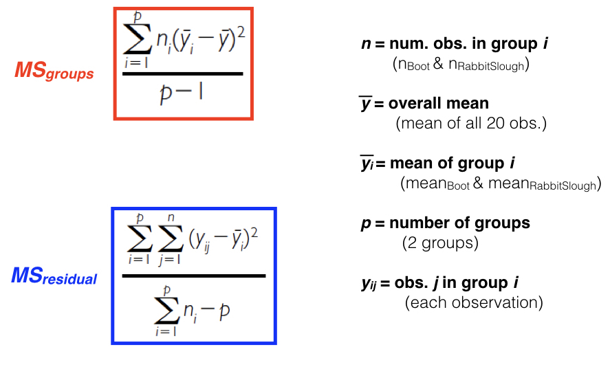
```

## ANOVA | One or more predictor variables

- One-way ANOVAs just have a single factor
- Multi-factor ANOVAs 
    - Factorial - two or more factors and their interactions
    - Nested - the levels of one factor are contained within another level
    - The models can be quite complex
- ANOVAs use an F-statistic to test factors in a model
    - Ratio of two variances (numerator and denominator)
    - The numerator and denominator d.f. need to be included (e.g. $F_{1, 34} = 29.43$)
- Determining the appropriate test ratios for complex ANOVAs takes some work

## ANOVA | Assumptions 

- Normally distributed groups
    - robust to non-normality if equal variances and sample sizes
- Equal variances across groups
    - okay if largest-to-smallest variance ratio < 3:1
    - problematic if there is a mean-variance relationship among groups
- Observations in a group are independent
    - randomly selected
    - don’t confound group with another factor

# Different ways to include factors in models

## ANOVA | Fixed effects of factors
- Groups are predetermined, of direct interest, repeatable. 
- For example:
    - medical treatments in a clinical trial 
    - predetermined doses of a toxin
    - age groups in a population
    - habitat, season, etc.
- Any conclusions reached in the study about differences among groups can be applied only to the groups included in the study. 
- The results cannot be generalized to other treatments, habitats, etc. not included in the study.

## ANOVA | Random effects of factors
- Measurements that come in groups. A group can be:
    - a family made up of siblings 
    - a subject measured repeatedly
    - a transect of quadrats in a sampling survey
    - a block of an experiment done at a given time
- Groups are assumed to be randomly sampled from a population of groups. 
- Therefore, conclusions reached about groups can be generalized to the population of groups. 
- With random effects, the variance among groups is the main quantity of interest, not the specific group attributes.

## ANOVA | Random effects of factors {.smaller}
- Below are cases where you are likely to treat factors as random effects
- Whenever your sampling design is nested
    - quadrats within transects 
    - transects within woodlots 
    - woodlots within districts
- Whenever you divide up plots and apply separate treatments to subplots
- Whenever your replicates are grouped spatially or temporally
    - in blocks
    - in batches
- Whenever you take measurements on related individuals
- Whenever you measure subjects or other sampling units repeatedly

## ANOVA | Random effects of factors {.smaller .vcenter .flexbox}

```{r, echo=FALSE, out.width='90%', fig.asp=.75, fig.align='center'}
knitr::include_graphics("images/images_6a.002.jpeg")
```

## ANOVA | Random effects - test your understanding

- Factor is sex (Male vs. Female)
- Factor is fish tank (10 tanks in an experiment)
- Factor is family (measure multiple sibs per family)
- Factor is temperature (10 arbitrary temps over natural range)

## ANOVA | Caution about fixed vs. random effects

- Using fixed vs. random effects changes the way that statistical tests are performed in ANOVA
- Most statistical packages assume that all factors are fixed unless you instruct it otherwise
- Designating factors as random takes extra work and probably a read of the manual
- In `R`, `lm` assumes that all effects are fixed
- For random effects, use `lme` instead (part of the nlme package)

# Means test to compare levels of a factor

## Means for greater than two factor levels? {.smaller}

- The F-ratio test for a single-factor ANOVA tests for any difference among groups. 
- If we want to understand specific differences, we need further “contrasts”.
- Unplanned comparisons (post hoc):
    - Multiple comparisons carried out after the results are obtained.
    - Used to find where the differences lie (which means differ from which other means)
    - Comparisons require protection for inflated Type 1 error rates:
        - Tukey tests: compare all pairs of means and control for multiple comparisons
        - Scheffé contrasts: compare all combinations of means
- Planned comparisons (a priori):
    - Comparisons between group means that were decided when the experiment was designed (not after the data were in)
    - Must be few in number to avoid inflating Type 1 error rates

## Planned (a priori) contrasts

- A well planned experiment often dictates which comparison of means are of most interest, whereas other comparisons are of no interest.
- By restricting the comparisons to just the ones of interest, researchers can mitigate the multiple testing problem associated with post-hoc tests.
- Some statisticians argue that, in fact, planned comparisons allow researchers to avoid adjusting p-values all together because each test is therefore unique.
- Contrasts can also allow more complicated tests of the relationships among means.
- Coding a priori contrasts in R is quite easy and just depends upon writing the right series of coefficient contrasts.

## Planned (a priori) contrasts {.flexbox .vcenter}

```{r, echo=FALSE, out.width='90%', fig.asp=.75, fig.align='center'}
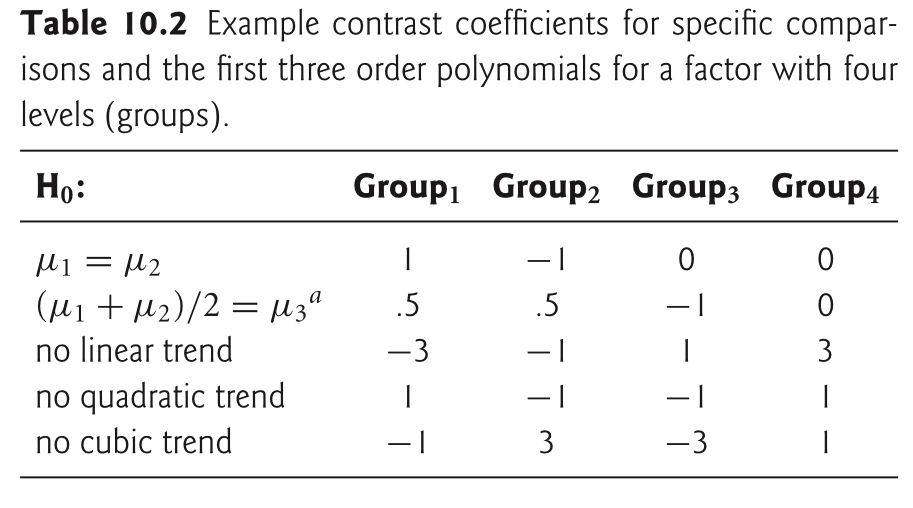
```

## Understand the coefficients table {.flexbox .vcenter}

```{r, echo=FALSE, out.width='90%', fig.asp=.75, fig.align='center'}
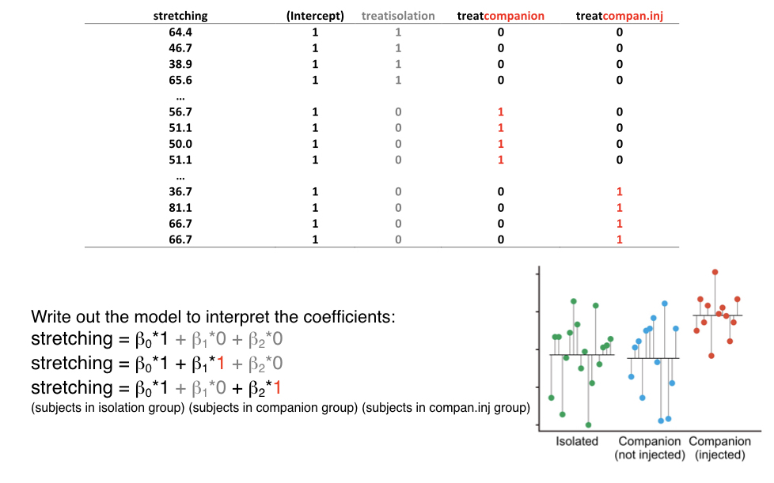
```

## R INTERLUDE | Planned contrasts {.smaller}

- Take the RNAseq data you've examined before and create a new four level genotype by combining genotype and microbiota treatment into a single variable
- Think about how to do this using `dplyr` functions.

```{r, eval=FALSE, echo=TRUE}
RNAseq_Data <- read.table("RNAseq.tsv", header=T, sep='')

x <- RNAseq_Data$categorical_var
y <- RNAseq_Data$continuous_var1
z <- RNAseq_Data$continuous_var2
```

- Set up the a priori contrasts specifically testing one group mean against another
- These are just examples - you should figure out the logic of the contrasts

```{r, eval=FALSE, echo=TRUE}
contrasts(x) <- cbind(c(0, 1, 0, -1), c(2, -1, 0, -1), c(-1, -1, 3, -1))
```

- Confirm that the contrasts are orthogonal

```{r, eval=FALSE, echo=TRUE}
round(crossprod(contrasts(x)), 2)
```

## R INTERLUDE | Planned contrasts {.smaller}

- Define the contrast labels

```{r, eval=FALSE, echo=TRUE}
rnaseq_data_list <- list(x = list(‘xxx vs. xxx’ = 1, ‘xxx vs. xxx’ = 2, ‘xxx vs. xxx’ = 3))
```

- Then fit the fixed effect model

```{r, eval=FALSE, echo=TRUE}
RNAseq_aov_fixed <- aov(y ~ x)
plot(RNAseq_aov_fixed)
boxplot(y ~ x)
summary(RNAseq_aov_fixed, split = rnaseq_data_list)
```

## R INTERLUDE | Unplanned contrasts {.smaller}
- Remember that this is when you had no hypotheses of differences in means in advance
- Read in the perchlorate data from Week 3
- Let’s assess the effects of the 4 perchlorate levels on T4
- Which perchlorate levels differ in their effect on T4?

```{r, eval=FALSE, echo=TRUE}
perc <- read.table('perchlorate_data.tsv', header=T, sep='\t')

x <- perc$Perchlorate_Level
y <- log10(perc$T4_Hormone_Level)

MyANOVA <- aov(y ~ x)
summary (MyANOVA)
boxplot(y ~ x)

install.packages("multcomp")
library(multcomp)

summary(glht(MyANOVA, linfct = mcp(x = "Tukey")))
```


## Goals for this week


# Design principles for planning a good experiment

## What is an experimental study?

- In an experimental study the researcher assigns treatments to units
- In an observational study nature does the assigning of treatments to units
- The crucial advantage of experiments derives from the random assignment of treatments to units
- Random assignment, or randomization, minimizes the influence of confounding variables


## Mount Everest example {.vcenter .flexbox}

Survival of climbers of Mount Everest is higher for individuals taking supplemental oxygen than those who don’t.  
  
**Why?**

## Mount Everest example

- One possibility is that supplemental oxygen (explanatory variable) really does cause higher survival (response variable).
- The other is that the two variables are associated because other variables affect both supplemental oxygen and survival. 
- Use of supplemental oxygen might be a benign indicator of a greater overall preparedness of the climbers that use it.
- Variables (like preparedness) that distort the causal relationship between the measured variables of interest (oxygen use and survival) are called **confounding variables**
- They are correlated with the variable of interest, and therefore preventing a decision about cause and effect.
- With random assignment, no confounding variables will be associated with treatment except by chance.

## Clinical Trials

- The gold standard of experimental designs is the **clinical trial** 
- Experimental design in all areas of biology have been informed by procedures used in clinical trials
- A clinical trial is an experimental study in which two or more treatments are assigned to human subjects
- The design of clinical trials has been refined because the cost of making a mistake with human subjects is so high
- Experiments on nonhuman subjects are simply called “laboratory experiments”or “field experiments”

## Example of a clinical trial {.smaller}

- Transmission of the HIV-1 virus via sex workers contributes to the rapid spread of AIDS in Africa
- The spermicide nonoxynol-9 had shown *in vitro* activity against HIV-1, which motivated a clinical trial by van Damme et al. (2002).
- They tested whether a vaginal gel containing the chemical would reduce the risk of acquiring the disease by female sex workers.
- Data were gathered on a volunteer sample of 765 HIV-free sex-workers in six clinics in Asia and Africa.
- Two gel treatments were assigned randomly to women at each clinic. 
- One gel contained nonoxynol-9 and the other contained a placebo.
- Neither the subjects nor the researchers making observations at the clinics knew who received the treatment and who got the placebo.

## Example of a clinical trial {.flexbox .vcenter}

```{r, echo=FALSE, out.width='90%', fig.asp=.75, fig.align='center'}
knitr::include_graphics("images/images_6a.005.jpeg")
```

## Design components of a clinical trial {.smaller}

The goal of experimental design is to eliminate bias and to reduce sampling error when estimating and testing effects of one variable on another.

- To reduce bias, the experiment included:
    - **Simultaneous control group**: study included both the treatment of interest and a control group (the women receiving the placebo).
    - **Randomization**: treatments were randomly assigned to women at each clinic.
    - **Blinding**: neither the subjects nor the clinicians knew which women were assigned which treatment.

- To reduce the effects of sampling error, the experiment included:
    - **Replication**: study was carried out on multiple independent subjects.
    - **Balance**: number of women was nearly equal in the two groups at every clinic.
    - **Blocking**: subjects were grouped according to the clinic they attended, yielding multiple repetitions of the same experiment in different settings (“blocks”).

## Simultaneous control group {.smaller}

- In clinical trials either a placebo or the currently accepted treatment should be provided.
- In experiments requiring intrusive methods to administer treatment, such as 
    - injections
    - surgery
    - restraint 
    - confinement
- the control subjects should be perturbed in the same way as the other subjects, except for the treatment itself, as far as ethical considerations permit. 
- The “sham operation”, in which surgery is carried out without the experimental treatment itself, is an example.
- In field experiments, applying a treatment of interest may physically disturb the plots receiving it and the surrounding areas, perhaps by trampling the ground by the researchers. 
- Ideally, the same disturbance should be applied to the control plots.

## Randomization

- The researcher should randomize assignment of treatments to units or subjects
- Chance rather than conscious or unconscious decision determines which units end up receiving the treatment and which the control
- A completely randomized design is one in which treatments are assigned to all units by randomization
- Randomization breaks the association between possible confounding variables and the explanatory variable
- Randomization doesn't eliminate the variation contributed by confounding variables, only their correlation with treatment
- Randomization ensures that variation from confounding variables is similar between the different treatment groups.

## Randomization

- Randomization should be carried out using a random process:
    - List all n subjects, one per row, in a computer spreadsheet.
    - Use the computer to give each individual a random number.
    - Assign treatment A to those subjects receiving the lowest numbers and treatment B to those with the highest numbers.
- Other ways of assigning treatments to subjects are almost always inferior because they do not eliminate the effects of confounding variables.
- “Haphazard” assignment, in which the researcher chooses a treatment while trying to make it random, has repeatedly been shown to be non-random and prone to bias.

## Blinding

- Blinding is the process of concealing information from participants (sometimes including researchers) about which subjects receive which treatment.
- Blinding prevents subjects and researchers from changing their behavior, consciously or unconsciously, as a result of knowing which treatment they were receiving or administering.
- For example, studies showing that acupuncture has a significant effect on back pain are limited to those without blinding (Ernst and White 1998).

## Blinding {.smaller}

- In a single-blind experiment, the subjects are unaware of the treatment that they have been assigned. 
- Treatments must be indistinguishable to subjects, which prevents them from responding differently according to knowledge of treatment.
- Blinding can also be a concern in non-human studies where animals respond to stimuli
- In a double-blind experiment the researchers administering the treatments and measuring the response are also unaware of which subjects are receiving which treatments
    - Researchers sometimes have pet hypotheses, and they might treat experimental subjects in different ways depending on their hopes for the outcome
    - Many response variables are difficult to measure and require some subjective interpretation, which makes the results prone to a bias
    - Researchers are naturally more interested in the treated subjects than the control subjects, and this increased attention can itself result in improved response

## Blinding

- Reviews of medical studies have revealed that studies carried out without double- blinding exaggerated treatment effects by 16% on average compared with studies carried out with double-blinding (Jüni et al. 2001).
- Experiments on non–human subjects are also prone to bias from lack of blinding.
- Bebarta et al.(2003) reviewed 290 two-treatment experiments carried out on animals or on cell lines. The odds of detecting a positive effect of treatment were more than threefold higher in studies without blinding than in studies with blinding.
- Blinding can be incorporated into experiments on nonhuman subjects using coded tags that identify the subject to a “blind” observer without revealing the treatment (and who measures units from different treatments in random order).

## Replication

- The goal of experiments is to estimate and test treatment effects against the background of variation between individuals (“noise”) caused by other variables
- One way to reduce noise is to make the experimental conditions constant 
- In field experiments, however, highly constant experimental conditions might not be feasible nor desirable 
- By limiting the conditions of an experiment, we also limit the generality of the results
- Another way to make treatment effects stand out is to include extreme treatments and to replicate the data.

## Replication {.smaller}

- Replication is the assignment of each treatment to multiple, independent experimental units.
- Without replication, we would not know whether response differences were due to the treatments or just chance differences between the treatments caused by other factors.
- Studies that use more units (i.e. that have larger sample sizes) will have smaller standard errors and a higher probability of getting the correct answer from a hypothesis test.
- Larger samples mean more information, and more information means better estimates and more powerful tests.
- Replication is not about the number of plants or animals used, but the number of independent units in the experiment. An “experimental unit” is the independent unit to which treatments are assigned.
- The figure shows three experimental designs used to compare plant growth under two temperature treatments (indicated by the shading of the pots). The first two designs are un-replicated.

## Pseudoreplication {.smaller}

```{r, echo=FALSE, out.width='90%', fig.asp=.75, fig.align='center'}
knitr::include_graphics("images/images_6a.006.jpeg")
```

## Balance {.smaller}

- A study design is balanced if all treatments have the same sample size. 
- Conversely, a design is unbalanced if there are unequal sample sizes between treatments. 
- Balance is a second way to reduce the influence of sampling error on estimation and hypothesis testing. 
- To appreciate this, look again at the equation for the standard error of the difference between two treatment means.

```{r, echo=FALSE, out.width='80%', fig.asp=.75, fig.align='center'}
knitr::include_graphics("images/images_6a.007.jpeg")
```

- For a fixed total number of experimental units, n1 + n2, the standard error is smallest when n1 and n2 are equal.
- Balance has other benefits. For example, ANOVA is more robust to departures from the assumption of equal variances when designs are balanced or nearly so.

## Blocking

- Blocking is the grouping of experimental units that have similar properties. Within each block, treatments are randomly assigned to experimental units. 
- Blocking essentially repeats the same, completely randomized experiment multiple times, once for each block. 
- Differences between treatments are only evaluated within blocks, and in this way the component of variation arising from differences between blocks is discarded. 

```{r, echo=FALSE, out.width='80%', fig.asp=.75, fig.align='center'}
knitr::include_graphics("images/images_6a.008.jpeg")
```

## Blocking | Paired designs

- For example, consider the design choices for a two-treatment experiment to investigate the effect of clear cutting on salamander density. 
- In the completely randomized (“two-sample”) design we take a random sample of forest plots from the population and then randomly assign each plot to either the clear-cut treatment or the no clear-cut treatment. 
- In the paired design we take a random sample of forest plots and clear-cut a randomly chosen half of each plot, leaving the other half untouched. 

## Blocking | Paired designs

- In the paired design, measurements on adjacent plot-halves are not independent. This is because they are likely to be similar in soil, water, sunlight, and other conditions that affect the number of salamanders. 
- As a result, we must analyze paired data differently than when every plot is independent of all the others, as in the case of the two-sample design. 
- Paired design is usually more powerful than completely randomized design because it controls for a lot of the extraneous variation between plots or sampling units that sometimes obscures the effects we are looking for. 

## Blocking | Paired designs {.smaller}

```{r, echo=FALSE, out.width='90%', fig.asp=.75, fig.align='center'}
knitr::include_graphics("images/images_6a.009.jpeg")
```

## Blocking | Randomized complete block design

- RCB design is analogous to the paired design, but may have more than two treatments. Each treatment is applied once to every block. 
- As in the paired design, treatment effects in a randomized block design are measured by differences between treatments exclusively within blocks. 
- By accounting for some sources of sampling variation blocking can make differences between treatments stand out. 
- Blocking is worthwhile if units within blocks are relatively homogeneous, apart from treatment effects, and units belonging to different blocks vary because of environmental or other differences.


## What if you can't do experiments?

- Experimental studies are not always feasible, in which case we must fall back upon observational studies.
- The best observational studies incorporate as many of the features of good experimental design as possible to minimize bias (e.g., blinding) and the impact of sampling error (e.g., replication, balance, blocking, and even extreme treatments) except for one: randomization.
- Randomization is out of the question, because in an observational study the researcher does not assign treatments to subjects. Instead, the subjects come as they are.
- Two strategies are used to limit the effects of confounding variables on a difference between treatments in a controlled observational study: matching; and adjusting for known confounding variables (covariates).


# Statistical power

## Recall type 1 and type 2 errors {.flexbox .vcenter}

```{r, echo=FALSE, out.width='90%', fig.asp=.75, fig.align='center'}
knitr::include_graphics("images/images_6b.001.jpeg")
```

## Power | underappreciated aspect of experimental design

- Type 1 error - $\alpha$ - incorrectly rejecting a true null hypothesis
    - This is saying that there is an effect when there isn’t)
- Type 2 error - $\beta$ - incorrectly accepting a false null hypothesis
    - This is saying that there isn’t an effect when there is)
      
- Power is the probability of rejecting a false null hypothesis
- Mostly we shoot for a power of around 80%
- Power can be calculated *post hoc* or *a priori*

## Power | the things one needs to know

$$ Power \propto \frac{(ES)(\alpha)(\sqrt n)}{\sigma}$$

- Power is proportional to the combination of these parameters

    - **ES** -      effect size; how large is the change of interest?
    - **alpha** -  significance level (usually 0.05)
    - **n** -         sample size
    - **sigma** - standard deviation among experimental units within the same group.

## Power | what we usually want to know {.flexbox .vcenter}

 ```{r, echo=FALSE, out.width='90%', fig.asp=.75, fig.align='center'}
knitr::include_graphics("images/images_6b.002.jpeg")
```  

## Power | rough calculation
 
 ```{r, echo=FALSE, out.width='90%', fig.asp=.75, fig.align='center'}
knitr::include_graphics("images/images_6b.003.jpeg")
```   

## R INTERLUDE | Perform a one-way ANOVA with power

- Read in the perchlorate data again
- Perform an ANOVA to test Strain on T4_Hormone_Level, but log-transform (base 10) the T4 variable

```{r, eval=FALSE, echo=TRUE}
perc <- read.table('perchlorate_data.tsv', header=T, sep='\t')
x <- perc$Strain
y <- log10(perc$T4_Hormone_Level)

MyANOVA <- aov(y ~ x)
summary (MyANOVA)
boxplot(y ~ x)
```

## R INTERLUDE | Perform a one-way ANOVA with power
- Consider the parameters of this test related to power:
    - The per-group sample sizes
    - The standard deviation (use the higher within-group sd)
    - The effect size (|difference between means| / within-grp sd)

- For more complex ANOVA power calculations (>2 groups):
    - The total variance
    - The within-group variance (use the higher one)

## R INTERLUDE | post hoc and a priori power analyses

Based on your results, calculate the power for your ANOVA.

```{r, eval=FALSE, echo=TRUE }
   pwr.t2n.test(n1=xxx, n2=xxx, d=xxx, sig.level=.05, power=NULL)
```

Check out the functions in the ‘pwr’ library (Unnecessary in this case, but could use ANOVA version):

```{r, eval=FALSE, echo=TRUE}
   pwr.anova.test(k=2, n=190, f=0.25, sig.level=.05, power=NULL)
```

## R INTERLUDE | post hoc and a priori power analyses

- effect size approximations: 
    - f=0.1 (small)
    - f=0.25 (medium)
    - f=0.4 (large)
    
- see http://www.statmethods.net/stats/power.html

## R INTERLUDE | post hoc and a priori power analyses {.flexbox .vcenter}

- Let’s say you have to repeat the experiment, but your IACUC wants you to get by by using fewer fish.
- You want to be able to detect a minimum mean difference of 1.3 T4 units (about 0.114 on the log10 scale), at a power of 90%. 
- First, divide 0.114 by std.dev. of transformed WK values (the higher std. dev. of the two groups) to get a conservative “d”. 
- What kind of sample size for the WK group would you need???
- (Again use the pwr.t2n.test() function, but this time specify the WK sample size as the unknown parameter) 


## Goals for this week


# Multifactor ANOVA

## Multifactor ANOVA {.smaller}

- **Nested ANOVA** or nested design
    - factors might be hierarchical - in other words nested - within one another
    - The sources of variance are therefore hierarchical too
- The **factorial ANOVA** design is the most common experimental design used to investigate more than one treatment variable
    - In a factorial design every combination of treatments from two (or more) treatment variables is investigated.
    - The main purpose of a factorial design is to evaluate possible interactions between variables. 
    - An **interaction** between two explanatory variables means that the effect of one variable on the response depends on the state of a second variable.
    
## Multifactor ANOVA | Key difference between nested and factorial designs {.smaller}

- Nested designs are hierarchical
    - often contain sub-replicates that are random, uncontrolled, nuisance effects
    - but the nested factors can be of interest too
- Factorial designs are 
    - all pairwise combinations, 
    - and often involve all combinations of factor levels
    - when each factor is fixed interactions can be assessed
- Completely nested designs therefore have no interaction terms, whereas factorial designs do
- **Mixed models** can have a combination of fixed and random factors that are more complicated 

# Nested ANOVA

## Nested ANOVA | Walking stick example {.smaller}

- Example 1: Study of “repeatability” (simple nested design)
- The walking stick, *Timema cristinae*, is a wingless herbivorous insect on plants in chaparral habitats of California. 
- Nosil and Crespi (2006) measured individuals using digital photographs. 
- To evaluate measurement repeatability they took two separate photographs of each specimen. 
- After measuring traits on one set of photographs, they repeated the measurements on the second set.

```{r, echo=FALSE, out.width='50%', fig.asp=.75, fig.align='center'}
knitr::include_graphics("images/images_7a.001.jpeg")
```

## Nested ANOVA | Walking stick example {.flexbox .vcenter}

Each pair of dots represents the two measurements

```{r, echo=FALSE, out.width='70%', fig.asp=.75, fig.align='center'}
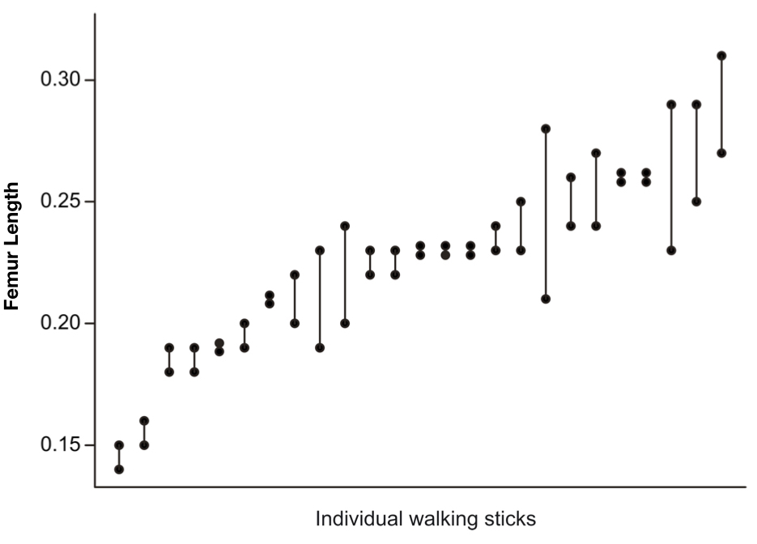
```

## Nested ANOVA | Walking stick example {.flexbox .vcenter}

```{r, echo=FALSE, out.width='100%', fig.asp=.75, fig.align='center'}
knitr::include_graphics("images/images_7a.003.jpeg")
```

## Nested ANOVA | ANOVA Table of Results {.flexbox .vcenter}

```{r, echo=FALSE, out.width='90%', fig.asp=.75, fig.align='center'}
knitr::include_graphics("images/images_7a.004.jpeg")
```

## Nesting Logic {.flexbox .vcenter}

```{r, echo=FALSE, out.width='90%', fig.asp=.75, fig.align='center'}
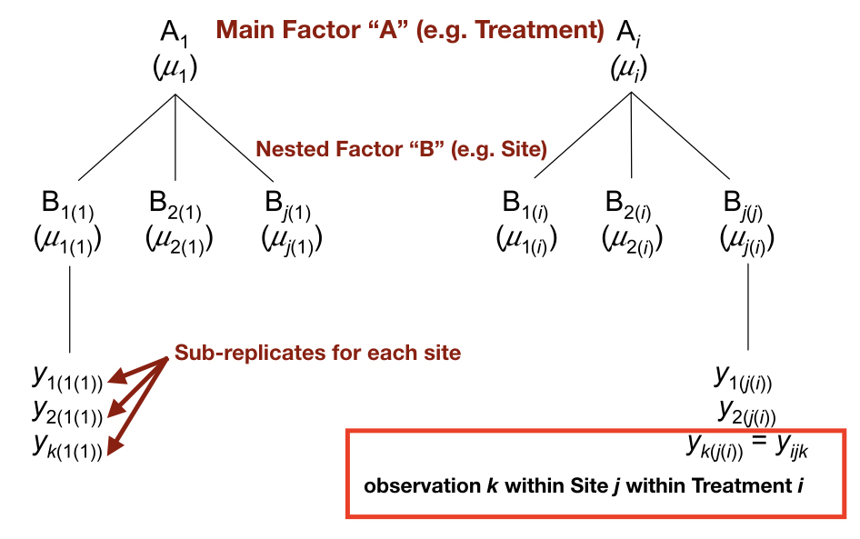
```

## Nesting equations {.flexbox .vcenter}

```{r, echo=FALSE, out.width='90%', fig.asp=.75, fig.align='center'}
knitr::include_graphics("images/images_7a.006.jpeg")
```

## Nesting hypothesis tests {.flexbox .vcenter}

```{r, echo=FALSE, out.width='90%', fig.asp=.75, fig.align='center'}
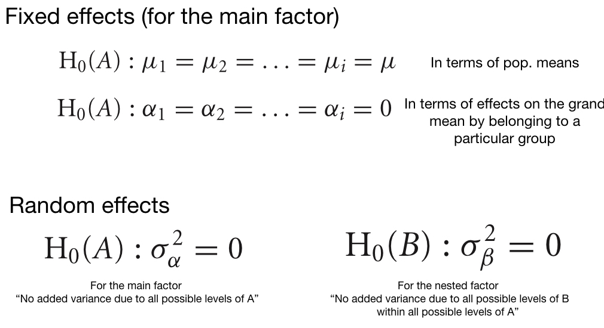
```

## Nesting MS calculations {.flexbox .vcenter}

```{r, echo=FALSE, out.width='90%', fig.asp=.75, fig.align='center'}
knitr::include_graphics("images/images_7a.008.jpeg")
```

## Nested ANOVA table of results {.flexbox .vcenter}

```{r, echo=FALSE, out.width='90%', fig.asp=.75, fig.align='center'}
knitr::include_graphics("images/images_7a.009.jpeg")
```

## R INTERLUDE | Nested ANOVA

```{r, echo=FALSE, out.width='80%', fig.asp=.75, fig.align='center'}
knitr::include_graphics("images/images_7a.010.jpeg")
```

## R INTERLUDE | Nested ANOVA {.smaller}

```{r, echo=TRUE, eval=FALSE}
andrew_data <- read.table('andrew.tsv', header=T, sep=‘\t')
head(andrew_data)
```

- There are four variables: ‘TREAT’, ‘PATCH’, ‘QUAD’ and ‘ALGAE’
- The main effect factor is TREAT
- Make a simplified factor called TREAT2, in which 0% and 33% are a level called “low” and 66% and 100% are “high”

```{r, echo=TRUE, eval=FALSE}
andrew_data$TREAT2 <- factor(c(rep(“low”,40),rep(“high”,40))
```

- The nested factor is PATCH - also need to turn this into a factor

```{r, echo=TRUE, eval=FALSE}
andrew_data$PATCH <- factor(andrew_data$PATCH)
```

## R INTERLUDE | Nested ANOVA {.smaller}

- In this case, our response variable is ALGAE
- Look at the distribution of ALGAE for the two levels of TREAT2 using boxplots based on the patch means, which are the replicates in this case.

```{r, echo=TRUE, eval=FALSE}
andrew.agg <- with(andrew_data, aggregate(data.frame(ALGAE), 
                  by = list(TREAT2=TREAT2, PATCH=PATCH), mean)

library(nlme)
andrew.agg <- gsummary(andrew_data, groups=andrew_data$PATCH)

boxplot(ALGAE ~ TREAT2, andrew.agg)
```

- Evaluate assumptions based on the boxplots
- Is the design balanced (equal numbers of sub-replicates per PATCH)?

## R INTERLUDE | Nested ANOVA {.smaller}

- Run the nested ANOVA:

```{r, echo=TRUE, eval=FALSE}
nested.aov <- aov(ALGAE ~ TREAT2 + Error(PATCH), data=andrew_data)
summary(nested.aov)
```

- Do we detect an effect of TREAT2 (high vs low sea urchin density)?  
- Estimate variance components to assess relative contributions of the random factors

```{r, echo=TRUE, eval=FALSE}
library(nlme)
VarCorr(lme(ALGAE ~ 1, random = ~1 | TREAT2/PATCH, andrew_data))
```

- Calculate the % of variation due to between-treatment differences vs. due to among patches within treatment differences.
- See pg. 302 in Logan if you need help.
- What do these variance component estimates tell us???

# Factorial Designs

## Multifactor ANOVA {.smaller}

- For example, Relyae (2003) looked at how a moderate dose (1.6mg/L) of a commonly used pesticide, carbaryl (Sevin), affected bullfrog tadpole survival. 
- In particular, the experiment asked how the effect of carbaryl depended on whether a native predator, the red-spotted newt, was also present. 
- The newt was caged and could cause no direct harm, but it emitted visual and chemical cues to other tadpoles
- The experiment was carried out in 10-L tubs (experimental units), each containing 10 tadpoles. 
- The four combinations of pesticide treatment (carbaryl vs. water only) and predator treatment (present or absent) were randomly assigned to tubs.
- The results showed that survival was high except when pesticide was applied together with the predator. 
- Thus, the two treatments, predation and pesticide, seem to have interacted.


```{r, echo=FALSE, out.width='30%', fig.asp=.75, fig.align='center'}
knitr::include_graphics("images/images_7a.011.jpeg")
```

## Multifactor ANOVA

```{r, echo=FALSE, out.width='100%', fig.asp=.75, fig.align='center'}
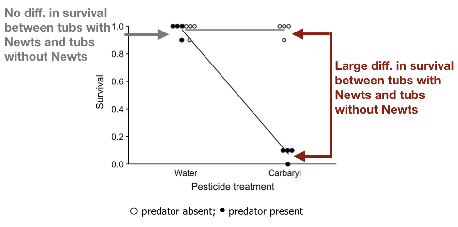
```

## Two Factor Factorial Designs {.flexbox .vcenter}

```{r, echo=FALSE, out.width='100%', fig.asp=.75, fig.align='center'}
knitr::include_graphics("images/images_7a.013.jpeg")
```

## Three Factor Factorial Designs {.flexbox .vcenter}

```{r, echo=FALSE, out.width='100%', fig.asp=.75, fig.align='center'}
knitr::include_graphics("images/images_7a.014.jpeg")
```

## Factorial Designs | Number of Replicates {.flexbox .vcenter}

```{r, echo=FALSE, out.width='90%', fig.asp=.75, fig.align='center'}
knitr::include_graphics("images/images_7a.015.jpeg")
```

## Model 1 factorial ANOVA | both main effects fixed {.flexbox .vcenter}

```{r, echo=FALSE, out.width='90%', fig.asp=.75, fig.align='center'}
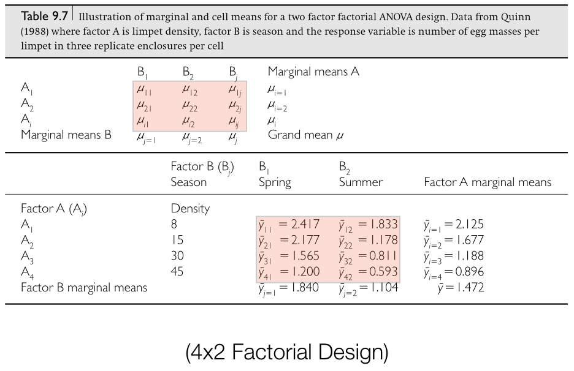
```

## Model 2 factorial ANOVA | both main effects fixed {.flexbox .vcenter}

```{r, echo=FALSE, out.width='80%', fig.asp=.75, fig.align='center'}
knitr::include_graphics("images/images_7a.017.jpeg")
```

## Model 2 factorial ANOVA | both main effects random {.flexbox .vcenter}

```{r, echo=FALSE, out.width='100%', fig.asp=.75, fig.align='center'}
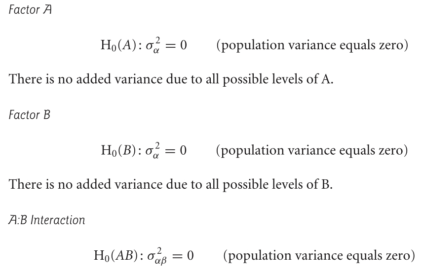
```

## The mean squares for a factorial model {.flexbox .vcenter}

```{r, echo=FALSE, out.width='100%', fig.asp=.75, fig.align='center'}
knitr::include_graphics("images/images_7a.019.jpeg")
```

## The F-ratios for a factorial model {.flexbox .vcenter}

```{r, echo=FALSE, out.width='100%', fig.asp=.75, fig.align='center'}
knitr::include_graphics("images/images_7a.020.jpeg")
```

## Interpretation | significant main and interaction effects {.flexbox .vcenter}

```{r, echo=FALSE, out.width='100%', fig.asp=.75, fig.align='center'}
knitr::include_graphics("images/images_7a.021.jpeg")
```

## Interaction plots {.flexbox .vcenter}

```{r, echo=FALSE, out.width='75%', fig.asp=.75, fig.align='center'}
knitr::include_graphics("images/images_7a.022.jpeg")
```

## R INTERLUDE | 2-by-2 fixed effect factorial ANOVA

```{r, echo=TRUE, eval=FALSE}
rnadata <- read.table('RNAseq.tsv', header=T, sep='')
head(rnadata)
```

- continuous response variable and two main effect categorical variables

```{r, echo=TRUE, eval=FALSE}
gene <- rnadata$Gene80
microbiota <- rnadata$Microbiota
genotype <- rnadata$Genotype
boxplot(gene ~ microbiota)
boxplot(gene ~ genotype)
boxplot(gene ~ microbiota*genotype)
```

## Fit the factorial linear model | two different ways to do the same thing

```{r, echo=TRUE, eval=FALSE}
rna_aov <- aov(gene ~ microbiota + genotype + microbiota:genotype)
rna_aov <- aov(gene ~ microbiota*genotype)
```

- Examine the fitted model diagnostics and the ANOVA results table

```{r, echo=TRUE, eval=FALSE}
plot(rna_aov)
summary(rna_aov)
anova(rna_aov)
```

- What are the general results of our hypothesis tests?
- If there is an interaction, can we understand it by looking at the boxplots?

## R INTERLUDE | 2-by-3 fixed effect factorial ANOVA {.flexbox .vcenter}

- Try the following code to produce an interaction plot for the response variable cell count. 
- In this case there are 2 genotypes and 3 treatment levels.
- Download the `IntPlot_data` file and `IntPlot_Example.R`
- Go through the R script, get a feel for what it’s doing, and try to produce and interpret the interaction plot.


# Means tests for multifactorial ANOVAs

## Means tests | factor level combinations in multi-factor ANOVA

- The F-ratio test for a single-factor ANOVA tests for any difference among groups. 
- If we want to understand specific differences, we need further “contrasts”.
- Unplanned comparisons (post hoc)
- Planned comparisons (a priori)
- Now we need to make 'pseudo-factors' that combine our levels of interest

## Planned (a priori) contrasts {.flexbox .vcenter}

```{r, echo=FALSE, out.width='90%', fig.asp=.75, fig.align='center'}
knitr::include_graphics("images/images_7b.002.jpeg")
```

## R INTERLUDE | 2x2 Fixed-Effects Factorial ANOVA contrasts & interaction {.smaller}

continuous response and two main effect variables

```{r, eval=FALSE, echo=TRUE}
rnadata <- read.table('RNAseq.tsv', header=T, sep='')
gene <- rnadata$Gene80
microbiota <- rnadata$Microbiota
genotype <- rnadata$Genotype
```

make new “pseudo factor,” combining genotype and microbiota
```{r, eval=FALSE, echo=TRUE}
gxm <- interaction(genotype,microbiota)
levels(gxm)
boxplot(gene ~ gxm)
```

specify the following 2 contrasts
```{r, eval=FALSE, echo=TRUE}
contrasts(gxm) <- cbind(c(2, -1, 0, -1), c(-1, -1, 3, -1))
```

## R INTERLUDE | 2x2 Fixed-Effects Factorial ANOVA contrasts & interaction {.smaller}

Fit the factorial linear model
```{r, eval=FALSE, echo=TRUE}
rna_aov <- aov(gene ~ gxm)
```

Examine the ANOVA table, using supplied contrasts.
Figure out the appropriate titles to give them.

```{r, eval=FALSE, echo=TRUE}
summary(rna_aov, split = list(gxm = list('xxx'=1,'xxx'=2)))
```

What does the contrast summary tell you about the nature of the interaction?


# Mixed effect models with unequal sample sizes {.flexbox .vcenter}

## Attributes of mixed effects models {.flexbox .vcenter}

- Linear models that include both fixed and random effects.
- The model is split into fixed and random parts:
    - Fixed effects influence mean of the response variable Y.
    - Random effects influence the variance of Y.
- There is a different error variance for each level of grouping.
- Estimation and testing is based on restricted maximum likelihood, which can handle unequal sample size.
- P-values for fixed effects are conservative when design unbalanced.
- Implemented in the `nlme` & `lme4` packages in `R`.

## Assumptions of mixed-effects models {.flexbox .vcenter}

- Variation within groups follows a normal distribution with equal variance among groups.
- Groups are randomly sampled from “population” of groups.
- Group means follow a normal distribution.
- Measurements within groups are independent.

## Hypotheses for Model 3 ANOVA Factorial Design With Mixed Effects {.flexbox .vcenter}

```{r, echo=FALSE, out.width='90%', fig.asp=.75, fig.align='center'}
knitr::include_graphics("images/images_7b.003.jpeg")
```

## General R syntax for two factor factorial designs {.flexbox .vcenter}

```{r, echo=FALSE, out.width='90%', fig.asp=.75, fig.align='center'}
knitr::include_graphics("images/images_7b.004.jpeg")
```

## R INTERLUDE | Variance components with 2 random factors using LME4 {.smaller}

```{r, echo=TRUE, eval=FALSE}
rnadata <- read.table('RNAseq.tsv', header=T, sep='')
head(rnadata)
```

variables excluding first 5 and last 5 observations 

```{r, echo=TRUE, eval=FALSE}
gene <- rnadata$Gene80[6:75] 
microbiota <- rnadata$Microbiota[6:75]
genotype <- rnadata$Genotype[6:75]
boxplot(gene ~ microbiota)
boxplot(gene ~ genotype)
boxplot(gene ~ microbiota*genotype)
```

Estimate the variance components using Restricted Maximum Likelihood (REML)

```{r, echo=TRUE, eval=FALSE}
library(lme4)
lmer(gene ~ 1 + (1 | microbiota) + (1 | genotype) + (1 | microbiota:genotype))
```

Based on the REML sd estimates, what are the relative contributions of the factors to total variance in gene expression? 


# Analysis of Covariance (ANCOVA)

## Brain & body size | neaderthals as compared to humans {.flexbox .vcenter}

```{r, echo=FALSE, out.width='90%', fig.asp=.75, fig.align='center'}
knitr::include_graphics("images/images_7b.005.jpeg")
```

## Brain & body size | neaderthals as compared to humans {.flexbox .vcenter}

```{r, echo=FALSE, out.width='90%', fig.asp=.75, fig.align='center'}
knitr::include_graphics("images/images_7b.006.jpeg")
```

## Brain & body size | neaderthals as compared to humans {.flexbox .vcenter}

```{r, echo=FALSE, out.width='90%', fig.asp=.75, fig.align='center'}
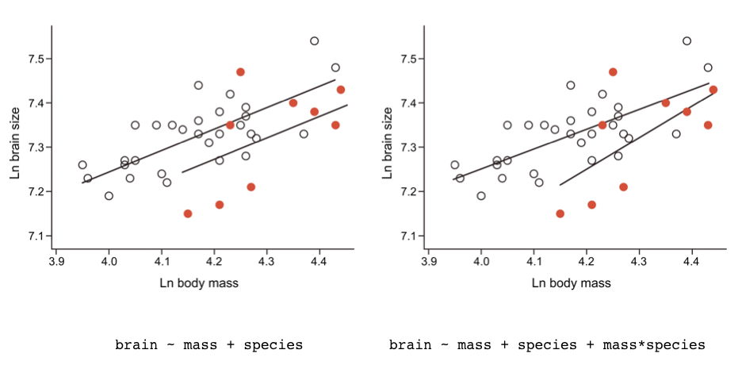
```

## ANCOVA {.flexbox .vcenter}

- Analysis of covariance - mixture of regression and ANOVA
- Response is still a normally distributed continuous variable
- One or more continuous predictor variables (covariates)
- Sometimes the covariates are of biological interest
- Most often we want to remove unexplained variance
- In this way they are similar to a blocking variable in ANOVA
- Operationally, ANCOVA is regular ANOVA in which the group and overall means are replaced by group and overall relationships

## ANCOVA | Adjusting for the covariate {.flexbox .vcenter}

```{r, echo=FALSE, out.width='100%', fig.asp=.75, fig.align='center'}
knitr::include_graphics("images/images_7b.008.jpeg")
```

## ANCOVA | Adjusting for the covariate {.flexbox .vcenter}

```{r, echo=FALSE, out.width='100%', fig.asp=.75, fig.align='center'}
knitr::include_graphics("images/images_7b.009.jpeg")
```

## ANCOVA | Linear model with two covariates {.flexbox .vcenter}

```{r, echo=FALSE, out.width='90%', fig.asp=.75, fig.align='center'}
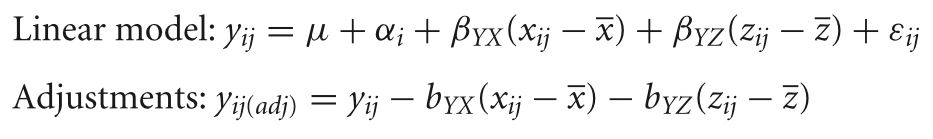
```

## ANCOVA | Factor and covariate hypothesis tests {.flexbox .vcenter}

```{r, echo=FALSE, out.width='100%', fig.asp=.75, fig.align='center'}
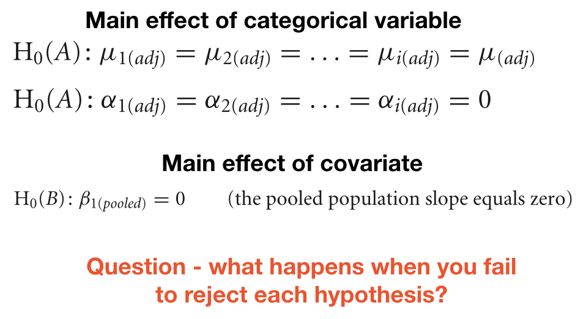
```

## ANCOVA | F ratio tests {.flexbox .vcenter}

```{r, echo=FALSE, out.width='100%', fig.asp=.75, fig.align='center'}
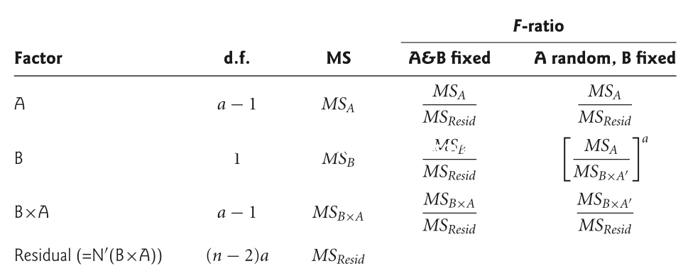
```

## ANCOVA | Assumptions {.flexbox .vcenter}

- The residuals are normally distributed
- The residuals show homoscedasticity of variance
- The residuals are independent of one another
- The relationship between the response variable and each covariate is linear
- Homogeneity of slopes among the groups
- Similar covariate ranges among the groups

## ANCOVA | Heterogeneous slopes {.flexbox .vcenter}

```{r, echo=FALSE, out.width='100%', fig.asp=.75, fig.align='center'}
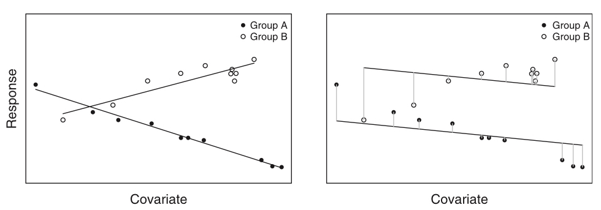
```

## ANCOVA | Heterogeneous slopes {.flexbox .vcenter}
- Problem - adjusting to a mean is difficult or impossible if the slopes are different
- In essence, the samples for the groups come from two different populations
- A test for homogeneity of slopes can be performed
- The assumption is tested by looking for a significant interaction term between the categorical response variables and the covariate(s)
 
## ANCOVA | Non-overlapping range of the covariate {.flexbox .vcenter}

```{r, echo=FALSE, out.width='100%', fig.asp=.75, fig.align='center'}
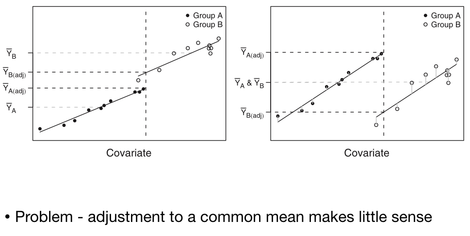
```

## R INTERLUDE | ANCOVA

- Impacts of sexual activity on male fruitfly longevity
- Data from Partridge and Faraquhar (1981) 
- Longevity of male measured in response to access to 
    - no females
    - one virgin
    - eight virgins
    - one mated
    - eight mated
- The male fruit flies also varied in size
- The males were assigned randomly to each of the treatment levels, and then measured thorax length as a covariate

## R INTERLUDE | ANCOVA {.smaller}

```{r, echo=TRUE, eval=FALSE}
longevity_data <- read.table('longevity.csv', header=T, sep=',')
head(longevity_data)
```

Variables

```{r, echo=TRUE, eval=FALSE}
long <- longevity_data$LONGEVITY
treat <- longevity_data$TREATMENT
thorax <- longevity_data$THORAX
```

- check to see if the covariate should be included

```{r, echo=TRUE, eval=FALSE}
boxplot(long ~ treat)
plot(long ~ thorax)
```

## R INTERLUDE | ANCOVA {.smaller}

- assess assumptions of normality and homogeneity of variance

```{r, echo=TRUE, eval=FALSE}
plot(aov(long ~ thorax + treat ), which = 1)
```

- †ry it again with a transformed response variable

```{r, echo=TRUE, eval=FALSE}
plot(aov(log10(long) ~ thorax + treat ), which = 1)
```

- visually assess linearity, homogenetiy of slopes and covariate range equality

```{r, echo=TRUE, eval=FALSE}
library(lattice)
print(xyplot(log10(long) ~ thorax | treat, type = c("r", "p")))
```


## R INTERLUDE | ANCOVA {.smaller}

- formally test homogenetiy of slopes by testing the interaction term

```{r, echo=TRUE, eval=FALSE}
anova(aov(log10(long) ~ thorax*treat))
```

- formally test covariate range disparity by modeling the effect of the treatments on the covariate

```{r, echo=TRUE, eval=FALSE}
anova(aov(thorax ~ treat))
```

- FINALLY, set up contrasts, fit the additive model and visualize the results (pg. 459 and 460 of your Logan book)
- Summarize the trends in a nice plot (pg. 461 of your Logan book)


# Graphical representation

## Goals for this week {.flexbox .vcenter}


## Graphical representation | general approaches {.smaller}

1. Distributions of data
    * location
    * spread
    * shape
  
2. Associations between variables
    * relationship among two or more variables
    * differences among groups in their distributions
  
## Graphical representation | general approaches {.smaller}

1. Distributions of data
    * bar graph
    * histogram
    * box plot
  
2. Associations between variables
    * pie chart
    * grouped bar graph
    * mosaic plot
    * box plot
    * scatter plot
    * dot plot 'stripchart'

## Box Plot {.flexbox .vcenter .smaller}

- Displays median, first and third quartile, range, and extreme observations 
- Can be combined with mean and standard error of the mean
- Concise way to visualize many aspects of distribution

```{r, echo=FALSE, fig.cap="xxx", out.width='75%', fig.asp=.75, fig.align='center'}
knitr::include_graphics("images/images_4a.001.jpeg")
```

[//]: The relationship between the ornamentation of male guppies and the average attractiveness of their sons, n=36

## Scatter Plot {.flexbox .vcenter .smaller}

- Displays association between two numerical variables 
- Non-zero baseline often ok  
- Goal is association not magnitude or frequency  
- Points fill the space available 

```{r, echo=FALSE, fig.cap="xxx", out.width='75%', fig.asp=.75, fig.align='center'}
knitr::include_graphics("images/images_4a.002.jpeg")
```

[//]: The relationship between the ornamentation of male guppies and the average attractiveness of their sons, n=36

## Examples of the good, bad and the ugly of graphical representation {.flexbox .vcenter}

- Examples of bad graphs and how to improve them.
- Courtesy of K.W. Broman  
- www.biostat.wisc.edu/~kbroman/topten_worstgraphs/ 

## Ticker tape parade {.flexbox .vcenter .smaller}

```{r, echo=FALSE, fig.cap="xxx", out.width='75%', fig.asp=.75, fig.align='center'}
knitr::include_graphics("images/images_4a.003.jpeg")
```

[//]: Roeder K  1994  DNA fingerprinting: A review of the controversy  with discussion . Statistical Science 9:222T278, Figure 4 

## A line to no understanding {.flexbox .vcenter .smaller}

```{r, echo=FALSE, fig.cap="xxx", out.width='75%', fig.asp=.75, fig.align='center'}
knitr::include_graphics("images/images_4a.004.jpeg")
```

[//]: Epstein MP, Satten GA  2003  Inference on haplotype effects in caseTcontrol studies using unphased genotype data.  American Journal of Human Genetics 73:1316T1329, Figure 1

## Distribution of TFBS {.flexbox .vcenter .smaller}

```{r, echo=FALSE, fig.cap="xxx", out.width='75%', fig.asp=.75, fig.align='center'}
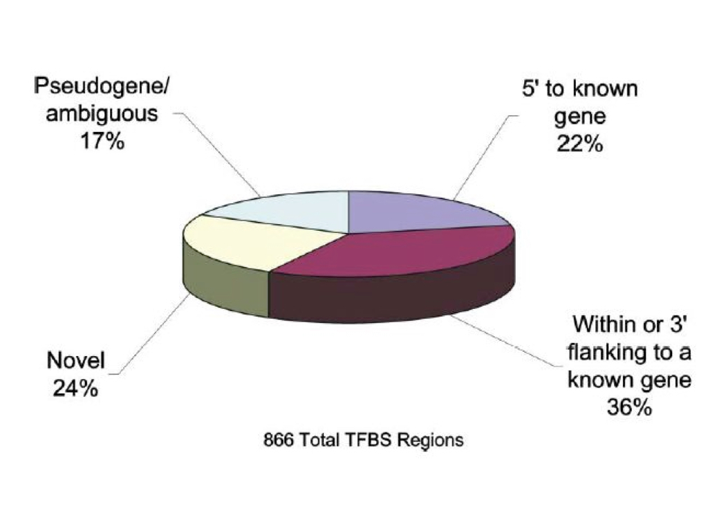
```

[//]: Cawley S, et al.  2004  Unbiased mapping of transcription factor binding sites along human chromosomes 21 and 22  points to widespread regulation of noncoding RNAs. Cell 116:499T509, Figure 1

## Carolyn's favorite figure {.flexbox .vcenter .smaller}

```{r, echo=FALSE, fig.cap="xxx", out.width='75%', fig.asp=.75, fig.align='center'}
knitr::include_graphics("images/images_4a.006.jpeg")
```

## A bake sale of pie charts {.flexbox .vcenter .smaller}

```{r, echo=FALSE, fig.cap="xxx", out.width='75%', fig.asp=.75, fig.align='center'}
knitr::include_graphics("images/images_4a.007.jpeg")
```

[//]: Bell ML, et al.  2007  Spatial and temporal variation in PM2.5 chemical composition in the United States for health effects  studies. Environmental Health Perspectives 115:989T995, Figure 3

## Wack a mole

```{r, echo=FALSE, fig.cap="xxx", out.width='75%', fig.asp=.75, fig.align='center'}
knitr::include_graphics("images/images_4a.008.jpeg")
```

[//]: Cotter DJ, et al.  2004  Hematocrit was not validated as a surrogate endpoint for survival amoung epoetinTtreated  hemodialysis patients. Journal of Clinical Epidemiology 57:1086T1095, Figure 2  


# Graphical representation best practices

## Principles of effective display {.flexbox .vcenter}

> "Graphical excellence is that which gives to the viewer the greatest number of ideas in the shortest time  with the least ink in the smallest space"
>
> --- Edward Tufte

## The best statistical graphic ever drawn | according to Edward Tufte

```{r, echo=FALSE, fig.cap="xxx", out.width='75%', fig.asp=.75, fig.align='center'}
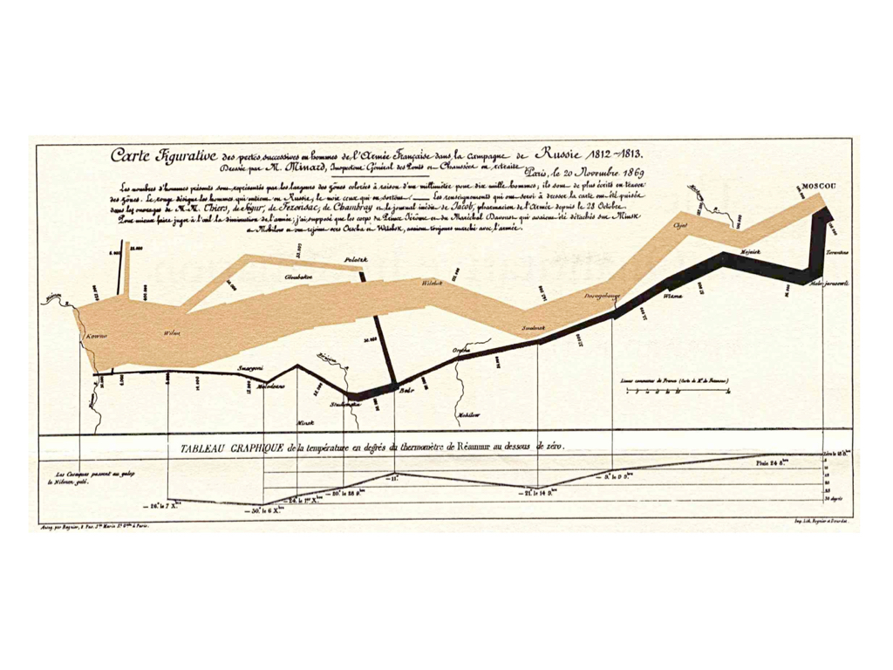
```

[//]: This map by Charles Joseph Minard portrays the losses suffered by Napoleon's army in the  Russian campaign of 1812. Beginning at the Polish-Russian border, the thick band shows  the size of the army at each position. The path of Napoleon's retreat from Moscow in the  bitterly cold winter is depicted by the dark lower band, which is tied to temperature and  time scales. 

## Principles of effective display

- Show the data  
- Encourage the eye to compare differences 
- Represent magnitudes honestly and accurately  
- Draw graphical elements clearly, minimizing clutter  
- Make displays easy to interpret 

## “Above all else show the data” | Tufte  1983 

```{r, echo=FALSE, fig.cap="xxx", out.width='75%', fig.asp=.75, fig.align='center'}
knitr::include_graphics("images/images_4a.010.jpeg")
```

[//]: The relationship between the numbers of native tropical stingless bees and Africanized honey bees onflowering shrubs in French Guiana. The data have been erased in the left panel. Redrawn from Roubik 1978.

## “Maximize  the  data to ink  ratio,  within  reason” | Tufte   1983   

Draw  graphical  elements  clearly,  minimizing  clutter  

```{r, echo=FALSE, fig.cap="xxx", out.width='75%', fig.asp=.75, fig.align='center'}
knitr::include_graphics("images/images_4a.011.jpeg")
```

[//]: The percentage of adults over 18 with a “body mass index” greater than 25 in different years    The Economist 2006  . Body mass index is a measure of weight relative to height. 

## “A  graphic  does  not  distort  if  the  visual  representation  of  the  data  is  consistent  with  the  numerical   representation” – Tufte   1983   

Represent  magnitudes  honestly  and  accurately  

```{r, echo=FALSE, fig.cap="xxx", out.width='75%', fig.asp=.75, fig.align='center'}
knitr::include_graphics("images/images_4a.012.jpeg")
```

[//]: Slow wave sleep in the brain hemispheres of mallard ducks sleeping with one eye open. From Rattenborg et al. 1999  Nature 

## How Fox News makes a figure ....    

```{r, echo=FALSE, fig.cap="xxx", out.width='75%', fig.asp=.75, fig.align='center'}
knitr::include_graphics("images/images_4a.013.jpeg")
```

## How Fox News makes a figure ....   

```{r, echo=FALSE, fig.cap="xxx", out.width='50%', fig.asp=.75, fig.align='center'}
knitr::include_graphics("images/images_4a.013.jpeg")
```
```{r, echo=FALSE, fig.cap="xxx", out.width='50%', fig.asp=.75, fig.align='center'}
knitr::include_graphics("images/images_4a.014.jpeg")
```

“Graphical  excellence  begins  with  telling  the  truth  about  the  data”  –  Tufte    1983  

## Make  displays  easy  to  interpret  

“Graphical  excellence  consists  of  complex  ideas  communicated  with  clarity,  precision  and  efficiency”    – Tufte   1983 

```{r, echo=FALSE, fig.cap="xxx", out.width='50%', fig.asp=.75, fig.align='center'}
knitr::include_graphics("images/images_4a.015.jpeg")
```

[//]: Map displaying the number of bird species and the number of distinct human languages present in each square of a grid of continental Africa. (Reproduced from Moore et al.  2002)


## The Tidyverse | https://www.tidyverse.org

```{r, echo=FALSE, fig.cap="xxx", out.width='75%', fig.asp=.75, fig.align='center'}

```

## GGPlot2 and the Grammar of Graphics

- GG stands for ‘Grammar of Graphics’
- A good paragraph uses good grammar to convey information
- A good figure uses good grammar in the same way
- Seven general components can be used to create most figures

## GGPlot2 and the Grammar of Graphics

```{r, echo=FALSE, fig.cap="xxx", out.width='90%', fig.asp=.75, fig.align='center'}
knitr::include_graphics("images/images_4a.017.jpeg")
```


[//]: The Grammar of Graphics. Visual by Thomas de Beus

## The `geom_bar` function {.flexbox .vcenter}

```{r, eval=FALSE, echo=TRUE}
ggplot(data=diamonds) +
  geom_bar(mapping=aes(x=cut))
```

Now try this...

```{r, eval=FALSE, echo=TRUE}
ggplot(data=diamonds) +
  geom_bar(mapping=aes(x=cut, colour=cut))
```

and this...

```{r, eval=FALSE, echo=TRUE}
ggplot(data=diamonds) +
  geom_bar(mapping=aes(x=cut, fill=cut))
```

and finally this...

```{r, eval=FALSE, echo=TRUE}
ggplot(data=diamonds) +
  geom_bar(mapping=aes(x=cut, fill=clarity), position="dodge")
```

## The `geom_histogram` and `geom_freqpoly`function {.flexbox .vcenter}

With this function you can make a histogram

```{r, eval=FALSE, echo=TRUE}
ggplot(data=diamonds) +
  geom_histogram(mapping=aes(x=carat), binwidth=0.5)
```

This allows you to make a frequency polygram

```{r, eval=FALSE, echo=TRUE}
ggplot(data=diamonds) +
  geom_histogram(mapping=aes(x=carat), binwidth=0.5)
```

## The `geom_boxplot` function {.flexbox .vcenter}

Boxplots are very useful for visualizing data

```{r, eval=FALSE, echo=TRUE}
ggplot(data=diamonds, mapping=aes(x=cut, y=price)) +
  geom_boxplot()
```

```{r, eval=FALSE, echo=TRUE}
ggplot(data=mpg, mapping=aes(x=reorder(class, hwy, FUN=median), y=hwy)) +
  coordflip()
```

```{r, eval=FALSE, echo=TRUE}
ggplot(data=mpg, mapping=aes(x=class, y=hwy)) +
  geom_boxplot() +
  coordflip
```

## The `geom_point` & `geom_smooth` functions {.flexbox .vcenter}

```{r, eval=FALSE, echo=TRUE}
ggplot(data=diamonds2, mapping=aes(x=x, y=y)) +
  geompoint()
```

```{r, eval=FALSE, echo=TRUE}
ggplot(data=mpg) +
  geompoint(mapping=aes(x=displ, y=hwy)) +
  facet_wrap(~class, nrow=2)
```

```{r, eval=FALSE, echo=TRUE}
ggplot(data=mpg) +
  geompoint(mapping=aes(x=displ, y=hwy)) +
  facet_grid(drv~cyl)
```

```{r, eval=FALSE, echo=TRUE}
ggplot(data=mpg) +
  geomsmooth(mapping=aes(x=displ, y=hwy))
```

## Combining geoms {.flexbox .vcenter}

```{r, eval=FALSE, echo=TRUE}
ggplot(data=mpg) +
  geompoint(mapping=aes(x=displ, y=hwy)) +
  geomsmooth(mapping=aes(x=displ, y=hwy))
```

## Adding labels {.flexbox .vcenter}

```{r, eval=FALSE, echo=TRUE}
ggplot(data=mpg, aes(displ, hwy)) +
  geompoint(aes(color=class)) +
  geomsmooth(se=FALSE) +
  labs(
    title = "Fuel efficiency generally decreases with engine size"
    subtitle = "Two seaters (sports cars) are an exception because of their light weight"
    caption = "Data from fueleconomy.gov"
  )
```


## Themes

```{r, echo=FALSE, fig.cap="xxx", out.width='80%', fig.asp=.75, fig.align='center'}
knitr::include_graphics("images/images_4a.018.jpeg")
```
