```{r setup, include=FALSE}
knitr::opts_chunk$set(echo = FALSE)
```

## {}

`git fetch` <br>
`git status` <br>
`git merge origin/master`

```{r, echo=FALSE, out.width='100%', fig.align='center'}
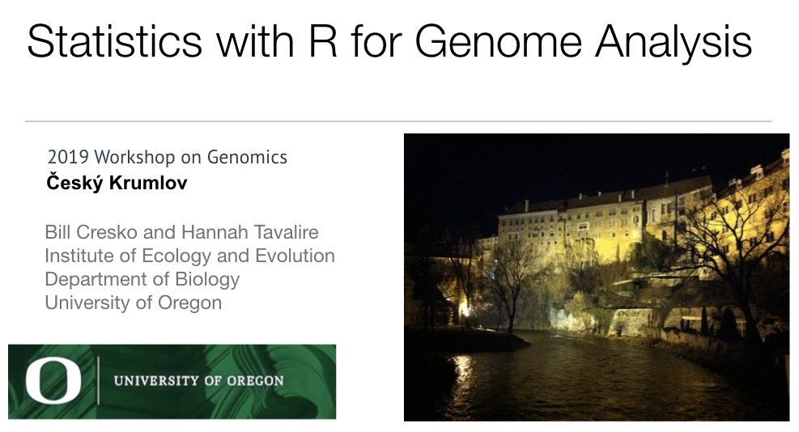
```

# That stupid chair again

## {.flexbox .vcenter}

```{r, echo=FALSE, out.width='50%', fig.align='center'}
knitr::include_graphics("images/week_01.001.jpeg")
```

## {.flexbox .vcenter}

```{r, echo=FALSE, out.width='100%', fig.align='center'}
knitr::include_graphics("images/week_01.002.jpeg")
```

## {.flexbox .vcenter}

```{r, echo=FALSE, out.width='100%', fig.align='center'}
knitr::include_graphics("images/week_01.003.jpeg")
```

## {.flexbox .vcenter}

```{r, echo=FALSE, out.width='100%'}
knitr::include_graphics("images/week_01.004.jpeg")
```

# How did I get here?

## {}

```{r, echo=FALSE, out.width='100%', fig.align='center'}
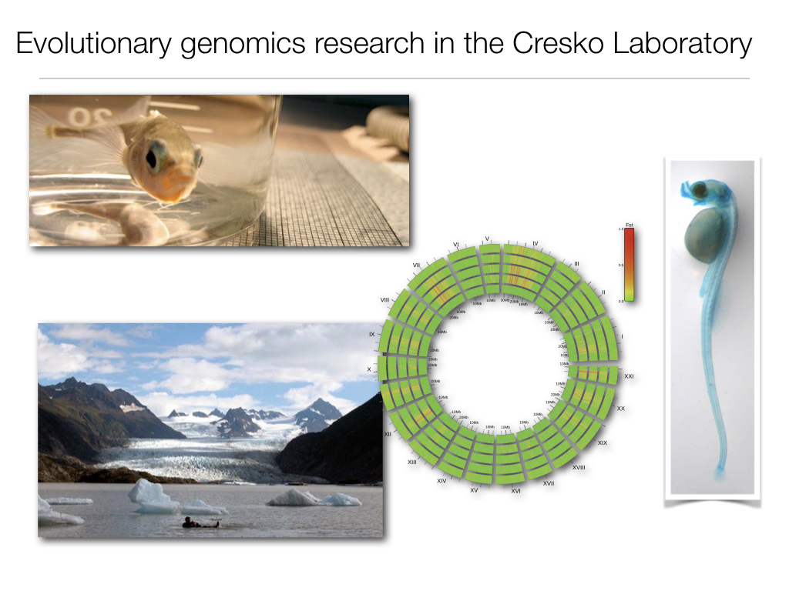
```

## {}

```{r, echo=FALSE, out.width='100%', fig.align='center'}
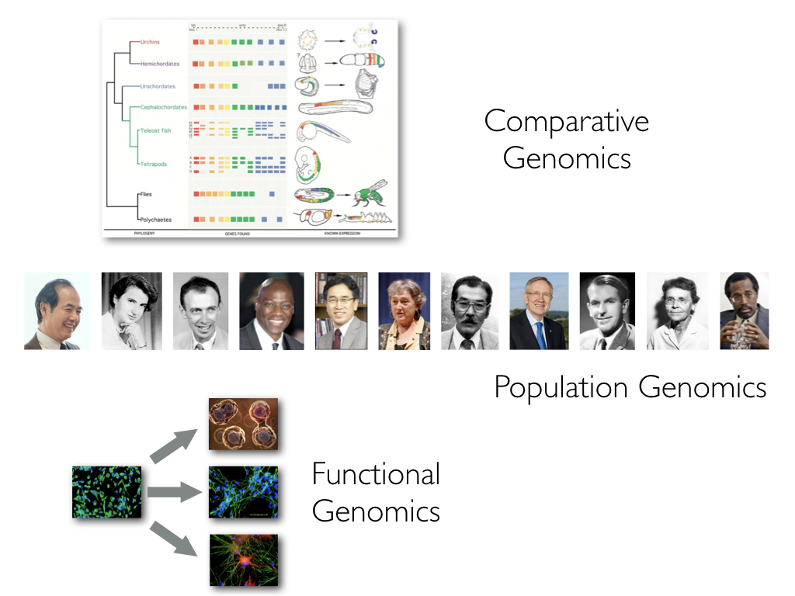
```

## {}

```{r, echo=FALSE, out.width='100%', fig.align='center'}
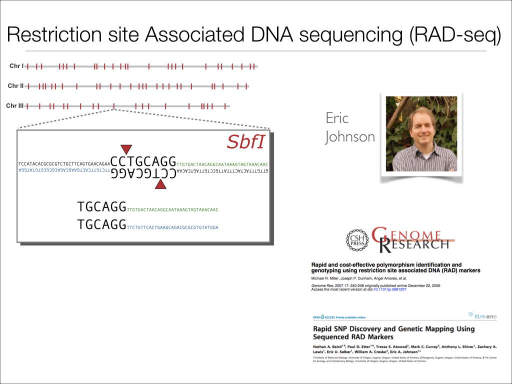
```

## {}

```{r, echo=FALSE, out.width='100%', fig.align='center'}
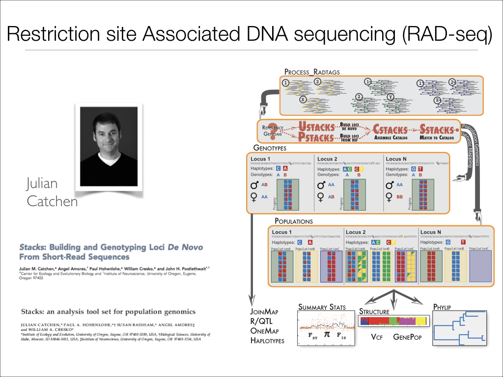
```

## {}

```{r, echo=FALSE, out.width='100%', fig.align='center'}
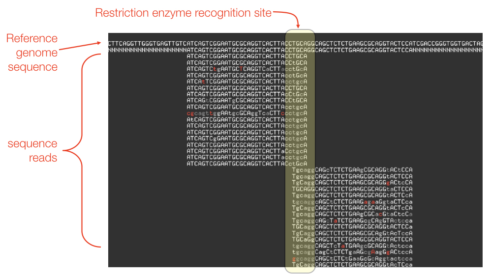
```

## {}

```{r, echo=FALSE, out.width='100%', fig.align='center'}
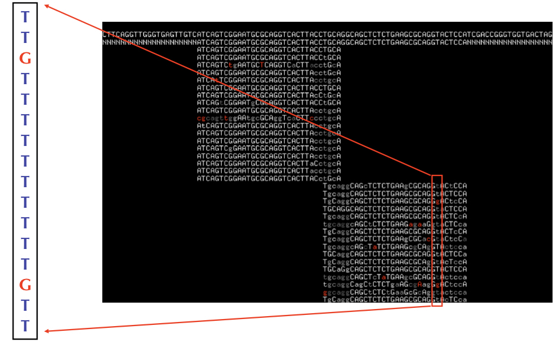
```

## {}

```{r, echo=FALSE, out.width='50%', fig.align='center'}
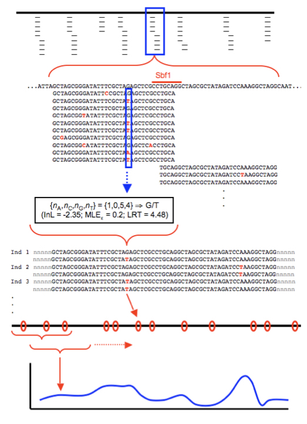
```

## {}

```{r, echo=FALSE, out.width='80%', fig.align='center'}
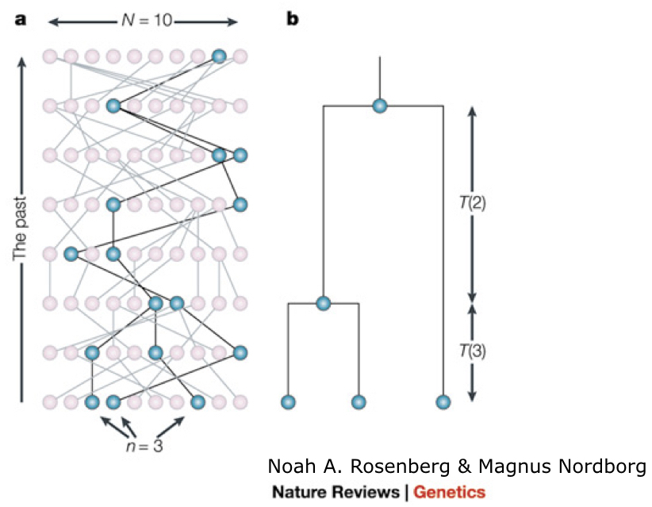
```

## {}

```{r, echo=FALSE, out.width='100%', fig.align='center'}

```

## {}

```{r, echo=FALSE, out.width='70%', fig.align='center'}
knitr::include_graphics("images/prob.011.jpeg")
```

## {}

```{r, echo=FALSE, out.width='70%', fig.align='center'}
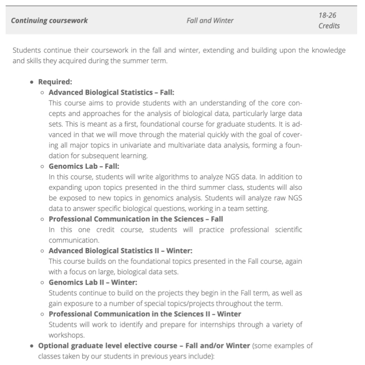
```

## {}

```{r, echo=FALSE, out.width='100%', fig.align='center'}

```

## {}

```{r, echo=FALSE, out.width='100%', fig.align='center'}
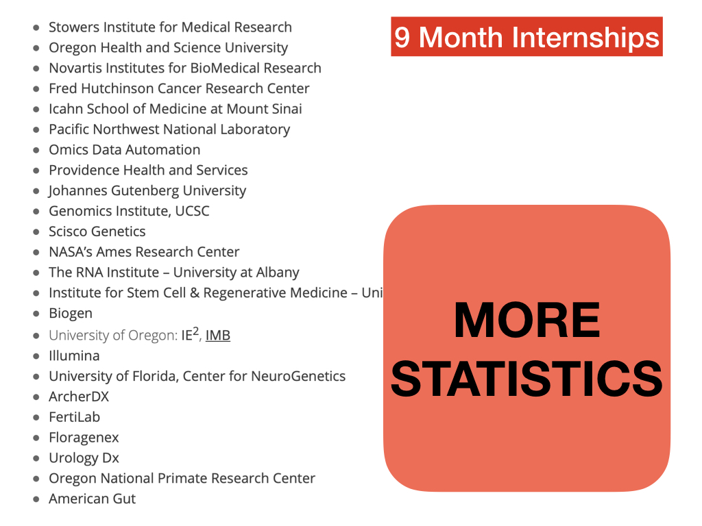
```

## {}

```{r, echo=FALSE, out.width='100%', fig.align='center'}
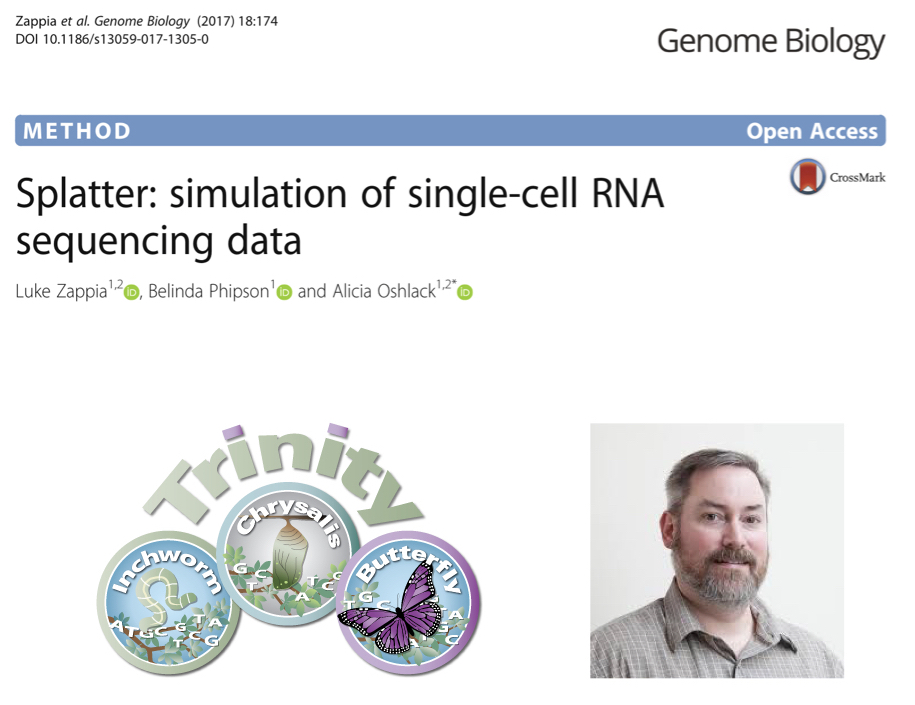
```

## {}

```{r, echo=FALSE, out.width='60%', fig.align='center'}
knitr::include_graphics("images/prob.016.jpeg")
```

## {.flexbox .vcenter}
<br>
<br>
<br>
<br>
**Applied math, statistics and computation are the foundations of genomic analysis**
<br>
<br>
<br>
**Period**

# Goals for today

## {}

**WE WILL COVER TODAY**

- Probability and distributions
- Different flavors of statistical inference
- Parameter estimation and hypothesis testing
- Power analyses
- Linear models
- Multivariate approaches 
- Application to genomic and phenotypic datasets
- Help you get even more comfortable with `R`

<br>

**EXTRA AT THE END OF THE SLIDES**

- Clinical trials as a guide to experimental design
- Reporting statistics in manuscripts


__________________________________

# Data wrangling and exploratory data analysis (EDA)

## A biological example to get us started

<br>
<br>

- Say you perform an experiment on two different strains of stickleback fish, one from an ocean population (RS) and one from a freshwater lake (BP) by making them microbe free. 

<br>

- Microbes in the gut are known to interact with the gut epithelium in ways that lead to a proper maturation of the immune system.

## A biological example to get us started

- You carry out an experiment by treating multiple fish from each strain so that some of them have a conventional microbiota, and some are inoculated with only one bacterial species. 

<br>

- You then measure the levels of gene expression in the stickleback gut using RNA-seq. 

<br>

- You suspect that the sex of the fish might be important so you track it too.

## A biological example to get us started

<br>

```{r, echo=FALSE, out.width='50%', fig.asp=.75, fig.align='center'}
knitr::include_graphics("images/week_01.005.jpeg")
```

## {.flexbox .vcenter}

```{r, echo=FALSE, out.width='100%', fig.asp=.75, fig.align='center'}
knitr::include_graphics("images/week_01.006.jpeg")
```

## Collecting Data with Analyses in Mind

<br>
<br>

- How should the data set be organized to best analyze it?
- What are the key properties of the variables?
- Why does it matter for learning `R`?
- Why does it matter for performing statistical analyses in `R`?


## Data set rules of thumb (aka Tidy Data)

<br>
<br>

- Store a copy of data in non-proprietary formats
- Leave an uncorrected file when doing analyses
- Maintain effective metadata about the data
- When you add observations to a database, add rows
- When you add variables to a database, add columns
- A column of data should contain only one data type

## {.flexbox .vcenter}

```{r, echo=FALSE, out.width='100%', fig.asp=.75, fig.align='center'}
knitr::include_graphics("images/week_01.007.jpeg")
```

____________________________________________________

# Tidyverse family of packages {.smaller}

## Tidyverse family of packages {.smaller}

```{r, echo=FALSE, out.width='90%', fig.align='center'}
knitr::include_graphics("images/week_3.011.jpeg")
```

## Tidyverse family of packages {.vcenter .flexbox}

- Hadley Wickham and others have written `R` packages to modify data

- These packages do many of the same things as base functions in `R`

- However, they are specifically designed to do them faster and more easily

- Wickham also wrote the package `GGPlot2` for elegant graphics creations

- GG stands for ‘Grammar of Graphics’


## Example of a tibble {.smaller}

```{r, echo=FALSE, out.width='80%', fig.align='center'}
knitr::include_graphics("images/week_3.012.jpeg")
```

## Example of a tibble {.smaller}

```{r, echo=FALSE, out.width='80%', fig.align='center'}
knitr::include_graphics("images/week_3.013.jpeg")
```

## Key functions in `dplyr` for vectors

<br>

- Pick observations by their values with `filter()`.
- Reorder the rows with `arrange()`.
- Pick variables by their names with `select()`.
- Create new variables with functions of existing variables with `mutate()`.
- Collapse many values down to a single summary with `summarise()`.

## `filter()`, `arrange()` & `select()`

```{r, echo=T, eval=F}
filter(flights, month == 11 | month == 12)
```

```{r, echo=T, eval=F}
arrange(flights, year, month, day)
```

```{r, echo=T, eval=F}
select(flights, year, month, day)
```

```{r, echo=FALSE, out.width='60%', fig.align='center'}
knitr::include_graphics("images/week_3.015.jpeg")
```


## `mutate()` & `transmutate()`

This function will add a new variable that is a function of other variable(s)

```{r, echo=T, eval=F}
mutate(flights,
  gain = arr_delay - dep_delay,
  hours = air_time / 60,
  gain_per_hour = gain / hours
)
```

This function will replace the old variable with the new variable

```{r, echo=T, eval=F}
transmute(flights,
  gain = arr_delay - dep_delay,
  hours = air_time / 60,
  gain_per_hour = gain / hours
)
```

## `group_by( )` & `summarize( )`

<br>

This first function allows you to aggregate data by values of categorical variables (factors)

```{r, echo=T, eval=F}
by_day <- group_by(flights, year, month, day)
```

Once you have done this aggregation, you can then calculate values (in this case the mean) of other variables split by the new aggregated levels of the categorical variable

```{r, echo=T, eval=F}
summarise(by_day, delay = mean(dep_delay, na.rm = TRUE))
```

## `group_by( )` & `summarize( )`

<br>

- Note - you can get a lot of missing values!
- That’s because aggregation functions obey the usual rule of missing values:
    - if there’s any missing value in the input, the output will be a missing value.
    - fortunately, all aggregation functions have an `na.rm` argument which removes the missing values prior to computation

## R INTERLUDE | Complete Exercise 2.3-2.4 {.flexbox .vcenter}


_________________________________

# Graphical communication

## GGPlot2 and the Grammar of Graphics

<br>
<br>

- GG stands for **Grammar of Graphics**
- A good paragraph uses good grammar to convey information
- A good figure uses good grammar in the same way
- Seven general components used to create most figures

## GGPlot2 and the Grammar of Graphics

```{r, echo=FALSE, fig.cap="xxx", out.width='80%', fig.asp=.75, fig.align='center'}
knitr::include_graphics("images/images_4a.017.jpeg")
```

## Graphical representation | general approaches {.smaller}

<br>

1. Distributions of data
    * location
    * spread
    * shape
  
2. Associations between variables
    * relationship among two or more variables
    * differences among groups in their distributions
  
## Graphical representation | general approaches {.smaller}

<br>

1. Distributions of data
    * bar graph
    * histogram
    * box plot
  
2. Associations between variables
    * pie chart
    * grouped bar graph
    * mosaic plot
    * box plot
    * scatter plot
    * dot plot 'stripchart'

## Box Plot {.flexbox .vcenter .smaller}

- Displays median, first and third quartile, range, and extreme observations 
- Can be combined with mean and standard error of the mean
- Concise way to visualize many aspects of distribution

```{r, echo=FALSE, out.width='50%', fig.asp=.75, fig.align='center'}
knitr::include_graphics("images/images_4a.001.jpeg")
```

## Scatter Plot {.flexbox .vcenter .smaller}

<br>

- Displays association between two numerical variables 
- Goal is association not magnitude or frequency  
- Points fill the space available 

```{r, echo=FALSE, out.width='50%', fig.asp=.75, fig.align='center'}
knitr::include_graphics("images/images_4a.002.jpeg")
```

## Examples of the good, bad and the ugly of graphical representation {.flexbox .vcenter}

<br>
<br>

- Examples of bad graphs and how to improve them.
- Courtesy of K.W. Broman  
- www.biostat.wisc.edu/~kbroman/topten_worstgraphs/ 

## Ticker tape parade {.flexbox .vcenter .smaller}

```{r, echo=FALSE, out.width='75%', fig.asp=.75, fig.align='center'}
knitr::include_graphics("images/images_4a.003.jpeg")
```

## A line to no understanding {.flexbox .vcenter .smaller}

```{r, echo=FALSE, out.width='75%', fig.asp=.75, fig.align='center'}
knitr::include_graphics("images/images_4a.004.jpeg")
```

## A cup of hot nothing {.flexbox .vcenter .smaller}

```{r, echo=FALSE, out.width='75%', fig.asp=.75, fig.align='center'}
knitr::include_graphics("images/images_4a.006.jpeg")
```

## A bake sale of pie charts {.flexbox .vcenter .smaller}

```{r, echo=FALSE, out.width='75%', fig.asp=.75, fig.align='center'}
knitr::include_graphics("images/images_4a.007.jpeg")
```

## Wack a mole

```{r, echo=FALSE, out.width='75%', fig.asp=.75, fig.align='center'}
knitr::include_graphics("images/images_4a.008.jpeg")
```

# Best practices

## {}

<br>
<br>

> "Graphical excellence is that which gives to the viewer the greatest number of ideas in the shortest time  with the least ink in the smallest space"
>
> --- Edward Tufte

## Principles of effective display
<br>
<br>

- Show the data  
- Encourage the eye to compare differences 
- Represent magnitudes honestly and accurately  
- Draw graphical elements clearly, minimizing clutter  
- Make displays easy to interpret 

## “Above all else show the data” | Tufte  1983 

```{r, echo=FALSE, out.width='75%', fig.asp=.75, fig.align='center'}
knitr::include_graphics("images/images_4a.010.jpeg")
```

## “Maximize  the  data to ink  ratio,  within  reason” | Tufte   1983   

Draw  graphical  elements  clearly,  minimizing  clutter  

```{r, echo=FALSE, out.width='50%', fig.asp=.75, fig.align='center'}
knitr::include_graphics("images/images_4a.011.jpeg")
```


## “A  graphic  does  not  distort  if  the  visual  representation  of  the  data  is  consistent  with  the  numerical   representation” – Tufte   1983   

Represent  magnitudes  honestly  and  accurately  

```{r, echo=FALSE, out.width='60%', fig.asp=.6, fig.align='center'}
knitr::include_graphics("images/images_4a.012.jpeg")
```

## How Fox News makes a figure ...    

```{r, echo=FALSE, out.width='75%', fig.asp=.75, fig.align='center'}
knitr::include_graphics("images/images_4a.013.jpeg")
```

## How Fox News makes a figure ...   

```{r, echo=FALSE, out.width='30%', fig.asp=.75, fig.align='center'}
knitr::include_graphics("images/images_4a.013.jpeg")
```
```{r, echo=FALSE, out.width='30%', fig.asp=.75, fig.align='center'}
knitr::include_graphics("images/images_4a.014.jpeg")
```

“Graphical  excellence  begins  with  telling  the  truth  about  the  data”  –  Tufte    1983  

# GGPlot2 and nice figures

## GGPlot2 and the Grammar of Graphics

```{r, echo=FALSE, fig.cap="xxx", out.width='80%', fig.asp=.75, fig.align='center'}
knitr::include_graphics("images/images_4a.017.jpeg")
```

## The `geom_bar` function {.flexbox .vcenter}

```{r, eval=TRUE, echo=TRUE,fig.asp=0.5}
library(ggplot2)
ggplot(data=diamonds) +
  geom_bar(mapping=aes(x=cut))
```

## The `geom_bar` function {.flexbox .vcenter}
Now try this...

```{r gp1, eval=TRUE, echo=TRUE,fig.asp=0.5}
ggplot(data=diamonds) +
  geom_bar(mapping=aes(x=cut, colour=cut))
```

## The `geom_bar` function {.flexbox .vcenter}
and this...

```{r, eval=TRUE, echo=TRUE,fig.asp=0.5}
ggplot(data=diamonds) +
  geom_bar(mapping=aes(x=cut, fill=cut))
```

## The `geom_bar` function {.flexbox .vcenter}
and finally this...

```{r, eval=TRUE, echo=TRUE,fig.asp=0.5}
ggplot(data=diamonds) +
  geom_bar(mapping=aes(x=cut, fill=clarity), position="dodge")
```

## The `geom_histogram` and `geom_freqpoly` function {.flexbox .vcenter }
With this function you can make a histogram
```{r, eval=TRUE, echo=TRUE,fig.asp=0.4}
ggplot(data=diamonds) +
  geom_histogram(mapping=aes(x=carat), binwidth=0.5)
```

## The `geom_histogram` and `geom_freqpoly` function {.flexbox .vcenter }
This allows you to make a frequency polygram
```{r, eval=TRUE, echo=TRUE,fig.asp=0.4}
ggplot(data=diamonds) +
  geom_freqpoly(mapping=aes(x=carat), binwidth=0.5)
```

## The `geom_boxplot` function {.flexbox .vcenter}

Boxplots are very useful for visualizing data

```{r, eval=TRUE, echo=TRUE,fig.asp=0.5}
ggplot(data=diamonds, mapping=aes(x=cut, y=price)) +
  geom_boxplot()
```

## The `geom_boxplot` function {.flexbox .vcenter}

```{r, eval=TRUE, echo=TRUE,fig.asp=0.5}
ggplot(data=mpg, mapping=aes(x=class, y=hwy)) +
  geom_boxplot() +
  coord_flip()
```

## The `geom_boxplot` function {.flexbox .vcenter}

```{r gp2, eval=TRUE, echo=TRUE,fig.asp=0.5}
ggplot(data=mpg, mapping=aes(x=reorder(class, hwy, FUN=median), y=hwy)) +
  geom_boxplot() +
  coord_flip()
```

## The `geom_point` & `geom_smooth` functions {.flexbox .vcenter}

```{r, eval=TRUE, echo=TRUE,fig.asp=0.5}
ggplot(data=diamonds, mapping=aes(x=x, y=y)) +
  geom_point()
```

##  `geom_point` & `geom_smooth`  {.flexbox .vcenter}

```{r, eval=TRUE, echo=TRUE,fig.asp=0.5}
ggplot(data=mpg) +
  geom_point(mapping=aes(x=displ, y=hwy)) +
  facet_wrap(~class, nrow=2)
```

##  `geom_point` & `geom_smooth`  {.flexbox .vcenter}

```{r, eval=TRUE, echo=TRUE,fig.asp=0.5}
ggplot(data=mpg) +
  geom_point(mapping=aes(x=displ, y=hwy)) +
  facet_grid(drv~cyl)
```

##  `geom_point` & `geom_smooth`  {.flexbox .vcenter}

```{r, eval=TRUE, echo=TRUE,fig.asp=0.5}
ggplot(data=mpg) +
  geom_smooth(mapping=aes(x=displ, y=hwy), method = "loess")
```

## Combining geoms {.flexbox .vcenter}

```{r, eval=TRUE, echo=TRUE,fig.asp=0.5}
ggplot(data=mpg) +
  geom_point(mapping=aes(x=displ, y=hwy)) +
  geom_smooth(mapping=aes(x=displ, y=hwy), method = "loess")
```

## Adding labels {.flexbox .vcenter}

```{r, eval=TRUE, echo=TRUE,fig.asp=0.5}
ggplot(data=mpg, aes(displ, hwy)) +
  geom_point(aes(color=class)) +
  geom_smooth(se=FALSE, method="loess") +
  labs(title = "Fuel efficiency generally decreases with engine size",
  subtitle = "Two seaters (sports cars) are an exception because of their light weight",
  caption = "Data from fueleconomy.gov")
```


## Themes

```{r, echo=FALSE, out.width='80%', fig.asp=.75, fig.align='center'}
knitr::include_graphics("images/images_4a.018.jpeg")
```

## Arranging Multiple Figures- Flexdashboard

- Modify YAML header to specify graph orientation

```{r, echo=TRUE, eval=FALSE}
---
title: Flexdashboard Options"
output: 
  flexdashboard::flex_dashboard:
    
   vertical_layout: 'fill' or 'scroll'
         or
     orientation: 'rows'
---
```
- Or specify data width to reorganize (try this in template)
https://rmarkdown.rstudio.com/flexdashboard/

## Arranging Multiple Figures- Flexdashboard

<br>

```{r, echo=FALSE, out.width='30%'}
knitr::include_graphics("images/felxdash_scroll.png")
knitr::include_graphics("images/dashboard_orient_rows.png")
knitr::include_graphics("images/dashboard_spec_col_widths.png")
```

## R INTERLUDE | Complete Exercise 2.5 {.flexbox .vcenter}

<br>

```{r, echo=FALSE, out.width='75%', fig.asp=.75, fig.align='center'}

```

____________________________________________________

# Statistical foundations for genomics

# Probability and distributions

## Different flavors of inferential statistics

<br>

- **Frequentist Statistics**
  - Classical or standard approaches
  - Null hypothesis testing
  - Genomic data provides challenges
  
<br>

- **Hierarchical Probabilistic Modeling**
  - Maximum Likelihood
  - Bayesian Analyses
  - Machine Learning
  
## R (&Python) can be used for both flavors

```{r, echo=FALSE, out.width='50%', fig.align='center'}

```

- Stan® is a platform for statistical modeling computation 
- Bayesian statistical inference with MCMC
- approximate Bayesian inference with variational inference
- maximum likelihood estimation with optimization
- probability functions & linear algebra  

## What is probability

- **Frequency interpretation** <br>
<br>
"Probabilities are understood as mathematically convenient approximations to long run relative frequencies." <br>
<br>
- **Subjective interpretation** <br>
<br>
"A probability statement expresses the opinion of some individual regarding how certain an event is to occur."
<br>

## Random variables & probability {.smaller}

<br>

- **Probability** is the expression of belief in some future outcome

- A **random variable** can take on different values with different probabilities

- The **sample space** of a random variable is the universe of all possible values

## Random variables & probability {.smaller}

<br>

- The **sample space** can be represented by a 
    - **probability distribution** (discrete) 
    - **probability density function** (continuous)
    - algebra and calculus are used for each respectively
    - probabilities of a sample space **always sum to 1.0**
    
    <br>
    
- There are many **families** or **forms** of distributions or PDFs
    - depends on the dynamical system they represent
    - the exact **instantiation of the form** depends on their parameter values
    - we are often interested in **estimating parameters**

## Bernoulli distribution {.smaller}

- Describes the expected outcome of a single event with probability `p`

- Example of flipping of a **fair** coin once

<br>

$$Pr(X=\text{Head}) = \frac{1}{2} = 0.5 = p $$

$$Pr(X=\text{Tails}) = \frac{1}{2} = 0.5 = 1 - p $$

## Bernoulli distribution
- If the coin isn't fair then $p \neq 0.5$
- However, the probabilities still sum to 1
<br>
<br>
$$ p + (1-p) = 1 $$
<br>
<br>
- Same is true for other binary possibilities
    - success or failure
    - yes or no answers
    - choosing an allele from a population based upon allele frequencies

## Probability rules {.flexbox .vcenter}

<br>

- Flip a coin twice
- Represent the first flip as ‘X’ and the second flip as ‘Y’

<br>
<br>

$$ Pr(\text{X=H and Y=H}) = p*p = p^2 $$
$$ Pr(\text{X=H and Y=T}) = p*p = p^2 $$
$$ Pr(\text{X=T and Y=H}) = p*p = p^2 $$
$$ Pr(\text{X=T and Y=T}) = p*p = p^2 $$

## Probability rules

<br>

- Probability that the `H` and `T` can occur in any order

<br>

$$ \text{Pr(X=H and Y=T) or Pr(X=T and Y=H)} = $$ 
$$ (p*p) + (p*p) = 2p^{2} $$
  <br>
  <br>

- These are the **'and'** and **'or'** rules of probability
    - 'and' means multiply the probabilities
    - 'or' means sum the probabilities
    - most probability distributions can be built up from these simple rules

## Expectation and Moments of Distributions

<br>

- Distributions have **moments** that can be estimated
- 1st, 2nd, 3rd and 4th moments of a distribution?
- The expectation or mean of a random variable X is:

$$E[X] = \sum_{\text{all x}}^{}xP(X=x) = \mu$$
<br>

- Often we want to know how dispersed the random variable is around its mean. 
- One measure of dispersion is the variance

$$Var(X) = E[X^2] = \sigma^2$$

## Joint probability
<br>
<br>
$$Pr(X,Y) = Pr(X) * Pr(Y)$$    
<br>
<br>

- Note that this is true for two **independent** events
- However, for two non-independent events we also have to take into account their **covariance**
- To do this we need **conditional probabilities**


## Conditional probability
<br>

- For two **independent** variables

$$Pr(Y|X) = Pr(Y)\text{ and }Pr(X|Y) = Pr(X)$$ 

<br>

- For two **non-independent** variables

$$Pr(Y|X) \neq Pr(Y)\text{ and }Pr(X|Y) \neq Pr(X)$$
<br>

- Variables that are non-independent have a shared variance, which is also known as the **covariance**
- Covariance standardized to a mean of zero and a unit standard deviation is **correlation**

## What is Likelihood vs. Probability?

- The **probability** of an event is the proportion of times that the event would occur if we repeated a random trial over and over again under the same conditions.

- The **likelihood** is a conditional probability of a parameter value given a set of data

- The likelihood of a population parameter **equaling a specific value, given the data**

`L[parameter|data] = Pr[data|parameter]`

- This is the **likelihood function** which can have a maximum

## A Bayesian looks at estimation

- A way of quantifying uncertainty of the population parameter, **not our estimate of it**, using prior information about the probability distribution of the parameter.

<br>

$$ P(\theta|d) = \frac{P(d|\theta)P(\theta)}{P(d)}$$

where
<br>

- $P(\theta|d)$ = posterior probability distribution <br>
- $P(d|\theta)$ = likelihood function for $\theta$ <br>
- $P(\theta)$ = prior probability distribution <br>
- $P(d)$ = mean of the likelihood function <br>

## Who wants to win a car?

- Pretend that there are three doors, and behind one is a car. 
- You choose one of the doors, and then Monte Hall opens one of the two remaining doors. 
- At this point you have the choice of changing doors or staying with your original choice.
<br>
- **What should you do?**

```{r, echo=FALSE, out.width='50%', fig.asp=.75, fig.align='center'}

```

# Common probability distributions in genomics | Many of these are thanks to Sally Otto at UBC

## Discrete Probability Distributions

## **Geometric Distribution**

- If a single event has two possible outcomes the probability of having to observe `k` trials before the first "one" appears is given by the **geometric distribution**
- The probability that the first "one" would appear on the first trial is `p`, but the probability that the first "one" appears on the second trial is `(1-p)*p`
- By generalizing this procedure, the probability that there will be `k-1` failures before the first success is:

$$P(X=k)=(1-p)^{k-1}p$$


- mean = $\frac{1}{p}$ 
- variance = $\frac{(1-p)}{p^2}$

## **Geometric Distribution**
- Example: If the probability of extinction of an endangered population is estimated to be 0.1 every year, what is the expected time until extinction?


```{r, echo=FALSE, out.width='80%', fig.align='center'}
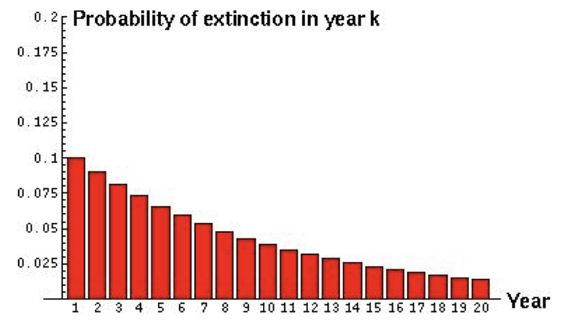
```

## **Binomial Distribution**

- A **binomial distribution** results from the **combination** of several independent Bernoulli events 

- **Example** 
    - Pretend that you flip 20 fair coins 
      - or collect alleles from a heterozygote
    - Now repeat that process and record the number of heads
    - We expect that most of the time we will get approximately 10 heads
    - Sometimes we get many fewer heads or many more heads

## Binomial Distribution

- The distribution of probabilities for each combination of outcomes is

$$\large f(k) = {n \choose k} p^{k} (1-p)^{n-k}$$

- `n` is the total number of trials
- `k` is the number of successes
- `p` is the probability of success
- `q` is the probability of not success
- For binomial as with the Bernoulli `p = 1-q`

## Binomial Probability Distribution

```{r, echo=FALSE, out.width='100%', fig.align='center'}
knitr::include_graphics("images/week_2.003.jpeg")
```

## **Negative Binomial Distribution**

- Extension of the geometric distribution describing the waiting time until `r` "ones" have appeared. 
- Generalizes the geometric distribution
- Probability of the $r^{th}$ "one" appearing on the $k^{th}$ trial:


$$P(X=k)=(\frac{k-1}{r-1})p^{r-1}(1-p)^{k-r}p$$

<br>

which simplifies to 

$$P(X=k)=(\frac{k-1}{r-1})p^{r}(1-p)^{k-r}$$

- mean = $\frac{r}{p}$
- variance = $r(1-p)/p^2$

## **Negative Binomial Distribution**
- Example: If a predator must capture 10 prey before it can grow large enough to reproduce
- What would the mean age of onset of reproduction be if the probability of capturing a prey on any given day is 0.1?
- Notice that the variance  is quite high (~1000) and that the distribution looks quite skewed

```{r, echo=FALSE, out.width='50%', fig.align='center'}
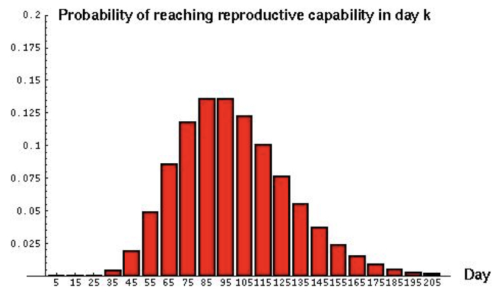
```

## **Poisson Probability Distribution**

- Another common situation in biology is when each trial is discrete, but the number of observations of each outcome is observed/counted

- Some examples are
    - counts of snails in several plots of land
    - observations of the firing of a neuron in a unit of time
    - count of genes in a genome binned to units of 500 AA
    
- Just like before you have 'successes', but 
    - now you count them for each replicate
    - the replicates now are units of area or time
    - the values can now range from 0 to a large number

## Poisson Probability Distribution

<br>

- For example, you can examine 1000 genes
    - count the number of base pairs in the coding region of each gene
    - what is the probability of observing a gene with 'r' bp?
- `Pr(Y=r)` is the probability that the number of occurrences of an event `y` equals a count `r` in the total number of trials

<br>

$$Pr(Y=r) = \frac{e^{-\mu}\mu^r}{r!}$$

## Poisson Probability Distribution  {.smaller}

- Note that this is a single parameter function because $\mu = \sigma^2$
- The two together are often just represented by $\lambda$

$$Pr(y=r) = \frac{e^{-\lambda}\lambda^r}{r!}$$

- This means that for a variable that is truly Poisson distributed:
    - the mean and variance should be equal to one another
    - variables that are approximately Poisson distributed but have a larger variance than mean are often called 'overdispersed'
    - quite common in RNA-seq and microbiome data

## Poisson Probability Distribution | gene length by bins of 500 nucleotides {.smaller}

```{r, echo=FALSE, out.width='80%', fig.align='center'}
knitr::include_graphics("images/week_2.004.jpeg")
```

## Poisson Probability Distribution | increasing parameter values of $\lambda$ {.smaller}

```{r, echo=FALSE, out.width='70%', fig.align='center'}
knitr::include_graphics("images/week_2.005.jpeg")
```

## **Continuous probability distributions**

<br>

P(observation lies within dx of x) = f(x)dx

$$P(a\leq X \leq b) = \int_{a}^{b} f(x) dx$$

<br>

Remember that the indefinite integral sums to one

$$\int_{-\infty}^{\infty} f(x) dx = 1$$

## Continuous probabilities

<br>

`E[X]` may be found by integrating the product of `x` and the probability density function over all possible values of `x`:

$$E[X] = \int_{-\infty}^{\infty} xf(x) dx $$

<br>

$Var(X) = E[X^2] - (E[X])^2$, where the expectation of $X^2$ is

$$E[X^2] = \int_{-\infty}^{\infty} x^2f(x) dx $$

## **Uniform Distribution**

<br>

$$E[X] = \int_{a}^{b} x\frac{1}{b-a} dx = \frac{(a+b)}{2} $$

<br>


```{r, echo=FALSE, out.width='100%', fig.align='center'}
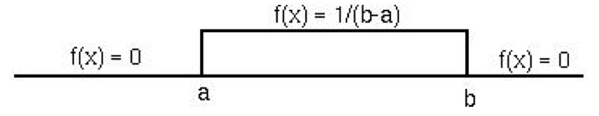
```


## Exponential Distribution

<br>

$$f(x)=\lambda e^{-\lambda x}$$

<br>

- `E[X]` can be found be integrating $xf(x)$ from 0 to infinity

<br>

- leading to the result that 

<br>

- $E[X] = \frac{1}{\lambda}$
- $E[X^2] = \frac{1}{\lambda^2}$

## Exponential Distribution

- For example, let  equal the instantaneous death rate of an individual. 
- The lifespan of the individual would be described by an exponential distribution (assuming that  does not change over time).

```{r, echo=FALSE, out.width='70%', fig.align='center'}
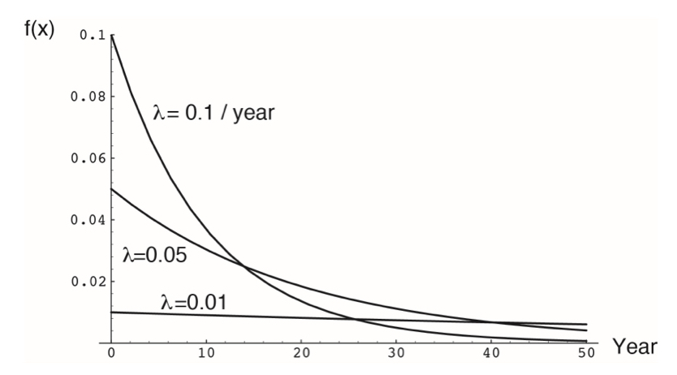
```

## **Gamma Distribution**

- The gamma distribution generalizes the exponential distribution. 
- It describes the waiting time until the $r^{th}$ event for a process that occurs randomly over time at a rate $\lambda$ :

<br>

$$f(x) = \frac{e^{-\lambda x}\lambda x^{r-1}}{(r-1)!}\lambda$$

<br>

$$ Mean =  \frac{r}{\lambda} $$
$$ Variance = \frac{r}{\lambda^2} $$

## Gamma Distribution

<br>

- **Example**: If, in a PCR reaction, DNA polymerase synthesizes new DNA strands at a rate of 1 per millisecond, how long until 1000 new DNA strands are produced? 

<br>

- Assume that DNA synthesis does not deplete the pool of primers or nucleotides in the chamber, so that each event is independent of other events in the PCR chamber.


## The Gaussian or Normal Distribution

## Log-normal PDF | Continuous version of Poisson (-ish) { .smaller}

<br>

```{r, echo=FALSE, out.width='70%', fig.align='center'}
knitr::include_graphics("images/week_2.006.jpeg")
```

## Transformations to ‘normalize’ data {.smaller .vcenter .flexbox}

<br>
<br>

```{r, echo=FALSE, out.width='100%', fig.align='center'}
knitr::include_graphics("images/week_2.007.jpeg")
```

## Transformations to ‘normalize’ data {.smaller .vcenter .flexbox}

<br>

```{r, echo=FALSE, out.width='100%', fig.align='center'}
knitr::include_graphics("images/week_2.008.jpeg")
```

## Binomial to Normal | Categorical to continuous {.smaller .vcenter .flexbox}

```{r, echo=FALSE, out.width='100%', fig.align='center'}
knitr::include_graphics("images/week_2.009.jpeg")
```

## The Normal (aka Gaussian) | Probability Density Function (PDF) {.smaller}

```{r, echo=FALSE, out.width='90%', fig.align='center'}
knitr::include_graphics("images/week_2.011.jpeg")
```

## Normal PDF {.smaller}

```{r, echo=FALSE, out.width='50%', fig.align='center'}
knitr::include_graphics("images/week_2.012.jpeg")
```


## Normal PDF | A function of two parameters 
### ($\mu$ and $\sigma$) {.smaller}

```{r, echo=FALSE, out.width='40%', fig.align='center'}
knitr::include_graphics("images/week_2.032.jpeg")
```
where 
$$\large \pi \approx 3.14159$$

$$\large \epsilon \approx 2.71828$$

To write that a variable (v) is distributed as a normal distribution with mean $\mu$ and variance $\sigma^2$, we write the following:

$$\large v \sim \mathcal{N} (\mu,\sigma^2)$$

## Normal PDF | estimates of mean and variance {.smaller}

Estimate of the mean from a single sample

$$\Large \bar{x} = \frac{1}{n}\sum_{i=1}^{n}{x_i} $$

Estimate of the variance from a single sample

$$\Large s^2 = \frac{1}{n-1}\sum_{i=1}^{n}{(x_i - \bar{x})^2} $$


## Normal PDF

```{r, echo=FALSE, out.width='90%', fig.align='center'}
knitr::include_graphics("images/week_2.010.jpeg")
```

## Why is the Normal special in biology?

```{r, echo=FALSE, out.width='100%', fig.align='center'}
knitr::include_graphics("images/week_2.013.jpeg")
```

## Why is the Normal special in biology? {.smaller}

```{r, echo=FALSE, out.width='100%', fig.align='center'}
knitr::include_graphics("images/week_2.015.jpeg")
```

## Why is the Normal special in biology? {.smaller}

```{r, echo=FALSE, out.width='60%', fig.align='center'}
knitr::include_graphics("images/week_2.014.jpeg")
```

## Parent-offspring resemblance {.smaller}

```{r, echo=FALSE, out.width='45%', fig.align='center'}
knitr::include_graphics("images/week_2.016.jpeg")
```

## Genetic model of complex traits {.smaller}

```{r, echo=FALSE, out.width='90%', fig.align='center'}
knitr::include_graphics("images/week_2.017.jpeg")
```

## Distribution of $F_2$ genotypes | really just binomial sampling {.smaller}

```{r, echo=FALSE, out.width='70%', fig.align='center'}
knitr::include_graphics("images/week_2.018.jpeg")
```

## Why else is the Normal special?

- The normal distribution is immensely useful because of the central limit theorem, which says that the he mean of many random variables independently drawn from the same distribution is distributed approximately normally
- One can think of numerous situations, such as 
    - when multiple genes contribute to a phenotype
    - or that many factors contribute to a biological process
- In addition, whenever there is variance introduced by stochastic factors the central limit theorem holds
- Thus, normal distributions occur throughout genomics
- It's also the basis of the majority of classical statistics

## z-scores of normal variables

<br>

- Often we want to make variables more comparable to one another
- For example, consider measuring the leg length of mice and of elephants
    - Which animal has longer legs in absolute terms? 
    - Pproportional to their body size? 
    - Proportional to their body size?
- A good way to answer these last questions is to use 'z-scores'

## z-scores of normal variables

<br>

- z-scores are standardized to a mean of 0 and a standard deviation of 1
- We can modify any normal distribution to have a mean of 0 and a standard deviation of 1 
- Another term for this is the standard normal distribution

<br>

$$\huge z_i = \frac{(x_i - \bar{x})}{s}$$


## R Interlude | Complete Exercise 3.1


```{r, echo=FALSE, out.width='50%', fig.asp=.75, fig.align='center'}

```

# Hypothesis testing, test statistics, p-values {.smaller}

## What is a hypothesis {.vcenter .flexbox}

<br>

- A statement of belief about the world
- Need a **critical** test to 
    - accept or reject the hypothesis
    - compare the relative merits of different models
- This is where **statistical sampling distributions** come into play
- Statistical distributions are built upon sampling distributions


## Hypothesis tests {.vcenter .flexbox}

- What is the probability that we would reject a **true null hypothesis**?

- What is the probability that we would accept a **false null hypothesis**?

- How do we **decide** when to reject a null hypothesis and support an alternative?

- What can we **conclude** if we fail to reject a null hypothesis?

- What **parameter estimates of distributions** are important to test hypotheses?

## Null and alternative hypotheses | population distributions {.smaller}

```{r, echo=FALSE, out.width='50%', fig.align='center'}
knitr::include_graphics("images/week_3.002.jpeg")
```

## Statistical sampling distributions {.vcenter .flexbox}

<br>

- Statistical tests provide a way to perform **critical tests** of hypotheses
- Just like raw data, statistics are **random variables** and depend on sampling distributions of the underlying data
- The particular **form of the statistical distribution** depends on the test statistic and parameters such as the degrees of freedom that are determined by sample size.

## Statistical sampling distributions {.vcenter .flexbox}

<br>

- In many cases we create a **null statistical distribution** that models the distribution of a test statistic under the **null hypothesis**. 
- Similar to point estimates, we calculate an **observed test statistic value** for our data
- Then see how probable it was by comparing against **the null distribution**
- The probability of seeing that value or greater is called the **p-value** of the statistic


## Four common statistical distributions {.smaller}

```{r, echo=FALSE, out.width='70%', fig.align='center'}
knitr::include_graphics("images/week_3.003.jpeg")
```

## The t-test and t sampling distribution {.smaller}

$$\large t = \frac{(\bar{y}_1-\bar{y}_2)}{s_{\bar{y}_1-\bar{y}_2}} $$

where

```{r, echo=FALSE, out.width='60%', fig.align='center'}
knitr::include_graphics("images/week_3.016.jpeg")
```

which is the calculation for the standard error of the mean difference

## The t-test and t sampling distribution | one-tailed test {.smaller}

```{r, echo=FALSE, out.width='90%', fig.align='center'}
knitr::include_graphics("images/week_3.005_1_tailed.jpeg")
```

## The t-test and t sampling distribution | two-tailed test {.smaller}

```{r, echo=FALSE, out.width='60%', fig.align='center'}
knitr::include_graphics("images/week_3.006.jpeg")
```

## Assumptions of parameteric t-tests  {.vcenter .flexbox}

<br>

- The theoretical t-distributions for each degree of freedom were calculated for populations that are:  
    - normally distributed
    - have equal variances (if comparing two means)
    - observations are independent (randomly drawn)
- This is an example of a **parametric** test
- What do you do if the there is non-normality?  
    - nonparametric tests such as Mann-Whitney-Wilcoxon
    - randomization tests to create a null distribution

## Type 1 and Type 2 errors {.smaller}

<br>

```{r, echo=FALSE, out.width='90%', fig.align='center'}
knitr::include_graphics("images/week_3.007.jpeg")
```

## Components of hypothesis testing

- **p-value** = the long run probability of rejecting a true null hypothesis
- **$\alpha$** = critical value of p-value cutoff for experiments. The Type I error we are willing to tolerate.
- **$\beta$** = cutoff for probability of accepting a false null hypothesis
- **Power** = the probability that a test will reject a false null hypothesis (1 - beta). It depends on effect size, sample size, chosen alpha, and population standard deviation 
- **Multiple testing** = performing the same or similar tests multiple times - need to correct alpha value
- Can correct multiple testing using a tax (e.g. **Bonferonni**) or directly estimating a **False Discovery Rate (FDR)**

## Statistical power

<br>

- Type 1 error - $\alpha$ - incorrectly rejecting a true null hypothesis
    - This is saying that there is an effect when there isn’t
- Type 2 error - $\beta$ - incorrectly accepting a false null hypothesis
    - This is saying that there isn’t an effect when there is
      
- Power is the probability of rejecting a false null hypothesis
- Mostly we shoot for a power of around 80%
- Power can be calculated *post hoc* or *a priori*

## Power | the things one needs to know

<br>

$$ Power \propto \frac{(ES)(\alpha)(\sqrt n)}{\sigma}$$

- Power is proportional to the combination of these parameters

    - **ES** -      effect size; how large is the change of interest?
    - **$\alpha$** -  significance level (usually 0.05)
    - **n** -         sample size
    - **$\sigma$** - standard deviation among experimental units within the same group.

## Power | what we usually want to know {.flexbox .vcenter}

<br>

 ```{r, echo=FALSE, out.width='90%', fig.asp=.75, fig.align='center'}
knitr::include_graphics("images/images_6b.002.jpeg")
```  

## Power | rough calculation
 
 ```{r, echo=FALSE, out.width='90%', fig.asp=.75, fig.align='center'}
knitr::include_graphics("images/images_6b.003.jpeg")
```

## R Interlude | Complete Exercises 3.2-3.4

<br>

```{r, echo=FALSE, out.width='75%', fig.asp=.75, fig.align='center'}

```

________________________

# Linear Models and Regression

## Parent offspring regression

```{r, echo=FALSE, out.width='70%', fig.asp=.75, fig.align='center'}
knitr::include_graphics("images/images_4b.002.jpeg")
```

## Linear Models - a note on history

```{r, echo=FALSE, out.width='70%', fig.asp=.75, fig.align='center'}
knitr::include_graphics("images/images_4b.003.jpeg")
```

## Linear Models - a note on history

```{r, echo=FALSE, out.width='70%', fig.asp=.75, fig.align='center'}
knitr::include_graphics("images/images_4b.004.jpeg")
```

## Bivariate normality

```{r, echo=FALSE, out.width='70%', fig.asp=.75, fig.align='center'}
knitr::include_graphics("images/images_4b.005.jpeg")
```

## Covariance and correlation

```{r, echo=FALSE, out.width='70%', fig.asp=.75, fig.align='center'}
knitr::include_graphics("images/images_4b.006.jpeg")
```

## A linear model to relate two variables

```{r, echo=FALSE, out.width='70%', fig.asp=.75, fig.align='center'}
knitr::include_graphics("images/images_4b.008.jpeg")
```

## Parameter Estimation | Ordinary Least Squares (OLS)

<br>

- Algorithmic approach to parameter estimation
- One of the oldest & best developed
- Used extensively in linear models (ANOVA and regression)
- By itself only produces a single best estimate (No C.I.’s)
- Many OLS estimators have been replaced by ML estimators

## Many approaches are linear models

<br>

- Flexible - applicable to many different study designs 
- Provides a common set of tools
  - `lm` in R for fixed effects
  - `nlme4` for random effects
- Includes tools to estimate parameters:
    - sizes of effects like the slope 
    - difference in means among categories
- Is easier to work with, especially with multiple variables

## Many approaches are linear models

<br>

- Linear regression 
- Single factor ANOVA
- Analysis of covariance (ANCOVA)
- Multiple regression
- Multi-factor ANOVA
- Repeated-measures ANOVA

## Plethora of linear models

<br>

- General Linear Model (**GLM**) - two or more continuous variables

- General Linear Mixed Model (**GLMM**) - a continuous response variable with a mix of continuous and categorical predictor variables

- Generalized Linear Model - a GLM that doesn’t assume normality of the response

- Generalized Additive Model (**GAM**) - a model that doesn’t assume linearity


## Linear models {.smaller}

<br>

All can be written in the form

response variable = intercept + (explanatory_variables) + random_error

in the general form:

$$ Y=\beta_0 +\beta_1*X_1 + \beta_2*X_2 +... + \epsilon$$  

where $\beta_0, \beta_1, \beta_2, ....$ are the parameters of the linear model

## linear model parameters

<br>

```{r, echo=FALSE, out.width='70%', fig.asp=.75, fig.align='center'}
knitr::include_graphics("images/images_4b.010.jpeg")
```


## Linear models in R

<br>


- Need to fit the model and then 'read' the output
- This is similar to what you learned from Malachi about `GGPlot2` figures

```{r, echo=TRUE, eval=FALSE}
trial_lm <- lm(Y~X)
summary (trial_lm)
```
- In general you will ask R to fit linear models and then do additional analyses on the output
- Note that there are a number of new variables created in the output

## Model fitting and hypothesis tests in regression

<br>

$$H_0 : \beta_0 = 0$$
$$H_0 : \beta_1 = 0$$


full model - $y_i = \beta_0 + \beta_1*x_i + error_i$

reduced model - $y_i = \beta_0 + 0*x_i + error_i$


1. fits a “reduced” model without slope term ($H_0$)
2. fits the “full” model with slope term added back
3. compares fit of full and reduced models using an F test

## Model fitting in regression

<br>

```{r, echo=FALSE, out.width='70%', fig.asp=.75, fig.align='center'}
knitr::include_graphics("images/images_4b.011.jpeg")
```


## Hypothesis tests in linear regression {.smaller}

<br>

```{r, echo=FALSE, out.width='70%', fig.asp=.75, fig.align='center'}
knitr::include_graphics("images/images_4b.012.jpeg")
```

## Hypothesis tests in linear regression {.smaller}

<br>

```{r, echo=FALSE, out.width='70%', fig.asp=.75, fig.align='center'}
knitr::include_graphics("images/images_4b.013.jpeg")
```


## Residual Analysis | did we meet our assumptions?

<br>
<br>

- Independent errors (residuals)
- Equal variance of residuals in all groups
- Normally-distributed residuals
- Robustness to departures from these assumptions is improved when sample size is large and design is balanced


## Residual Analysis

$$y_i = \beta_0 + \beta_1 * x_i + \epsilon_i$$

```{r, echo=FALSE, out.width='70%', fig.asp=.75, fig.align='center'}
knitr::include_graphics("images/images_4b.015.jpeg")
```

## Residual Analysis

```{r, echo=FALSE, out.width='70%', fig.asp=.75, fig.align='center'}
knitr::include_graphics("images/images_4b.016.jpeg")
```

## Residual Plots | Spotting assumption violations

```{r, echo=FALSE, out.width='70%', fig.asp=.75, fig.align='center'}
knitr::include_graphics("images/images_4b.020.jpeg")
```

## Anscombe's quartet | what would residual plots look like for these?

```{r, echo=FALSE, out.width='70%', fig.asp=.75, fig.align='center'}
knitr::include_graphics("images/images_4b.017.jpeg")
```

## Anscombe's quartet | what would residual plots look like for these?

```{r, echo=FALSE, out.width='70%', fig.asp=.75, fig.align='center'}
knitr::include_graphics("images/images_4b.018.jpeg")
```


## Multiple Linear Regression - Goals

- To develop a better predictive model than is possible from models based on single independent variables.
- To investigate the relative individual effects of each of the multiple independent variables above and beyond the effects of the other variables.
- The individual effects of each of the predictor variables on the response variable can be depicted by single partial regression lines. 
- The slope of any single partial regression line (partial regression slope) thereby represents the rate of change or effect of that specific predictor variable (holding all the other predictor variables constant to their respective mean values) on the response variable.

## Multiple Linear Regression | Additive and multiplicative models of 2 or more predictors

<br>

<br>

Additive model
$$y_i = \beta_0 + \beta_1x_{i1} + \beta_2x_{i2} + ... + B_jx_{ij} + \epsilon_i$$

<br>

Multiplicative model (with two predictors)
$$y_i = \beta_0 + \beta_1x_{i1} + \beta_2x_{i2} + \beta_3x_{i1}x_{i2} + \epsilon_i$$

## Multiple Linear Regression | Additive and multiplicative models

<br>

```{r, echo=FALSE, out.width='100%', fig.asp=.75, fig.align='center'}
knitr::include_graphics("images/images_5a.006.jpeg")
```

## Multiple linear regression assumptions

<br>

- linearity
- normality
- homogeneity of variance
- The absence of **multi-collinearity** 
    - a predictor variable must not be linearly predicted by - or correlated with - any combination of the other predictor variables.

## checking for multi-collinearity

```{r, echo=TRUE, eval=FALSE}
library(car)
scatterplotMatrix(~var1+var2+var3, diag=”boxplot”)
```

```{r, echo=FALSE, out.width='60%', fig.asp=.75, fig.align='center'}
knitr::include_graphics("images/Images_5b.001.jpeg")
```

## R Interlude | Exercise 4.1


```{r, echo=FALSE, out.width='40%', fig.asp=.75, fig.align='center'}
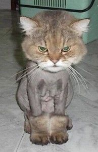
```

__________________________________

# ANOVA

## ANOVA {.flexbox .vcenter}

- Stands for **AN**alysis **o**f **VA**riance
- Core statistical procedure in biology
- Developed by R.A. Fisher in the early 20th Century
- The core idea is to ask how much variation exists within vs. among groups
- ANOVAs are linear models that have **categorical predictor** and **continuous response** variables
- The categorical predictors are often called **factors**, and can have two or more **levels** (important to specify in R)
- Each factor will have a **hypothesis test**
- The levels of each factor may also need to be tested

## ANOVA | Let's start with an example

- Percent time that male mice experiencing discomfort spent “stretching”.
- Data are from an experiment in which mice experiencing mild discomfort (result of injection of 0.9% acetic acid into the abdomen)
- The injected mice were then kept in:
    - isolation 
    - with a companion mouse not injected or 
    - with a companion mouse also injected and exhibiting “stretching” behaviors associated with discomfort 

From Langford, D. J.,et al. 2006. Science 312: 1967-1970

## ANOVA | Let's start with an example {.flexbox .vcenter}

In words:
  
**stretching = intercept + treatment**
  
- The model statement includes a response variable, a constant, and an explanatory variable.  
- The only difference with regression is that here the explanatory variable is categorical.

## ANOVA | Let's start with an example {.vcenter .flexbox}

```{r, echo=FALSE, out.width='80%', fig.asp=.75, fig.align='center'}
knitr::include_graphics("images/Images_5b.014.jpeg")
```

## ANOVA {.vcenter .flexbox}

```{r, echo=FALSE, out.width='100%', fig.asp=.75, fig.align='center'}
knitr::include_graphics("images/Images_5b.015.jpeg")
```

## ANOVA | Conceptually similar to regression {.vcenter .flexbox}

```{r, echo=FALSE, out.width='80%', fig.asp=.75, fig.align='center'}
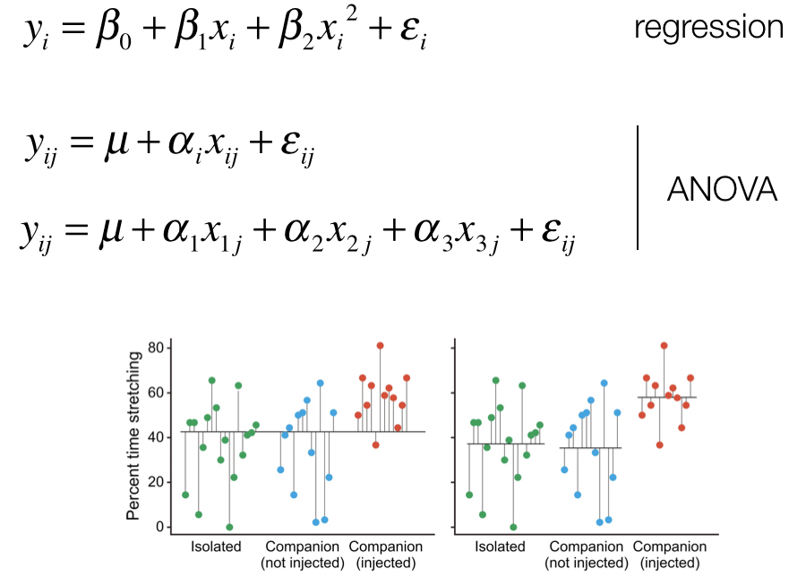
```

## ANOVA | Statistical results table {.vcenter .flexbox}

```{r, echo=FALSE, out.width='100%', fig.asp=.75, fig.align='center'}
knitr::include_graphics("images/Images_5b.017.jpeg")
```

## ANOVA | F-ratio calculation {.vcenter .flexbox}

```{r, echo=FALSE, out.width='100%', fig.asp=.75, fig.align='center'}
knitr::include_graphics("images/Images_5b.018.jpeg")
```

## ANOVA | One or more predictor variables

<br>

- One-way ANOVAs just have a single factor
- Multi-factor ANOVAs have more than one factor
- The interaction among factors needs to be considered
- Multi-factor ANOVAs 
    - Factorial - two or more factors and their interactions
    - Nested - the levels of one factor are contained within another level
    - The models can be quite complex

## Multifactor ANOVA | Assumptions 

<br>

- Normally distributed groups
    - robust to non-normality if equal variances and sample sizes
- Equal variances across groups
    - okay if largest-to-smallest variance ratio < 3:1
    - problematic if there is a mean-variance relationship among groups
- Observations in a group are independent
    - randomly selected
    - don’t confound group with another factor

## Two Factor Factorial Designs {.flexbox .vcenter}

<br>

```{r, echo=FALSE, out.width='100%', fig.asp=.75, fig.align='center'}
knitr::include_graphics("images/images_7a.013.jpeg")
```

## Interpretation | significant main and interaction effects {.flexbox .vcenter}

<br>

```{r, echo=FALSE, out.width='100%', fig.asp=.75, fig.align='center'}
knitr::include_graphics("images/images_7a.021.jpeg")
```

## Interaction plots {.flexbox .vcenter}

```{r, echo=FALSE, out.width='55%', fig.asp=.75, fig.align='center'}
knitr::include_graphics("images/images_7a.022.jpeg")
```

## R Interlude | Exercise 4.2

<br>

```{r, echo=FALSE, out.width='75%', fig.asp=.75, fig.align='center'}

```

______________________________________

# Multivariate Statistics

## What are multivariate statitistics?

<br>

- **General** - more than one variable recorded from a number of experimental sampling units
- **Specific** - two or more response variables that likely co-vary
- **Goals** of multivariate statistics
    - Data reduction and simplification (**PCA and PCoA**)
    - Organization of objects (**Cluster Analysis and MDS**)
    - Testing the effects of a factor on linear combinations of variables (**MANOVA and DFA**)

## Conceptual overview of multivariate statistics

<br>

```{r, echo=FALSE, out.width='75%', fig.asp=.75, fig.align='center'}
knitr::include_graphics("images/multi.001.jpeg")
```

## Multivariate statitistics definitions?

<br>

- Some definitions first
- `i = 1 to n` objects and `j = 1 to p` variables
- Measure of center of a multivariate distribution = the centroid
- Multivariate statistics uses eigenanalysis of either matrices of covariances of variables (`p-by-p`), or dissimilarities of objects (`n-by-n`)
- Matrix and linear algebra are therefore very useful in multivariate statistics

## Multivariate statitistics conceptual overview

```{r, echo=FALSE, out.width='90%', fig.asp=.75, fig.align='center'}
knitr::include_graphics("images/multi.002.jpeg")
```

## Eigenanalysis

<br>

$$Z_{ik} = c_1y_{i1} + c_2y_{i1} + c_3y_{i2} + c_1y_{i3} + ... + c_py_{ip}$$

<br>

- Derives linear combinations of the original variables that best summarize the total variation in the data
- These new linear combinations become new variables themselves
- Each object can now have a score for the new variables

## Eigenvalues

<br>

- Also called 
  - **characteristic** or **latent roots** or 
  - **factors**
- Rearranging the variance in the association matrix so that the first few derived variables explain most of the variation that was present between objects in the original variables
- The **eigenvalues** can also be expressed as proportions or percents of the original variance explained by each new derived variable (also called **components or factors**)

## Eigenvectors

<br>

- Lists of the **coefficients or  weights** showing how much each original variable contributes to each new derived variable
- The linear combination s can be solved to provide a score ($z_{ik}$) for each object
- There are the same number of derived variables as there are original variables (`p`)
- The newly derived variables are extracted sequentially so that they are **uncorrelated with each other**
- The eigenvalues and eigenvectors can be derived using either **spectral decomposition of the `p-by-p` matrix** or **singular value decomposition of the original matrix**

## Correlation vs. dissimiliarity matrices

- **Principal Component Analysis (PCA)** and **Correspondence Analysis (CA)** use covariance or correlation of variables.
- **Principal Coordinate Analysis (PCoA)**, **Cluster Analysis** and **Multidimensional Scaling (MDS)** use dissimilarity indices.
- The scaling of the derived latent variables **can therefore differ** between analyses that use covariance of variables as compared to dissimilarity indices.
- Whether the derived variable can be considered metric (e.g. on a **rational scale**) or non-metric (e.g. on an **ordinal scale**) depends on the analysis.
- As a consequence the downstream use of the derived variables can change depending upon the analysis.

## Correlation vs. dissimiliarity matrices

<br>

```{r, echo=FALSE, out.width='75%', fig.asp=.75, fig.align='center'}
knitr::include_graphics("images/multi.003.jpeg")
```

## Dissimiliarity indices for continuous variables

<br>

```{r, echo=FALSE, out.width='80%', fig.asp=.75, fig.align='center'}
knitr::include_graphics("images/multi.005.jpeg")
```


## How many PC's or PCo's should I examine?

<br>

```{r, echo=FALSE, out.width='75%', fig.asp=.75, fig.align='center'}
knitr::include_graphics("images/multi.004.jpeg")
```

## What else can I do with the z-scores of the new **PCs and metric PCoAs**?

<br>

- They’re nice **new variables** that you can use in any analysis you’ve learned previously!!
- You can perform single or multiple regression of your PCs on other continuous variables 
- For example, ask whether they correlate with an environmental gradient or body mass index.
- If you have one or more grouping variables you can use ANOVA on each newly derived PC.
- **NOTE** - non-metric PCoA or NMDS values _**cannot**_ just be put into linear models!!

## R Interlude | Exercises 4.3-4.4
Get more advanced and bring it all home sisters and brothers


```{r, echo=FALSE, out.width='75%', fig.asp=.75, fig.align='center'}

```


****************************

*****************************

# Design principles for planning a good experiment

## What is an experimental study?

- In an experimental study the researcher assigns treatments to units
- In an observational study nature does the assigning of treatments to units
- The crucial advantage of experiments derives from the random assignment of treatments to units
- Random assignment, or randomization, minimizes the influence of confounding variables


## Mount Everest example {.vcenter .flexbox}

Survival of climbers of Mount Everest is higher for individuals taking supplemental oxygen than those who don’t.  
  
**Why?**

## Mount Everest example

- One possibility is that supplemental oxygen (explanatory variable) really does cause higher survival (response variable).
- The other is that the two variables are associated because other variables affect both supplemental oxygen and survival. 
- Use of supplemental oxygen might be a benign indicator of a greater overall preparedness of the climbers that use it.
- Variables (like preparedness) that distort the causal relationship between the measured variables of interest (oxygen use and survival) are called **confounding variables**
- They are correlated with the variable of interest, and therefore preventing a decision about cause and effect.
- With random assignment, no confounding variables will be associated with treatment except by chance.

## Clinical Trials

- The gold standard of experimental designs is the **clinical trial** 
- Experimental design in all areas of biology have been informed by procedures used in clinical trials
- A clinical trial is an experimental study in which two or more treatments are assigned to human subjects
- The design of clinical trials has been refined because the cost of making a mistake with human subjects is so high
- Experiments on nonhuman subjects are simply called “laboratory experiments”or “field experiments”

## Example of a clinical trial {.smaller}

- Transmission of the HIV-1 virus via sex workers contributes to the rapid spread of AIDS in Africa
- The spermicide nonoxynol-9 had shown *in vitro* activity against HIV-1, which motivated a clinical trial by van Damme et al. (2002).
- They tested whether a vaginal gel containing the chemical would reduce the risk of acquiring the disease by female sex workers.
- Data were gathered on a volunteer sample of 765 HIV-free sex-workers in six clinics in Asia and Africa.
- Two gel treatments were assigned randomly to women at each clinic. 
- One gel contained nonoxynol-9 and the other a placebo.
- Neither the subjects nor the researchers making observations at the clinics knew who received the treatment and who got the placebo.

## Example of a clinical trial {.flexbox .vcenter}

<br>

```{r, echo=FALSE, out.width='90%', fig.asp=.75, fig.align='center'}
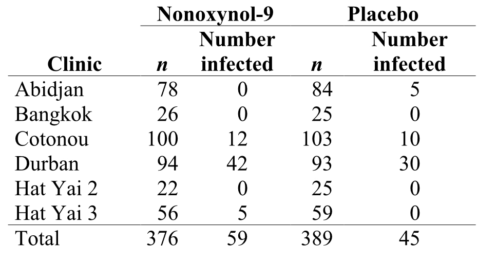
```

## Design components of a clinical trial {.smaller}

The goal of experimental design is to eliminate bias and to reduce sampling error when estimating and testing effects of one variable on another.

- To reduce bias, the experiment included:
    - **Simultaneous control group**: study included both the treatment of interest and a control group (the women receiving the placebo).
    - **Randomization**: treatments were randomly assigned to women at each clinic.
    - **Blinding**: neither the subjects nor the clinicians knew which women were assigned which treatment.
    
## Design components of a clinical trial {.smaller}

- To reduce the effects of sampling error, the experiment included:
    - **Replication**: study was carried out on multiple independent subjects.
    - **Balance**: number of women was nearly equal in the two groups at every clinic.
    - **Blocking**: subjects were grouped according to the clinic they attended, yielding multiple repetitions of the same experiment in different settings (“blocks”).

## Simultaneous control group {.smaller}

- In clinical trials either a placebo or the currently accepted treatment should be provided.
- In experiments requiring intrusive methods to administer treatment, such as 
    - injections
    - surgery
    - restraint 
    - confinement
- the control subjects should be perturbed in the same way as the other subjects, except for the treatment itself, as far as ethical considerations permit. 

## Simultaneous control group {.smaller}

- The “sham operation”, in which surgery is carried out without the experimental treatment itself, is an example.
- In field experiments, applying a treatment of interest may physically disturb the plots receiving it and the surrounding areas, perhaps by trampling the ground by the researchers. 
- Ideally, the same disturbance should be applied to the control plots.

## Randomization

- The researcher should randomize assignment of treatments to units or subjects
- Chance rather than conscious or unconscious decision determines which units end up receiving the treatment and which the control
- A completely randomized design is one in which treatments are assigned to all units by randomization

## Randomization

- Randomization breaks the association between possible confounding variables and the explanatory variable
- Randomization doesn't eliminate the variation contributed by confounding variables, only their correlation with treatment
- Randomization ensures that variation from confounding variables is similar between the different treatment groups.

## Randomization

- Randomization should be carried out using a random process:
    - List all n subjects, one per row, in a computer spreadsheet.
    - Use the computer to give each individual a random number.
    - Assign treatment A to those subjects receiving the lowest numbers and treatment B to those with the highest numbers.
- Other ways of assigning treatments to subjects are almost always inferior because they do not eliminate the effects of confounding variables.
- “Haphazard” assignment, in which the researcher chooses a treatment while trying to make it random, has repeatedly been shown to be non-random and prone to bias.

## Blinding

- Blinding is the process of concealing information from participants (sometimes including researchers) about which subjects receive which treatment.
- Blinding prevents subjects and researchers from changing their behavior, consciously or unconsciously, as a result of knowing which treatment they were receiving or administering.
- For example, studies showing that acupuncture has a significant effect on back pain are limited to those without blinding (Ernst and White 1998).

## Blinding {.smaller}

- In a single-blind experiment, the subjects are unaware of the treatment that they have been assigned. 
- Treatments must be indistinguishable to subjects, which prevents them from responding differently according to knowledge of treatment.
- Blinding can also be a concern in non-human studies where animals respond to stimuli

## Blinding {.smaller}

- In a double-blind experiment the researchers administering the treatments and measuring the response are also unaware of which subjects are receiving which treatments
    - Researchers sometimes have pet hypotheses, and they might treat experimental subjects in different ways depending on their hopes for the outcome
    - Many response variables are difficult to measure and require some subjective interpretation, which makes the results prone to a bias
    - Researchers are naturally more interested in the treated subjects than the control subjects, and this increased attention can itself result in improved response

## Blinding

- Reviews of medical studies have revealed that studies carried out without double- blinding exaggerated treatment effects by 16% on average compared with studies carried out with double-blinding (Jüni et al. 2001).
- Experiments on non–human subjects are also prone to bias from lack of blinding.

## Blinding

- Bebarta et al.(2003) reviewed 290 two-treatment experiments carried out on animals or on cell lines. The odds of detecting a positive effect of treatment were more than threefold higher in studies without blinding than in studies with blinding.
- Blinding can be incorporated into experiments on nonhuman subjects using coded tags that identify the subject to a “blind” observer without revealing the treatment (and who measures units from different treatments in random order).

## Replication

- The goal of experiments is to estimate and test treatment effects against the background of variation between individuals (“noise”) caused by other variables
- One way to reduce noise is to make the experimental conditions constant 
- In field experiments, however, highly constant experimental conditions might not be feasible nor desirable 
- By limiting the conditions of an experiment, we also limit the generality of the results
- Another way to make treatment effects stand out is to include extreme treatments and to replicate the data.

## Replication {.smaller}

- Replication is the assignment of each treatment to multiple, independent experimental units.
- Without replication, we would not know whether response differences were due to the treatments or just chance differences between the treatments caused by other factors.
- Studies that use more units (i.e. that have larger sample sizes) will have smaller standard errors and a higher probability of getting the correct answer from a hypothesis test.
- Larger samples mean more information, and more information means better estimates and more powerful tests.

## Replication {.smaller}

- Replication is not about the number of plants or animals used, but the number of independent units in the experiment. An “experimental unit” is the independent unit to which treatments are assigned.
- The figure shows three experimental designs used to compare plant growth under two temperature treatments (indicated by the shading of the pots). The first two designs are un-replicated.

## Pseudoreplication {.smaller}

```{r, echo=FALSE, out.width='90%', fig.asp=.75, fig.align='center'}
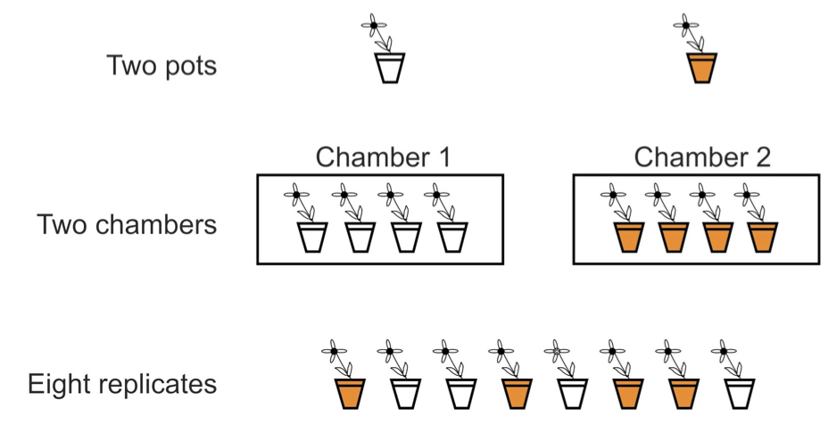
```

## Balance

- A study design is balanced if all treatments have the same sample size. 
- Conversely, a design is unbalanced if there are unequal sample sizes between treatments. 
- Balance is a second way to reduce the influence of sampling error on estimation and hypothesis testing. 
- To appreciate this, look again at the equation for the standard error of the difference between two treatment means.

```{r, echo=FALSE, out.width='80%', fig.asp=.75, fig.align='center'}
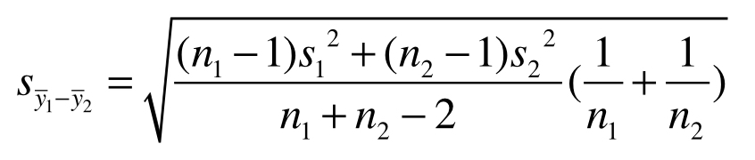
```

## Balance

- For a fixed total number of experimental units, n1 + n2, the standard error is smallest when n1 and n2 are equal.
- Balance has other benefits. For example, ANOVA is more robust to departures from the assumption of equal variances when designs are balanced or nearly so.

## Blocking

- Blocking is the grouping of experimental units that have similar properties. Within each block, treatments are randomly assigned to experimental units. 
- Blocking essentially repeats the same, completely randomized experiment multiple times, once for each block. 
- Differences between treatments are only evaluated within blocks, and in this way the component of variation arising from differences between blocks is discarded. 

```{r, echo=FALSE, out.width='80%', fig.asp=.75, fig.align='center'}
knitr::include_graphics("images/images_6a.008.jpeg")
```

## Blocking | Paired designs

- For example, consider the design choices for a two-treatment experiment to investigate the effect of clear cutting on salamander density. 
- In the completely randomized (“two-sample”) design we take a random sample of forest plots from the population and then randomly assign each plot to either the clear-cut treatment or the no clear-cut treatment. 
- In the paired design we take a random sample of forest plots and clear-cut a randomly chosen half of each plot, leaving the other half untouched. 

## Blocking | Paired designs

- In the paired design, measurements on adjacent plot-halves are not independent. This is because they are likely to be similar in soil, water, sunlight, and other conditions that affect the number of salamanders. 
- As a result, we must analyze paired data differently than when every plot is independent of all the others, as in the case of the two-sample design. 
- Paired design is usually more powerful than completely randomized design because it controls for a lot of the extraneous variation between plots or sampling units that sometimes obscures the effects we are looking for. 

## Blocking | Paired designs {.smaller}

```{r, echo=FALSE, out.width='90%', fig.asp=.75, fig.align='center'}
knitr::include_graphics("images/images_6a.009.jpeg")
```

## Blocking | Randomized complete block design

- RCB design is analogous to the paired design, but may have more than two treatments. Each treatment is applied once to every block. 
- As in the paired design, treatment effects in a randomized block design are measured by differences between treatments exclusively within blocks. 
- By accounting for some sources of sampling variation blocking can make differences between treatments stand out. 
- Blocking is worthwhile if units within blocks are relatively homogeneous, apart from treatment effects, and units belonging to different blocks vary because of environmental or other differences.


## What if you can't do experiments?

- Experimental studies are not always feasible, in which case we must fall back upon observational studies.
- The best observational studies incorporate as many of the features of good experimental design as possible to minimize bias (e.g., blinding) and the impact of sampling error (e.g., replication, balance, blocking, and even extreme treatments) except for one: randomization.
- Randomization is out of the question, because in an observational study the researcher does not assign treatments to subjects.
- Two strategies are used to limit the effects of confounding variables on a difference between treatments in a controlled observational study: matching; and adjusting for known confounding variables (covariates).

*************************************

# How to present your statistical results

## Style of a results section {.flexbox .vcenter}

- Write the text of the Results section concisely and objectively. 
- The passive voice will likely dominate here, but use the active voice as much as possible. 
- Use the past tense. 
- Avoid repetitive paragraph structures. Do not interpret the data here.

## Function of a results section {.flexbox .vcenter}

- The function is to objectively present your key results, without interpretation, in an orderly and logical sequence using both text and illustrative materials (Tables and Figures). 

- The results section always begins with text, reporting the key results and referring to figures and tables as you proceed. 

- The text of the Results section should be crafted to follow this sequence and highlight the evidence needed to answer the questions/hypotheses you investigated. 

- Important negative results should be reported, too. Authors usually write the text of the results section based upon the sequence of Tables and Figures.

## Summaries of the statistical analyses

- May appear either in the text (usually parenthetically) or in the relevant Tables or Figures (in the legend or as footnotes to the Table or Figure). 
- Each Table and Figure must be referenced in the text portion of the results, and you must tell the reader what the key result(s) is that each Table or Figure conveys.
- Tables and Figures are assigned numbers separately and in the sequence that you will refer to them from the text.
    - The first Table you refer to is Table 1, the next Table 2 and so forth.
    - Similarly, the first Figure is Figure 1, the next Figure 2, etc.
    
## Summaries of the statistical analyses

- Each Table or Figure must include a brief description of the results being presented and other necessary information in a legend.
    - Table legends go above the Table; tables are read from top to bottom.
    - Figure legends go below the figure; figures are usually viewed from bottom to top.
- When referring to a Figure from the text, "Figure" is abbreviated as Fig.,e.g., (Fig. 1. Table is never abbreviated, e.g., Table 1.

## Example {.flexbox .vcenter}

- For example, suppose you asked the question, "Is the average height of male students the same as female students in a pool of randomly selected Biology majors?"  You would first collect height data from large random samples of male and female students. You would then calculate the descriptive statistics for those samples (mean, SD, n, range, etc) and plot these numbers. Suppose you found that male Biology majors are, on average, 12.5 cm taller than female majors; this is the answer to the question. Notice that the outcome of a statistical analysis is not a key result, but rather an analytical tool that helps us understand what is our key result.

## Differences, directionality, and magnitude {.smaller .flexbox .vcenter}

- Report your results so as to provide as much information as possible to the reader about the nature of differences or relationships. 

- If you are testing for differences among groups, and you find a significant difference, it is not sufficient to simply report that "groups A and B were significantly different". How are they different and by how much? 

- Much more informative to say "Group A individuals were 23% larger than those in Group B", or, "Group B pups gained weight at twice the rate of Group A pups." 

- Report the direction of differences (greater, larger, smaller, etc) and the magnitude of differences (% difference, how many times, etc.) whenever possible.

## Statistical results in text {.smaller .flexbox .vcenter}

- Statistical test summaries (test name, p-value) are usually reported parenthetically in conjunction with the biological results they support. This parenthetical reference should include the statistical test used, the value, degrees of freedom and the level of significance. 

- For example, if you found that the mean height of male Biology majors was significantly larger than that of female Biology majors, you might report this result (in blue) and your statistical conclusion (shown in red) as follows:

    - "Males (180.5 ± 5.1 cm; n=34) averaged 12.5 cm taller than females (168 ± 7.6 cm; n=34) in the pool of Biology majors (two-sample t-test, t = 5.78, 33 d.f., p < 0.001).”
    
## Statistical results in text {.smaller .flexbox .vcenter}

- If the summary statistics are shown in a figure, the sentence above need not report them specifically, but must include a reference to the figure where they may be seen:

    - "Males averaged 12.5 cm taller than females in the pool of Biology majors (two-sample t-test, t = 5.78, 33 d.f., p < 0.001; Fig. 1)."

## Statistical results in text {.flexbox .vcenter}

- Always enter the appropriate units when reporting data or summary statistics.
    - for an individual value you would write, "the mean length was 10 cm", or, "the maximum time was 140 min."
    - When including a measure of variability, place the unit after the error value, e.g., "...was 10 ± 2.3 m".
    - Likewise place the unit after the last in a series of numbers all having the same unit. For example: "lengths of 5, 10, 15, and 20 m", or "no differences were observed after 2, 4, 6, or 8 min. of incubation".

