```{r setup, include=FALSE}
knitr::opts_chunk$set(echo = FALSE)
```

## Goals for statistics section
- Introduce univariate and multivariate approaches of hypothesis testing in biological statistics 
- Apply these approaches to genomic and phenotypic datasets

# Revisiting our biological example

## {}
- Two different strains of stickleback fish (ocean population (RS) and one from a freshwater lake (BP)) that you make microbe free. 
- Microbes in the gut are known to interact with the gut epithelium in ways that lead to a proper maturation of the immune system. 
- You carry out an experiment by treating multiple fish from each strain so that some of them have a conventional microbiota, and some are inoculated with only one bacterial species. 
- You then measure the levels of gene expression in the stickleback gut using RNA-seq. 
- You suspect that the sex of the fish might be important so you track it too.

## 

```{r, echo=FALSE, out.width='70%', fig.asp=.75, fig.align='center'}
knitr::include_graphics("images/week_01.005.jpeg")
```

## {.flexbox .vcenter}

```{r, echo=FALSE, out.width='100%', fig.asp=.75, fig.align='center'}
knitr::include_graphics("images/week_01.006.jpeg")
```

# Basics of probability and distributions

## Random variables & probability {.smaller}

- **Probability** is the expression of belief in some future outcome

- A **random variable** can take on different values with different probabilities

- The **sample space** of a random variable is the universe of all possible values

## Random variables & probability {.smaller}
- The **sample space** can be represented by a 
    - **probability distribution** (for discrete variables) 
    - **probability density function** (PDF - for continuous variables)
    - algebra and calculus are used for each respectively
    - the probabilities of an entire sample space **always sum to 1.0**
- There are many **families** or **forms** of distributions or PDFs
    - depends on the nature of the dynamical system they represent
    - the exact **instantiation of the form** depends on their parameter values
    - we are often interested in statistics in **estimating parameters**

## Bernoulli distribution {.smaller}

- Describes the expected outcome of a single event with probability `p`

- Example of flipping of a **fair** coin once

$$Pr(X=\text{Head}) = \frac{1}{2} = 0.5 = p $$

$$Pr(X=\text{Tails}) = \frac{1}{2} = 0.5 = 1 - p $$

## Bernoulli distribution

- If the coin isn't fair then $p \neq 0.5$
- However, the probabilities still sum to 1

$$ p + (1-p) = 1 $$

- Same is true for other binary possibilities
    - success or failure
    - yes or no answers
    - choosing an allele from a population based upon allele frequencies

## Probability rules {.flexbox .vcenter}

- Flip a coin twice
- Represent the first flip as ‘X’ and the second flip as ‘Y’
- First, pretend you determine the probability in advance of flipping both coins

\br
\br
\br

$$ Pr(\text{X=H and Y=H}) = p*p = p^2 $$
$$ Pr(\text{X=H and Y=T}) = p*p = p^2 $$
$$ Pr(\text{X=T and Y=H}) = p*p = p^2 $$
$$ Pr(\text{X=T and Y=T}) = p*p = p^2 $$

## Probability rules


- Now determine the probability if the `H` and `T` can occur in any order

$$ \text{Pr(H and T) =} $$ 
$$ \text{Pr(X=H and Y=T) or Pr(X=T and Y=H)} = $$ 
$$ (p*p) + (p*p) = 2p^{2} $$
  

- These are the **'and'** and **'or'** rules of probability
    - 'and' means multiply the probabilities
    - 'or' means sum the probabilities
    - most probability distributions can be built up from these simple rules

## Joint and conditional probability

**Joint probability**

$$Pr(X,Y) = Pr(X) * Pr(Y)$$    

- Note that this is true for two independent events
- However, for two non-independent events we also have to take into account their **covariance**


## Joint and conditional probability

**Conditional probability**

- For two **independent** variables

$$Pr(Y|X) = Pr(Y)\text{ and }Pr(X|Y) = Pr(X)$$ 

- For two **non-independent** variables

$$Pr(Y|X) \neq Pr(Y)\text{ and }Pr(X|Y) \neq Pr(X)$$

- Variables that are non-independent have a shared variance, which is also known as the **covariance**
- Covariance standardized to a mean of zero and a unit standard deviation is **correlation**


## Binomial Distribution {.smaller}

- A **binomial distribution** results from the **combination** of several independent Bernoulli events 

- **Example** 
    - Pretend that you flip 20 fair coins and record the number of heads
    - Now repeat that process and record the number of heads for each
    - We expect that most of the time we will get approximately 10 heads
    - Sometimes we get many fewer heads or many more heads

## Binomial Distribution {.smaller}

- The distribution of probabilities for each combination of outcomes is

$$\large f(k) = {n \choose k} p^{k} (1-p)^{n-k}$$

- `n` is the total number of trials
- `k` is the number of successes
- `p` is the probability of success
- `q` is the probability of not success
- For binomial as with the Bernoulli `p = 1-q`

## Binomial Probability Distribution  {.smaller}

```{r, echo=FALSE, out.width='100%', fig.align='center'}
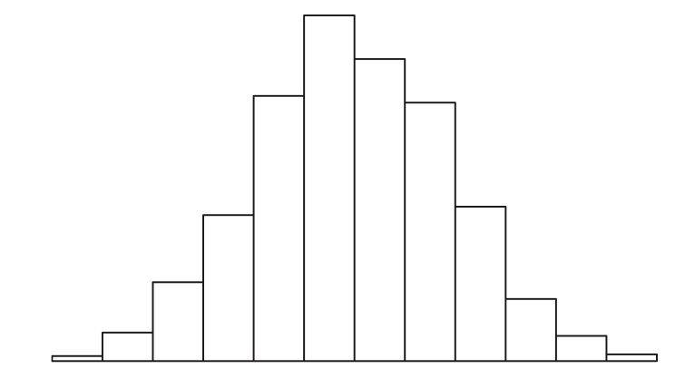
```

## Binomial Probability Distribution {.smaller}

- Note that the binomial function incorporates both the 'and' and 'or' rules of probability
- This part is the probability of each outcome (multiplication)

$$\large p^{k} (1-p)^{n-k}$$

- This part (called the binomial coefficient) is the number of different ways each combination of outcomes can be achieved (summation)

$$\large {n \choose k}$$


## Poisson Probability Distribution  {.smaller}

- Another common situation in biology is when each trial is discrete, but the number of observations of each outcome is observed/counted

- Some examples are
    - counts of snails in several plots of land
    - observations of the firing of a neuron in a unit of time
    - count of genes in a genome binned to units of 500 amino acids in length
- Just like before you have 'successes', but 
    - now you count them for each replicate
    - the replicates now are units of area or time
    - the values can now range from 0 to an arbitrarily large number

## Poisson Probability Distribution  {.smaller}

- For example, you can examine 1000 genes
    - count the number of base pairs in the coding region of each gene
    - what is the probability of observing a gene with 'r' bp in it?
- `Pr(Y=r)` is the probability that the number of occurrences of an event `y` equals a count `r` in the total number of trials

$$Pr(Y=r) = \frac{e^{-\mu}\mu^r}{r!}$$

## Poisson Probability Distribution  {.smaller}

- Note that this is a single parameter function because $\mu = \sigma^2$
- The two together are often just represented by $\lambda$

$$Pr(y=r) = \frac{e^{-\lambda}\lambda^r}{r!}$$

- This means that for a variable that is truly Poisson distributed:
    - the mean and variance should be equal to one another
    - variables that are approximately Poisson distributed but have a larger variance than mean are often called 'overdispersed'
    - quite common in RNA-seq and microbiome data

## Poisson Probability Distribution | gene length by bins of 500 nucleotides {.smaller}

```{r, echo=FALSE, out.width='80%', fig.align='center'}
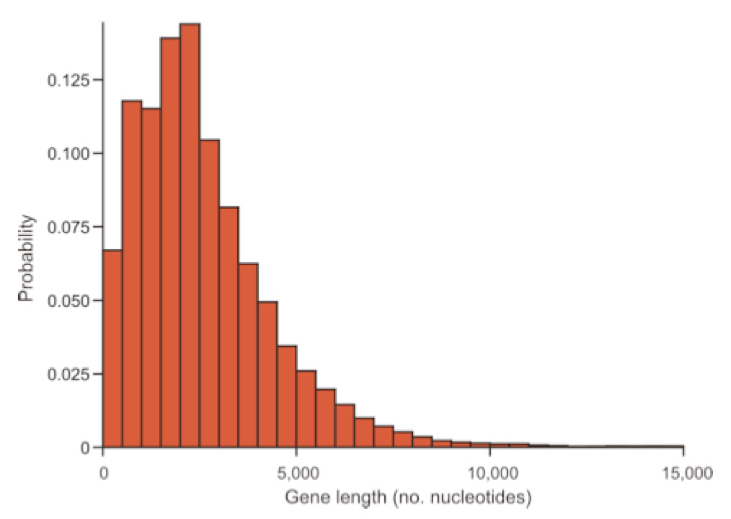
```

## Poisson Probability Distribution | increasing parameter values of $\lambda$ {.smaller}

```{r, echo=FALSE, out.width='80%', fig.align='center'}
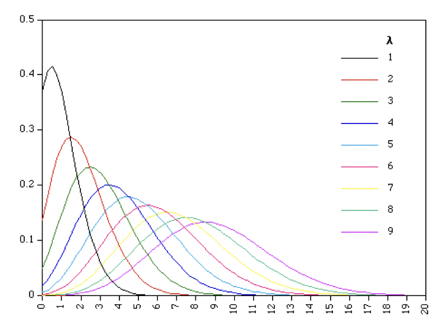
```

## Log-normal PDF | Continuous version of Poisson (-ish) { .smaller}

```{r, echo=FALSE, out.width='100%', fig.align='center'}
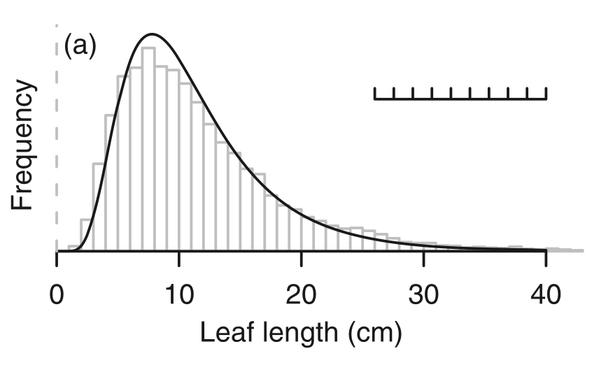
```

## Transformations to ‘normalize’ data {.smaller .vcenter .flexbox}

```{r, echo=FALSE, out.width='100%', fig.align='center'}
knitr::include_graphics("images/week_2.007.jpeg")
```

## Transformations to ‘normalize’ data {.smaller .vcenter .flexbox}

```{r, echo=FALSE, out.width='100%', fig.align='center'}
knitr::include_graphics("images/week_2.008.jpeg")
```

## Binomial to Normal | Categorical to continuous {.smaller .vcenter .flexbox}

```{r, echo=FALSE, out.width='100%', fig.align='center'}
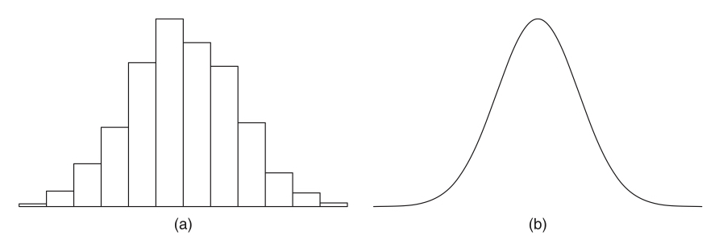
```

## The Normal (aka Gaussian) | Probability Density Function (PDF) {.smaller}

```{r, echo=FALSE, out.width='90%', fig.align='center'}
knitr::include_graphics("images/week_2.011.jpeg")
```

## Normal PDF {.smaller}

```{r, echo=FALSE, out.width='50%', fig.align='center'}
knitr::include_graphics("images/week_2.012.jpeg")
```


## Normal PDF | A function of two parameters 
### ($\mu$ and $\sigma$) {.smaller}

```{r, echo=FALSE, out.width='40%', fig.align='center'}
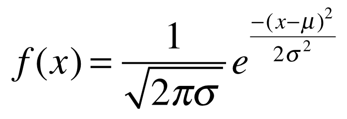
```
where 
$$\large \pi \approx 3.14159$$

$$\large \epsilon \approx 2.71828$$

To write that a variable (v) is distributed as a normal distribution with mean $\mu$ and variance $\sigma^2$, we write the following:

$$\large v \sim \mathcal{N} (\mu,\sigma^2)$$

## Normal PDF | estimates of mean and variance {.smaller}

Estimate of the mean from a single sample

$$\Large \bar{x} = \frac{1}{n}\sum_{i=1}^{n}{x_i} $$

Estimate of the variance from a single sample

$$\Large s^2 = \frac{1}{n-1}\sum_{i=1}^{n}{(x_i - \bar{x})^2} $$


## Normal PDF

```{r, echo=FALSE, out.width='90%', fig.align='center'}
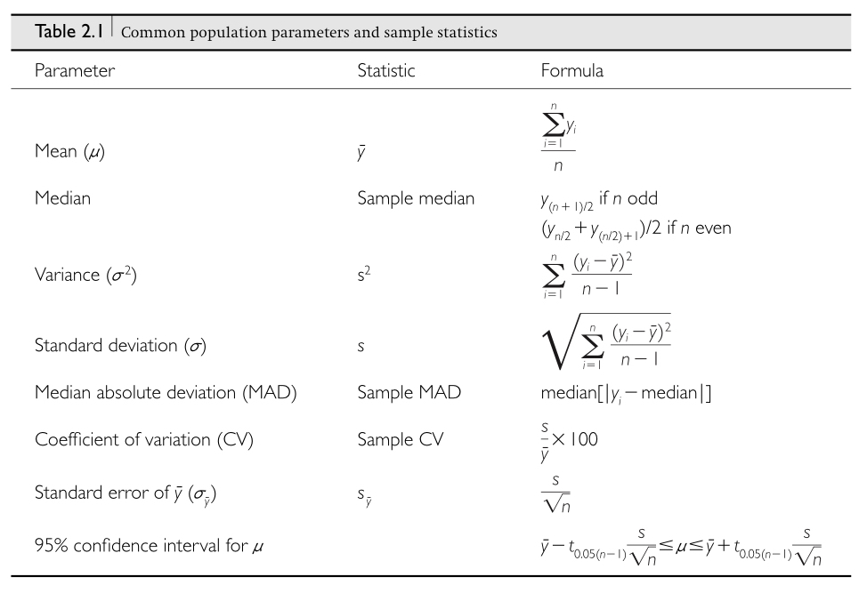
```

## Why is the Normal special in biology?

```{r, echo=FALSE, out.width='100%', fig.align='center'}
knitr::include_graphics("images/week_2.013.jpeg")
```

## Why is the Normal special in biology? {.smaller}

```{r, echo=FALSE, out.width='100%', fig.align='center'}
knitr::include_graphics("images/week_2.015.jpeg")
```

## Why is the Normal special in biology? {.smaller}

```{r, echo=FALSE, out.width='70%', fig.align='center'}
knitr::include_graphics("images/week_2.014.jpeg")
```

## Parent-offspring resemblance {.smaller}

```{r, echo=FALSE, out.width='45%', fig.align='center'}
knitr::include_graphics("images/week_2.016.jpeg")
```

## Genetic model of complex traits {.smaller}

```{r, echo=FALSE, out.width='90%', fig.align='center'}
knitr::include_graphics("images/week_2.017.jpeg")
```

## Distribution of $F_2$ genotypes | really just binomial sampling {.smaller}

```{r, echo=FALSE, out.width='70%', fig.align='center'}
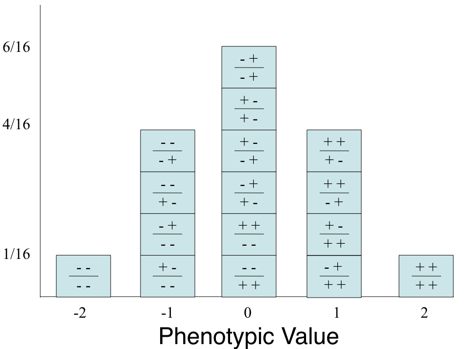
```

## Why else is the Normal special?

- The normal distribution is immensely useful because of the central limit theorem  
- The mean of many random variables independently drawn from the same distribution is distributed approximately normally
- One can think of numerous situations, such as 
    - when multiple genes contribute to a phenotype
    - or that many factors contribute to a biological process
- In addition, whenever there is variance introduced by stochastic factors or sampling error, the central limit theorem holds
- Thus, normal distributions occur throughout biology and biostatistics

## z-scores of normal variables

- Often we want to make variables more comparable to one another
- For example, consider measuring the leg length of mice and of elephants
    - Which animal has longer legs in absolute terms? 
    - Which has longer legs on average proportional to their body size? 
    - Which has more variation proportional to their body size?
- A good way to answer this last question is to use 'z-scores'

## z-scores of normal variables
- z-scores are standardized to a mean of 0 and a standard deviation of 1
- We can modify any normal distribution to have a mean of 0 and a standard deviation of 1 
- Another term for this is the standard normal distribution

$$\huge z_i = \frac{(x_i - \bar{x})}{s}$$


## R Interlude | Complete Exercise 3.1

# Hypothesis testing, test statistics, p-values {.smaller}

## What is a hypothesis {.vcenter .flexbox}

- A statement of belief about the world
- Need a **critical** test to 
    - accept or reject the hypothesis
    - compare the relative merits of different models
- This is where **statistical sampling distributions** come into play


## Hypothesis tests {.vcenter .flexbox}

- What is the probability that we would reject a **true null hypothesis**?

- What is the probability that we would accept a **false null hypothesis**?

- How do we **decide** when to reject a null hypothesis and support an alternative?

- What can we **conclude** if we fail to reject a null hypothesis?

- What **parameter estimates of distributions** are important to test hypotheses?

## Null and alternative hypotheses | population distributions {.smaller}

```{r, echo=FALSE, out.width='60%', fig.align='center'}
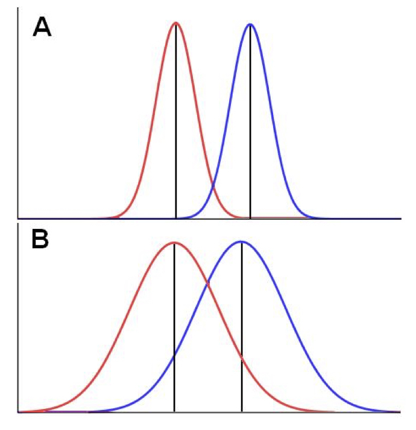
```

## Statistical sampling distributions {.vcenter .flexbox}

- Statistical tests provide a way to perform **critical tests** of hypotheses
- Just like raw data, statistics are **random variables** and depend on sampling distributions of the underlying data
- The particular **form of the statistical distribution** depends on the test statistic and parameters such as the degrees of freedom that are determined by sample size.

## Statistical sampling distributions {.vcenter .flexbox}

- In many cases we create a **null statistical distribution** that models the distribution of a test statistic under the **null hypothesis**. 
- Similar to point estimates, we calculate an **observed test statistic value** for our data
- Then see how probable it was by comparing against **the null distribution**
- The probability of seeing that value or greater is called the **p-value** of the statistic


## Four common statistical distributions {.smaller}

```{r, echo=FALSE, out.width='90%', fig.align='center'}
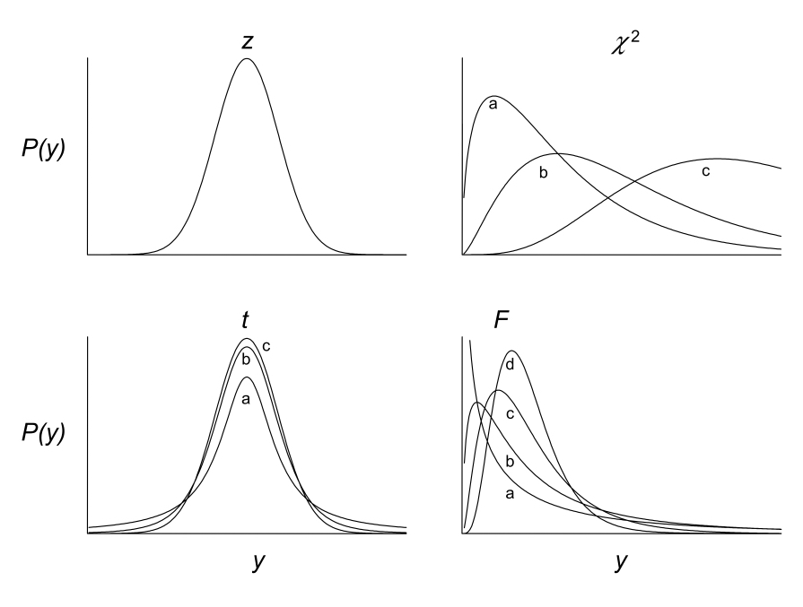
```

## The t-test and t sampling distribution {.smaller}

$$\large t = \frac{(\bar{y}_1-\bar{y}_2)}{s_{\bar{y}_1-\bar{y}_2}} $$

where

```{r, echo=FALSE, out.width='60%', fig.align='center'}
knitr::include_graphics("images/week_3.016.jpeg")
```

which is the calculation for the standard error of the mean difference

## The t-test and t sampling distribution | one-tailed test {.smaller}

```{r, echo=FALSE, out.width='90%', fig.align='center'}
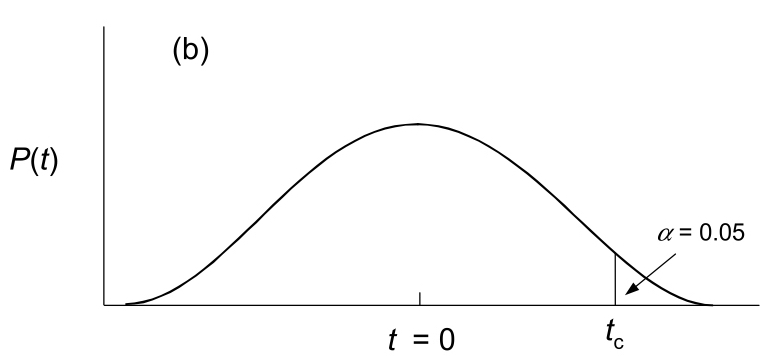
```

## The t-test and t sampling distribution | two-tailed test {.smaller}

```{r, echo=FALSE, out.width='60%', fig.align='center'}
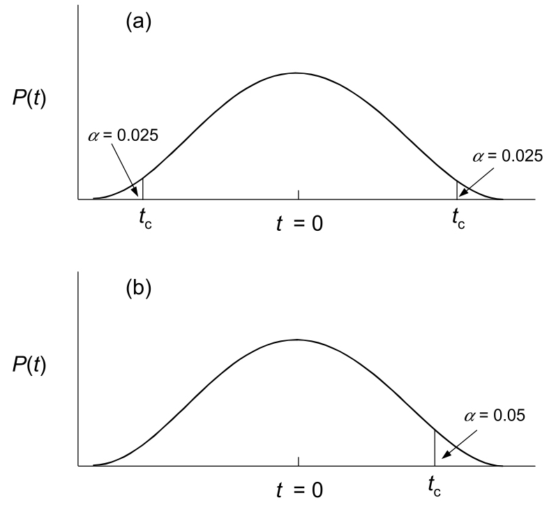
```

## Assumptions of parameteric t-tests  {.vcenter .flexbox}

- The theoretical t-distributions for each degree of freedom were calculated for populations that are:  
    - normally distributed
    - have equal variances (if comparing two means)
    - observations are independent (randomly drawn)
- This is an example of a **parametric** test
- What do you do if the there is non-normality?  
    - nonparametric tests such as Mann-Whitney-Wilcoxon
    - randomization tests to create a null distribution

## Type 1 and Type 2 errors {.smaller}

```{r, echo=FALSE, out.width='90%', fig.align='center'}
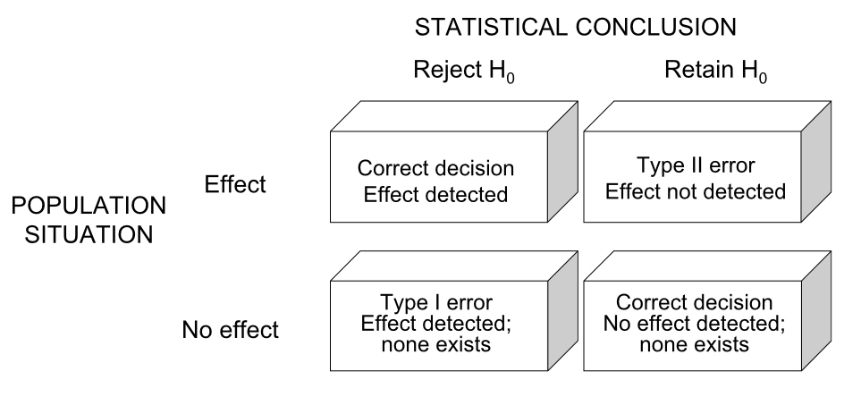
```

## Components of hypothesis testing

- **p-value** = the long run probability of rejecting a true null hypothesis
- **alpha** = critical value of p-value cutoff for experiments. The Type I error we are willing to tolerate.
- **beta** = cutoff for probability of accepting a false null hypothesis
- **Power** = the probability that a test will reject a false null hypothesis (1 - beta). It depends on effect size, sample size, chosen alpha, and population standard deviation 
- **Multiple testing** = performing the same or similar tests multiple times - need to correct alpha value

## Statistical power

- Type 1 error - $\alpha$ - incorrectly rejecting a true null hypothesis
    - This is saying that there is an effect when there isn’t
- Type 2 error - $\beta$ - incorrectly accepting a false null hypothesis
    - This is saying that there isn’t an effect when there is
      
- Power is the probability of rejecting a false null hypothesis
- Mostly we shoot for a power of around 80%
- Power can be calculated *post hoc* or *a priori*

## Power | the things one needs to know

$$ Power \propto \frac{(ES)(\alpha)(\sqrt n)}{\sigma}$$

- Power is proportional to the combination of these parameters

    - **ES** -      effect size; how large is the change of interest?
    - **alpha** -  significance level (usually 0.05)
    - **n** -         sample size
    - **sigma** - standard deviation among experimental units within the same group.

## Power | what we usually want to know {.flexbox .vcenter}

 ```{r, echo=FALSE, out.width='90%', fig.asp=.75, fig.align='center'}
knitr::include_graphics("images/images_6b.002.jpeg")
```  

## Power | rough calculation
 
 ```{r, echo=FALSE, out.width='90%', fig.asp=.75, fig.align='center'}
knitr::include_graphics("images/images_6b.003.jpeg")
```

## R Interlude | Complete Exercises 3.2-3.4

________________________

# Linear Models and Regression

## Parent offspring regression

```{r, echo=FALSE, out.width='90%', fig.asp=.75, fig.align='center'}
knitr::include_graphics("images/images_4b.002.jpeg")
```

## Linear Models - a note on history

```{r, echo=FALSE, out.width='90%', fig.asp=.75, fig.align='center'}
knitr::include_graphics("images/images_4b.003.jpeg")
```

## Linear Models - a note on history

```{r, echo=FALSE, out.width='90%', fig.asp=.75, fig.align='center'}
knitr::include_graphics("images/images_4b.004.jpeg")
```

## Bivariate normality

```{r, echo=FALSE, out.width='90%', fig.asp=.75, fig.align='center'}
knitr::include_graphics("images/images_4b.005.jpeg")
```

## Covariance and correlation

```{r, echo=FALSE, out.width='90%', fig.asp=.75, fig.align='center'}
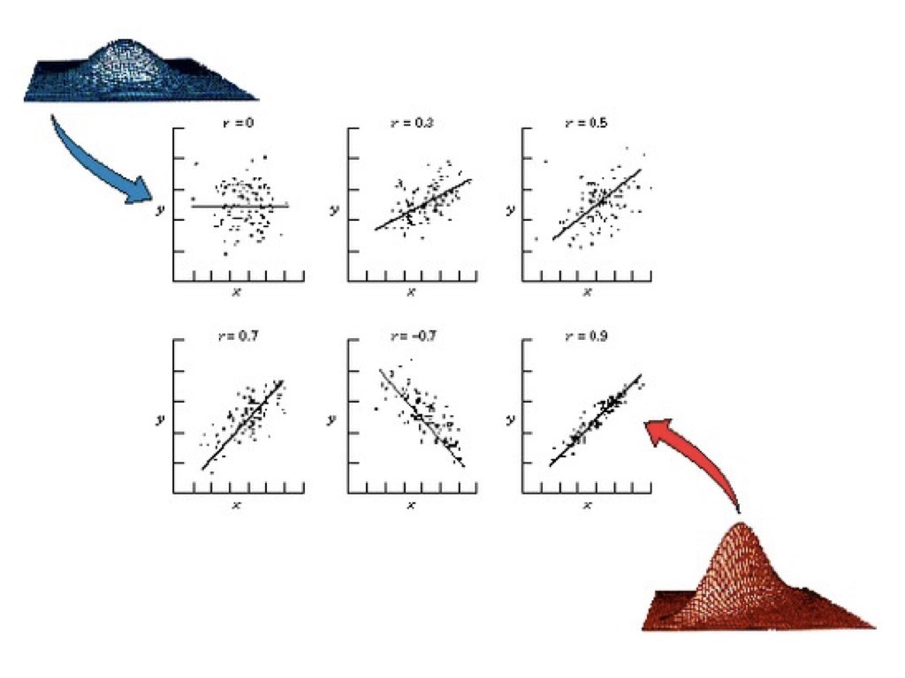
```

## A linear model to relate two variables

```{r, echo=FALSE, out.width='90%', fig.asp=.75, fig.align='center'}
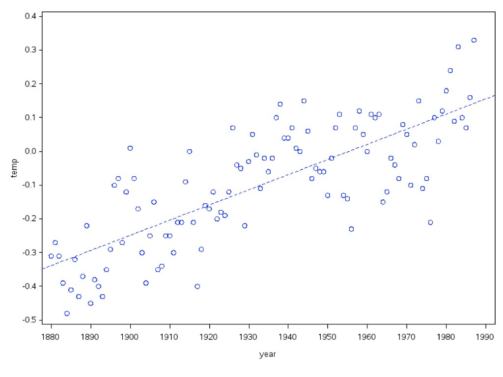
```

## Parameter Estimation | Ordinary Least Squares (OLS)

- Algorithmic approach to parameter estimation
- One of the oldest and best developed statistical approaches
- Used extensively in linear models (ANOVA and regression)
- By itself only produces a single best estimate (No C.I.’s)
- Many OLS estimators have been duplicated by ML estimators

## Many approaches are linear models

- Flexible - applicable to many different study designs 
- Provides a common set of tools (`lm` in R for fixed effects)
- Includes tools to estimate parameters:
    - sizes of effects like the slope 
    - difference in means among categories
- Is easier to work with, especially with multiple variables

## Many approaches are linear models

- Linear regression 
- Single factor ANOVA
- Analysis of covariance (ANCOVA)
- Multiple regression
- Multi-factor ANOVA
- Repeated-measures ANOVA

## Plethora of linear models

- General Linear Model (**GLM**) - two or more continuous variables

- General Linear Mixed Model (**GLMM**) - a continuous response variable with a mix of continuous and categorical predictor variables

- Generalized Linear Model - a GLM that doesn’t assume normality of the response

- Generalized Additive Model (**GAM**) - a model that doesn’t assume linearity


## Linear models {.smaller}

All can be written in the form

response variable = intercept + (explanatory_variables) + random_error

in the general form:

$$ Y=\beta_0 +\beta_1*X_1 + \beta_2*X_2 +... + \epsilon$$  

where $\beta_0, \beta_1, \beta_2, ....$ are the parameters of the linear model

## linear model parameters

```{r, echo=FALSE, out.width='90%', fig.asp=.75, fig.align='center'}
knitr::include_graphics("images/images_4b.010.jpeg")
```


## linear models in R


- Need to fit the model and then 'read' the output

```{r, echo=TRUE, eval=FALSE}
trial_lm <- lm(Y~X)
summary (trial_lm)
```
- In general you will ask R to fit linear models and then do additional analyses on the output

## Model fitting and hypothesis tests in regression

$$H_0 : \beta_0 = 0$$
$$H_0 : \beta_1 = 0$$


full model - $y_i = \beta_0 + \beta_1*x_i + error_i$

reduced model - $y_i = \beta_0 + 0*x_i + error_i$


1. fits a “reduced” model without slope term ($H_0$)
2. fits the “full” model with slope term added back
3. compares fit of full and reduced models using an F test

## Model fitting and hypothesis tests in regression

```{r, echo=FALSE, out.width='90%', fig.asp=.75, fig.align='center'}
knitr::include_graphics("images/images_4b.011.jpeg")
```


## Hypothesis tests in linear regression {.smaller}

```{r, echo=FALSE, out.width='90%', fig.asp=.75, fig.align='center'}
knitr::include_graphics("images/images_4b.012.jpeg")
```

## Hypothesis tests in linear regression {.smaller}

```{r, echo=FALSE, out.width='90%', fig.asp=.75, fig.align='center'}
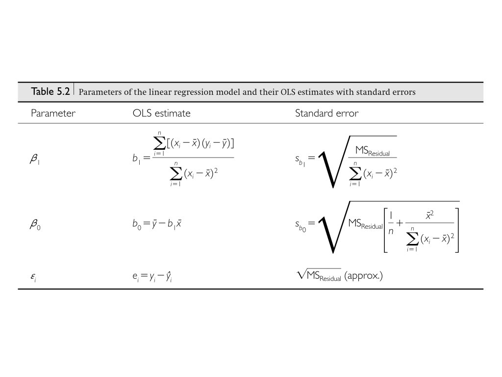
```


## Relationship of correlation and regression

$$\beta_{YX}=\rho_{YX}*\sigma_Y/\sigma_X$$
$$b_{YX} = r_{YX}*S_Y/S_X$$

## Residual Analysis | did we meet our assumptions?

- Independent errors (residuals)
- Equal variance of residuals in all groups
- Normally-distributed residuals
- Robustness to departures from these assumptions is improved when sample size is large and design is balanced


## Residual Analysis | did we meet our assumptions?

$$y_i = \beta_0 + \beta_1 * x_I + \epsilon_i$$

## Residual Analysis

```{r, echo=FALSE, out.width='90%', fig.asp=.75, fig.align='center'}
knitr::include_graphics("images/images_4b.015.jpeg")
```

## Residual Analysis

```{r, echo=FALSE, out.width='90%', fig.asp=.75, fig.align='center'}
knitr::include_graphics("images/images_4b.016.jpeg")
```

## Residual Plots | Spotting assumption violations

```{r, echo=FALSE, out.width='80%', fig.asp=.75, fig.align='center'}
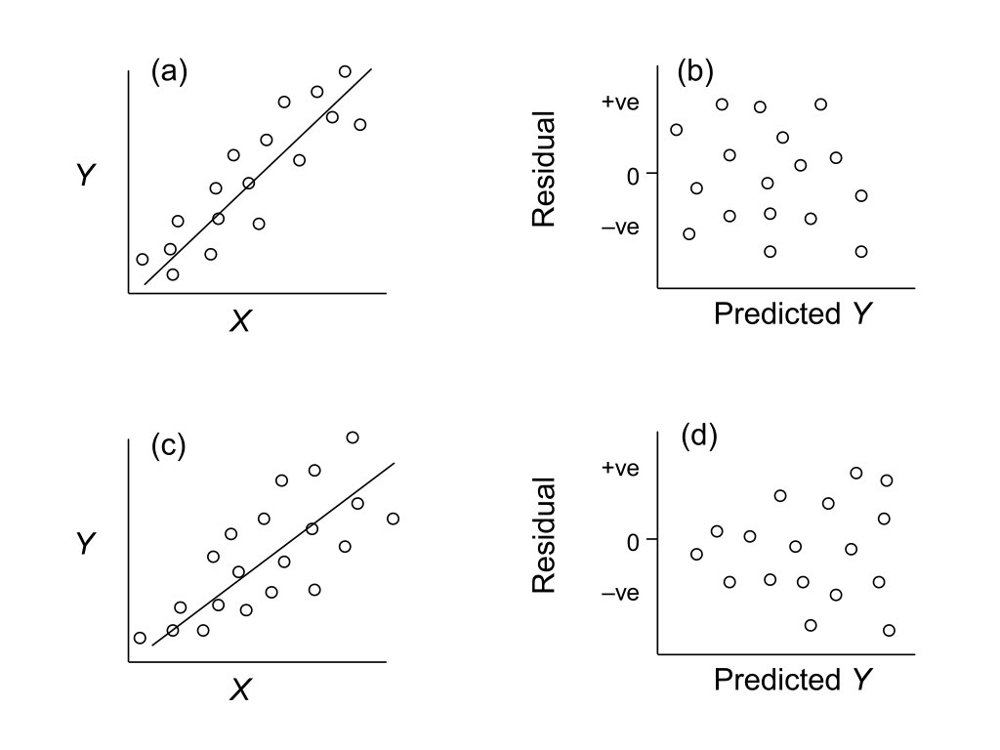
```

## Anscombe's quartet | what would residual plots look like for these?

```{r, echo=FALSE, out.width='80%', fig.asp=.75, fig.align='center'}
knitr::include_graphics("images/images_4b.017.jpeg")
```

## Anscombe's quartet | what would residual plots look like for these?

```{r, echo=FALSE, out.width='70%', fig.asp=.75, fig.align='center'}
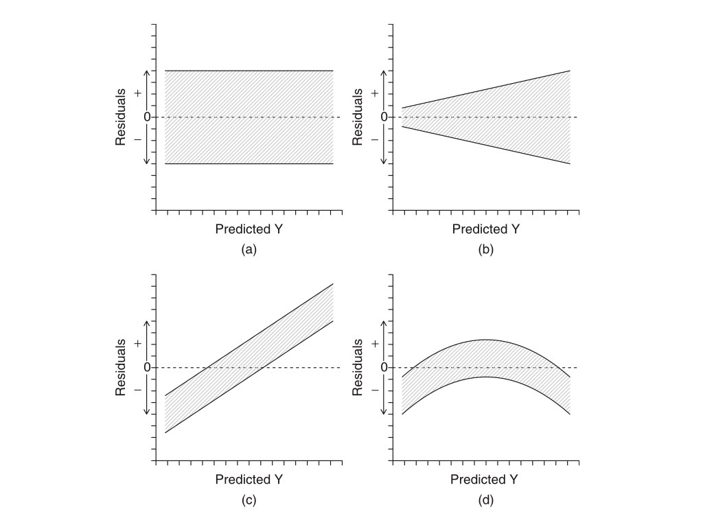
```


_______________________________


# Multiple Linear Regression

## Multiple Linear Regression - Goals

- To develop a better predictive model than is possible from models based on single independent variables.
- To investigate the relative individual effects of each of the multiple independent variables above and beyond the effects of the other variables.
- The individual effects of each of the predictor variables on the response variable can be depicted by single partial regression lines. 
- The slope of any single partial regression line (partial regression slope) thereby represents the rate of change or effect of that specific predictor variable (holding all the other predictor variables constant to their respective mean values) on the response variable.

## Multiple Linear Regression | Additive and multiplicative models of 2 or more predictors


Additive model
$$y_i = \beta_0 + \beta_1x_{i1} + \beta_2x_{i2} + ... + B_jx_{ij} + \epsilon_i$$


Multiplicative model (with two predictors)
$$y_i = \beta_0 + \beta_1x_{i1} + \beta_2x_{i2} + B_3x_{i1}x_{i2} + \epsilon_i$$

## Multiple Linear Regression | Additive and multiplicative models {.smaller}

```{r, echo=FALSE, out.width='100%', fig.asp=.75, fig.align='center'}
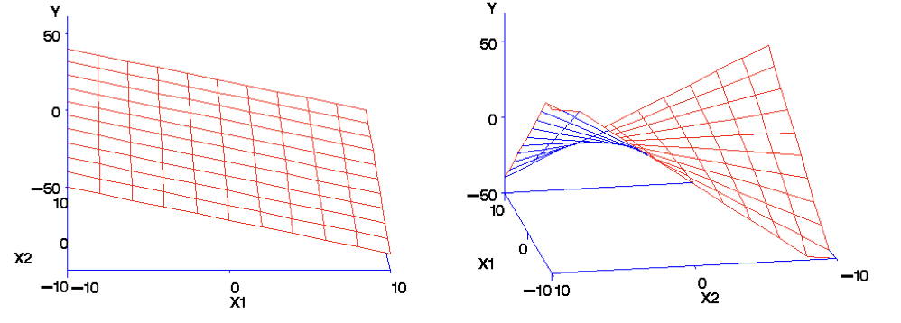
```

## Multiple linear regression assumptions

- linearity
- normality
- homogeneity of variance
- The absence of **multi-collinearity** 
    - a predictor variable must not be linearly predicted by - or correlated with - any combination of the other predictor variables.

## checking for multi-collinearity

```{r, echo=TRUE, eval=FALSE}
library(car)
scatterplotMatrix(~var1+var2+var3, diag=”boxplot”)
```

```{r, echo=FALSE, out.width='60%', fig.asp=.75, fig.align='center'}
knitr::include_graphics("images/Images_5b.001.jpeg")
```


## R Interlude | Exercise 4.1

__________________________________

# ANOVA

## ANOVA {.flexbox .vcenter}

- Stands for **AN**alysis **o**f **VA**riance
- Core statistical procedure in biology
- Developed by R.A. Fisher in the early 20th Century
- The core idea is to ask how much variation exists within vs. among groups
- ANOVAs are linear models that have **categorical predictor** and **continuous response** variables
- The categorical predictors are often called **factors**, and can have two or more **levels** (important to specify in R)
- Each factor will have a **hypothesis test**
- The levels of each factor may also need to be tested

## ANOVA | Let's start with an example

- Percent time that male mice experiencing discomfort spent “stretching”.
- Data are from an experiment in which mice experiencing mild discomfort (result of injection of 0.9% acetic acid into the abdomen)
- The injected mice were then kept in:
    - isolation 
    - with a companion mouse not injected or 
    - with a companion mouse also injected and exhibiting “stretching” behaviors associated with discomfort 

From Langford, D. J.,et al. 2006. Science 312: 1967-1970

## ANOVA | Let's start with an example {.flexbox .vcenter}

In words:
  
**stretching = intercept + treatment**
  
- The model statement includes a response variable, a constant, and an explanatory variable.  
- The only difference with regression is that here the explanatory variable is categorical.

## ANOVA | Let's start with an example {.vcenter .flexbox}

```{r, echo=FALSE, out.width='80%', fig.asp=.75, fig.align='center'}
knitr::include_graphics("images/Images_5b.014.jpeg")
```

## ANOVA {.vcenter .flexbox}

```{r, echo=FALSE, out.width='100%', fig.asp=.75, fig.align='center'}
knitr::include_graphics("images/Images_5b.015.jpeg")
```

## ANOVA | Conceptually similar to regression {.vcenter .flexbox}

```{r, echo=FALSE, out.width='80%', fig.asp=.75, fig.align='center'}
knitr::include_graphics("images/images_5b.016.jpeg")
```

## ANOVA | Statistical results table {.vcenter .flexbox}

```{r, echo=FALSE, out.width='100%', fig.asp=.75, fig.align='center'}
knitr::include_graphics("images/Images_5b.017.jpeg")
```

## ANOVA | F-ratio calculation {.vcenter .flexbox}

```{r, echo=FALSE, out.width='100%', fig.asp=.75, fig.align='center'}
knitr::include_graphics("images/Images_5b.018.jpeg")
```

## ANOVA | One or more predictor variables

- One-way ANOVAs just have a single factor
- Multi-factor ANOVAs have more than one factor
- The interaction among factors needs to be considered
- Multi-factor ANOVAs 
    - Factorial - two or more factors and their interactions
    - Nested - the levels of one factor are contained within another level
    - The models can be quite complex

## Multifactor ANOVA | Assumptions 

- Normally distributed groups
    - robust to non-normality if equal variances and sample sizes
- Equal variances across groups
    - okay if largest-to-smallest variance ratio < 3:1
    - problematic if there is a mean-variance relationship among groups
- Observations in a group are independent
    - randomly selected
    - don’t confound group with another factor

## Two Factor Factorial Designs {.flexbox .vcenter}

```{r, echo=FALSE, out.width='100%', fig.asp=.75, fig.align='center'}
knitr::include_graphics("images/images_7a.013.jpeg")
```

## Interpretation | significant main and interaction effects {.flexbox .vcenter}

```{r, echo=FALSE, out.width='100%', fig.asp=.75, fig.align='center'}
knitr::include_graphics("images/images_7a.021.jpeg")
```

## Interaction plots {.flexbox .vcenter}

```{r, echo=FALSE, out.width='55%', fig.asp=.75, fig.align='center'}
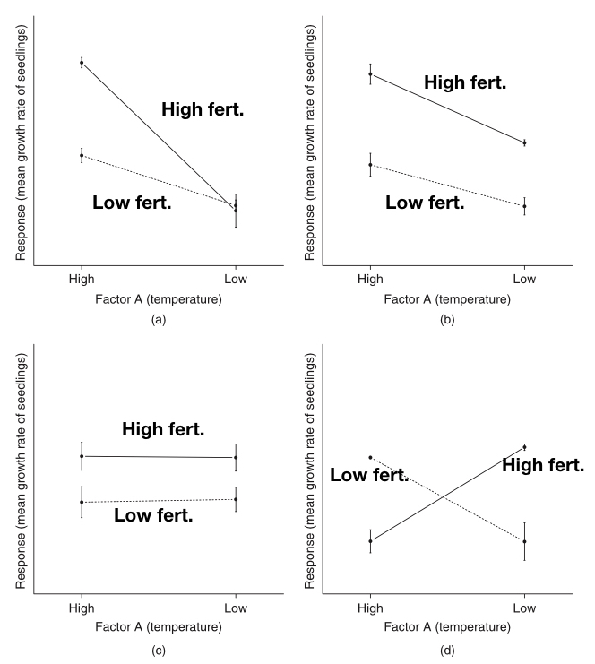
```

## R Interlude | Exercise 4.2

______________________________________

# Multivariate Statistics

## What are multivariate statitistics?

- **General** - more than one variable recorded from a number of experimental sampling units
- **Specific** - two or more response variables that likely co-vary
- Goals of multivariate statistics
    - Data reduction and simplification (PCA and PCoA)
    - Organization of objects (Cluster Analysis and MDS)
    - Testing the effects of a factor on linear combinations of variables (MANOVA and DFA)

## Conceptual overview of multivariate statistics


```{r, echo=FALSE, out.width='75%', fig.asp=.75, fig.align='center'}
knitr::include_graphics("images/multi.001.jpeg")
```

## Multivariate statitistics definitions?

- Some definitions first
- i = 1 to n objects and j = 1 to p variables
- Measure of center of a multivariate distribution = the centroid
- Multivariate statistics uses eigenanalysis of either matrices of covariances of variables (p-by-p), or dissimilarities of objects (n-by-n)
- Matrix and linear algebra are therefore very useful in multivariate statistics

## Multivariate statitistics conceptual overview

```{r, echo=FALSE, out.width='75%', fig.asp=.75, fig.align='center'}
knitr::include_graphics("images/multi.002.jpeg")
```

## Eigenanalysis

$$Z_{ik} = c_1y_{i1} + c_2y_{i1} + c_3y_{i2} + c_1y_{i3} + ... + c_py_{ip}$$

- Derives linear combinations of the original variables that best summarize the total variation in the data
- These new linear combinations become new variables themselves
- Each object can now have a score for the new variables

## Eigenvalues

- Also called 
  - characteristic or latent roots or 
  - factors
- Rearranging the variance in the association matrix so that the first few derived variables explain most of the variation that was present between objects in the original variables
- The eigenvalues can also be expressed as proportions or percents of the original variance explained by each new derived variable (also called components or factors)

## Eigenvectors

- Lists of the coefficients or  weights showing how much each original variable contributes to each new derived variable
- The linear combination s can be solved to provide a score ($z_{ik}$) for each object
- There are the same number of derived variables as there are original variables (p)
- The newly derived variables are extracted sequentially so that they are uncorrelated with each other
- The eigenvalues and eigenvectors can be derived using either spectral decomposition of the p-by-p matrix, or singular value decomposition of the original matrix

## Correlation vs. dissimiliarity matrices

- Principal Component Analysis (PCA) and Correspondence Analysis (CA) use covariance or correlation of variables.
- Principal Coordinate Analysis (PCoA), Cluster Analysis and Multidimensional Scaling (MDS) use dissimilarity indices.
- The scaling of the derived latent variables can therefore differ between analyses that use covariance of variables as compared to dissimilarity indices.
- Whether the derived variable can be considered metric (e.g. on a rational scale) or non-metric (e.g. on an ordinal scale) depends on the analysis.
- As a consequence the downstream use of the derived variables can change depending upon the analysis.

## Correlation vs. dissimiliarity matrices

```{r, echo=FALSE, out.width='75%', fig.asp=.75, fig.align='center'}
knitr::include_graphics("images/multi.003.jpeg")
```

## Dissimiliarity indices for continuous variables

```{r, echo=FALSE, out.width='75%', fig.asp=.75, fig.align='center'}
knitr::include_graphics("images/multi.005.jpeg")
```


## How many PC's or PCo's should I concern myself with?

```{r, echo=FALSE, out.width='75%', fig.asp=.75, fig.align='center'}
knitr::include_graphics("images/multi.004.jpeg")
```

## What else can I do with the z-scores of the new PCs and metric PCoA's?

- They’re nice new variables that you can use in any analysis you’ve learned previously!!
- You can perform single or multiple regression of your PCs on other continuous variables (e.g. an environmental gradient).
- If you have one or more grouping variables you can use ANOVA on each newly derived PC.

## R Interlude | Exercises 4.3-4.4
- Getting slightly more advanced and bringing it all together


